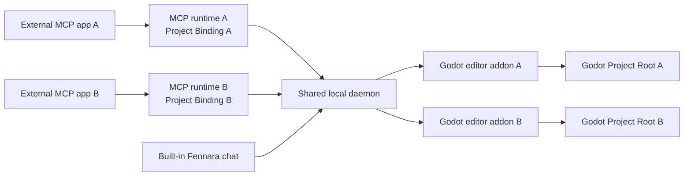

<!-- fennara-i18n: locale=de source=docs/architecture.md sha256=1bc08d075d4b48d0c781f954d4da4752d6c7223ff1636f01f06524b06dce256a -->
<a id="architecture"></a>
# Architektur

<!-- fennara-doc-nav:start -->
[English](../../architecture.md) · [简体中文](../zh-CN/architecture.md) · [Español](../es/architecture.md) · [Português do Brasil](../pt-BR/architecture.md) · [日本語](../ja/architecture.md) · [한국어](../ko/architecture.md) · [Русский](../ru/architecture.md) · [Français](../fr/architecture.md) · **Deutsch** · [Türkçe](../tr/architecture.md)

> ℹ️ Diese Übersetzung wurde von einer KI anhand der englischen Quelle verfasst. Eine Prüfung durch Muttersprachler ist willkommen. [Englische Quelle](../../architecture.md)
<!-- fennara-doc-nav:end -->

Fennara ist eine lokale Bridge zwischen KI-Clients und einem im Godot-Editor geöffneten Projekt.
Diese Seite erläutert Zuständigkeiten, Prozessgrenzen, das Installationslayout und
das Übergabeverhalten bei Aktualisierungen.

| Wenn du Folgendes tun möchtest... | Beginne hier |
| --- | --- |
| Den Quellcode einer Komponente finden | [Repositorysübersicht](repo-map.md) |
| Fennara installieren oder aktualisieren | [Einrichtung](setup.md) |
| Release-Artefakte verstehen | [Release-Prozess](release.md) |
| Die verfügbaren Modellwerkzeuge untersuchen | [Werkzeuge](tools.md) |

Im normalen OSS-Pfad gibt es keinen Fennara-Cloud-Dienst. Jede externe
MCP-Verbindung startet einen lokalen MCP-Prozess, der mit einem gemeinsamen
benutzerbezogenen Daemon kommuniziert. Der integrierte Chat kommuniziert direkt
mit diesem Daemon. Der Daemon erreicht die Fennara-Addons in den geöffneten
Godot-Editoren.



<a id="main-pieces"></a>
## Hauptbestandteile

| Bestandteil | Speicherort | Aufgabe |
| --- | --- | --- |
| CLI | `local/crates/fennara-cli/` | Installiert das Addon in einem Godot-Projekt, aktualisiert lokale Pakete, schreibt Projektrichtlinien und konfiguriert MCP-Anwendungen über `fennara mcp-setup`. |
| MCP-Launcher | `local/crates/fennara-mcp/` | Stabile ausführbare Datei, die von MCP-Anwendungen aufgerufen wird. Sie findet die aktive Version und startet die Laufzeit. |
| MCP-Laufzeit | `local/crates/fennara-mcp/` | Kommuniziert über MCP per stdio, fixiert beim Start eine optionale Projektbindung und leitet Werkzeugaufrufe an die lokale Bridge weiter. |
| Daemon-Launcher | `local/crates/fennara-daemon/` | Stabile ausführbare Datei zum Starten der aktiven Daemon-Laufzeit. |
| Daemon-Laufzeit | `local/crates/fennara-daemon/` | Verwaltet gemeinsamen lokalen Status, leitet MCP-Verbindungen an passende Editoren weiter, besitzt den rechnerweiten Laufzeit-Slot, koordiniert sich mit Godot und stellt Routen für den integrierten Chat bereit. |
| Projektidentität | `local/crates/fennara-project-identity/` | Löst Godot-Projektstämme für MCP-Laufzeit und Daemon auf, validiert und kanonisiert sie und vergleicht ihre Identität. |
| Quellcode der Chat-UI | `ui/chat/` | HTML, CSS und JavaScript für den integrierten Chat, Einstellungen, Anbietereinrichtung, Einrichtung von MCP-Anwendungen und die Aktualisierungsoberfläche. Er wird mit dem paketierten Addon unter `godot_demo/addons/fennara/dist/` synchronisiert. |
| Godot-Addon | `godot_demo/addons/fennara/` | Die Addon-Nutzlast, die in Benutzerprojekte kopiert wird. |
| Quellcode der Laufzeit-Hilfsfunktionen | `runtime/` | Godot-seitige Laufzeit-Hilfsskripte, die für Laufzeitsitzungen und Laufzeitskripte in die Addon-Nutzlast synchronisiert werden. |
| GDExtension | `fennara-cpp/` | Godot-seitige Werkzeuge, Dock-Benutzeroberfläche, Diagnose, Validierung, Laufzeiterfassung und Editor-Integration. |
| Werkzeugschemas | `local/schemas/tools/` | Gemeinsame, an Modelle gerichtete Werkzeugverträge. Die MCP-Laufzeit und der integrierte Chat wählen jeweils die Schemas aus, die sie bereitstellen. |

<a id="native-update-handoff"></a>
## Native Übergabe von Aktualisierungen

Die Chat-UI fordert die Vorbereitung einer Aktualisierung über den Daemon und die
gebundene Godot-Bridge an. Der native `UpdateCoordinator` startet die installierte CLI,
verfolgt den dauerhaften Betriebsstatus und stellt den Fortschritt dar, ohne nach Beginn
der Vorbereitung von der Webview abhängig zu sein.

Geprüfte Addon-Dateien werden unter
`.godot/fennara-update/<operation-id>/` bereitgestellt. Nach ausdrücklicher Bestätigung wartet
eine abgekoppelte CLI darauf, dass die exakte Godot-PID samt Startzeit verschwindet. Sie prüft
erneut einen Digest, der das vollständige bereitgestellte Addon abdeckt, erstellt Snapshots
beider gemeinsam genutzter Launcher und des Laufzeitmanifests, verschiebt das aktive Addon
nach `previous-addon`, verschiebt das bereitgestellte Addon nach `addons/fennara` und öffnet
dasselbe Editor-Projekt erneut.
Die neu geöffnete GDExtension schreibt einen Aktivierungs-Handshake. Die CLI löscht die
Sicherung erst, nachdem Erfolgsbestätigung, Handshake und ein passender Daemon-Zustand
dauerhaft gespeichert wurden. Andernfalls verbleibt die Bestätigung im Zustand
`recovery_required`, und ein Rollback stellt das vorherige Addon, die Launcher und das
Laufzeitmanifest wieder her. Falls eine Unterbrechung vorübergehend verhindert, dass das
Addon geladen werden kann, verbleibt die installierte CLI außerhalb des Projekt-Addons
und stellt `fennara recover --project <path>` als einzigen Notfall-Einstiegspunkt zur
Wiederherstellung des Addons bereit.

<a id="in-editor-chat-webview"></a>
## Chat-Webview im Editor

Das optionale Chat-Dock wird von der UI-Schicht der GDExtension gehostet. Der gemeinsame
Host-Vertrag trennt drei Arten von Browseroberflächen:

| Plattformpfad | Verhalten |
| --- | --- |
| Windows | Native WebView2-Unterkomponente/-Überlagerung, die an das Fenster des Godot-Editors angefügt ist und ausgeblendet wird, solange überlappende Godot-Popups, eingebettete Fenster, Canvas-Ebenen oder Bedienelemente der obersten Ebene sichtbar sind. |
| macOS | Native WKWebView, die an das Fenster des Godot-Editors angefügt ist und dieselbe Ausblendung bei überlappender Godot-Benutzeroberfläche wie Windows verwendet. |
| Linux | CEF-Off-Screen-Rendering in ein internes Godot-`TextureRect` unter Verwendung einer gemeinsam genutzten CEF-Laufzeit aus den Fennara-Anwendungsdaten. |

Benutzer können in Chat Settings außerdem festlegen, dass der integrierte Chat beim
nächsten Mal in ihrem Systembrowser geöffnet wird. In diesem Modus zeigt das Godot-Dock
ein Ersatzpanel **Open chat** und stellt dieselbe Chat-UI über den lokalen Daemon unter
`127.0.0.1` mit dem `chat_token` des besitzenden Editors bereit. Dadurch ändert sich nur
die Anzeigeoberfläche. Anbietereinstellungen, Chatverlauf, Projektumfang, Snapshots,
Werkzeugausführung und externe MCP-Weiterleitung verbleiben auf denselben Daemon-Pfaden.

`fennara install`, `fennara update` und `fennara doctor` melden Webview-Voraussetzungen
für die aktuelle Plattform. Windows warnt, wenn Microsoft Edge WebView2 Runtime fehlt,
macOS meldet den Status des systemeigenen WebKit.framework und Linux validiert die vom
Release verwaltete gemeinsame CEF-Laufzeit. Diese Prüfungen betreffen ausschließlich das
optionale integrierte Chat-Dock. MCP-Werkzeuge funktionieren auch ohne native Webview.

Der Linux-Pfad rendert Browserpixel innerhalb eines Godot-`Control` und führt die
CEF-Nachrichtenschleife über den Prozess-Hook des Docks. Die GDExtension findet die
gemeinsame CEF-Laufzeit, validiert deren Markierung `fennara-cef-runtime.json` sowie
die erforderlichen Dateien, öffnet `libcef.so` dynamisch und lädt anschließend die
kleine Addon-Bibliothek `libfennara_linux_cef_bridge.so` per dlopen über einen
fokussierten Bridge-Loader. Diese Bridge wird aus dem
angehefteten offiziellen CEF-139-Quellcode von `libcef_dll_wrapper` gebaut und besitzt
die C++-CEF-Objekte (`CefClient`, `CefRenderHandler`, `CefRefPtr`), mit denen CEF im
fensterlosen Modus initialisiert, der Browser für die paketierte Chat-URL erstellt und
Paint-Puffer in eine Godot-Textur kopiert werden. Vollständige Unterstützung für IME,
Zwischenablage und Cursor ist getrennte Folgearbeit. Die CEF-Laufzeit ist bewusst von
der ZIP-Datei des Godot-Addons getrennt: Linux-Installationen verwenden einen gemeinsam
genutzten Laufzeitspeicherort in den Anwendungsdaten, und die CLI installiert das vom
Release verwaltete CEF-Asset dort einmal pro Benutzer.

Mehrere Godot-Editoren können gleichzeitig geöffnet sein. Jede Websocket-Verbindung des
eingebetteten Chats wird mit dem `chat_token` des besitzenden Editors angenommen und
bleibt für Speicherumfang des Chats, Snapshots, Werkzeugausführung, Abbruch und
Rückgängigmachen an diese Godot-Sitzung gebunden. Ein projektgebundener externer
MCP-Prozess wird an den Editor weitergeleitet, dessen kanonischer Projektstamm
übereinstimmt. Nur ein ungebundener Prozess verwendet das im Dock ausgewählte
Kompatibilitätsziel des Daemons.
Chat-Anbietereinstellungen sind derzeit global, während Chats projektbezogen bleiben.
Cloud-Chat-Anbieter verwenden lokal gespeicherte API-Schlüssel, lokale Anbieter verwenden
vom Daemon gespeicherte Basis-URLs. Die aktuelle Anbieterauswahl des integrierten Chats
umfasst OpenAI, Anthropic, OpenRouter, Ollama Cloud, DeepSeek, Z.AI, Moonshot AI, Kimi For
Coding, MiniMax, lokales Ollama und LM Studio. Ollama verwendet standardmäßig
`http://127.0.0.1:11434`; LM Studio verwendet standardmäßig `http://127.0.0.1:1234/v1`.
Die Chat-Laufzeit des Daemons löst ausgewählte Modelle vor Anfragen über einen kleinen
Anbieterkatalog auf. Kanonische Modellreferenzen verwenden `provider/model`.
OpenRouter ist die wichtigste für Benutzer erkennbare Ausnahme, weil Modell-Slugs von
OpenRouter häufig bereits ein Anbietersegment enthalten. Bevorzuge
`openrouter/google/example` in Fennara. Wenn ein Benutzer einen unverarbeiteten
OpenRouter-Slug wie `google/example` einfügt, leitet der Daemon ihn aus
Kompatibilitätsgründen dennoch an OpenRouter weiter. Native Referenzen `openai/...` und
`anthropic/...` verwenden die offiziellen Anbieter. Verwende `openrouter/openai/...`
oder `openrouter/anthropic/...` für diese Anbieter über OpenRouter. Anbieter nutzen nach
Möglichkeit gemeinsame OpenAI-kompatible oder Anthropic-kompatible Chat-Adapter. Eigenheiten
der Anbieter sind in Anbietermodulen isoliert, und oberhalb der Adaptergrenze werden
Stream-/Fehlerereignisse normalisiert.

Chat-Züge des integrierten Chats schreiben außerdem einen rein lokalen Diagnose-Trace
in dieselbe Anwendungsdaten-Datenbank `chat.sqlite`, und zwar in `chat_trace_events`
getrennt von den Transkripttabellen. Trace-Zeilen verwenden stabile
Turn-/Generierungs-/Werkzeug-/Bridge-IDs sowie Zeitangaben, Statuswerte, Anzahlen und
begrenzte Zusammenfassungen. Rohe Prompts und vollständige Werkzeugergebnisse werden
standardmäßig nicht erfasst. Der Daemon stellt unter `/chat/traces` einen kleinen lokalen
Debug-Leseendpunkt bereit, der nach `chat_id`, `trace_id`, `turn_id` oder `generation_id`
filtern kann.

<a id="anonymous-telemetry"></a>
## Anonyme Telemetrie

Nach einer echten Verbindung zum Godot-Editor kann der Daemon pro UTC-Tag ein anonymes
Ereignis für eine aktive Installation in die Warteschlange stellen. Die begrenzte
Warteschlange und der HTTP-Hintergrund-Worker sind von Werkzeugausführung, Chat-Generierung
und der Godot-Bridge getrennt, sodass Telemetrie einen Benutzervorgang weder verzögern noch
fehlschlagen lassen kann.

Der Daemon speichert eine zufällige Installations-UUID und den letzten akzeptierten UTC-Tag
unter `Fennara/telemetry/state.json`. Das Ereignis enthält ausschließlich diese UUID, die
Fennara-Version und die numerische Godot-Version, Plattform sowie CPU-Architektur. Der
Empfänger von `fennara.io` validiert die exakte Nutzlast und wandelt die UUID in einen
serverseitigen HMAC um, bevor er ein personenloses Ereignis an PostHog weiterleitet.

Die gespeicherte Voreinstellung in Chat Settings ist standardmäßig aktiviert. Sie kann
über die UI deaktiviert werden, und `FENNARA_DISABLE_TELEMETRY` oder `DO_NOT_TRACK` kann
eine Umgebungsüberschreibung erzwingen. Durch das Deaktivieren wird der lokale
Telemetriestatus gelöscht. Den vollständigen Datenschutzvertrag findest du unter
[Anonyme Telemetrie](telemetry.md).

<a id="install-layout"></a>
## Installationslayout

Beim Ablauf mit manuell kopiertem Release-Addon zeigt die GDExtension zunächst ein natives
Einrichtungspanel an, wenn die exakte lokale Installation fehlt. Ihre Bootstrap-Bridge lädt
mit Godots HTTP-Client das Release-Manifest und das CLI-Archiv der Addon-Version herunter,
prüft den angegebenen SHA-256 und legt ausschließlich die CLI in den Fennara-Anwendungsdaten
ab. Anschließend startet sie `fennara install` und liest für Fortschritt und Diagnose den
dauerhaften Betriebsstatus. Chat und Webview bleiben inaktiv, bis die Einrichtung erfolgreich
ist und der passende Daemon eine Verbindung herstellt. Die lokale Bridge startet oder
verbindet sich nicht mit einem älteren Daemon in den Anwendungsdaten, solange eine Einrichtung
erforderlich ist. Bei einem Versionswechsel muss der gemeinsam genutzte Daemon melden, dass
keine Godot-Projekte verbunden sind. Das Projekt, das eingerichtet wird, bleibt getrennt,
solange sein Addon und die installierten Komponenten nicht übereinstimmen. Nach dieser
Vorprüfung beendet das Installationsprogramm den inaktiven älteren Daemon, bevor es die
passenden Komponenten aktiviert. Eine gemeldete Verbindung lässt die bestehende Installation
unverändert, damit der Benutzer den verbundenen Editor schließen und es erneut versuchen kann.

Unter macOS empfiehlt die Benutzerdokumentation eine Installation über die CLI. Der
Bootstrap im Editor kann erst ausgeführt werden, nachdem die native GDExtension-Bibliothek
geladen wurde, und kann daher eine Gatekeeper-Blockierung nicht beheben, die durch manuelles
Herunterladen und Entpacken der nicht notarisierten Addon-ZIP-Datei verursacht wurde.
Benutzer, deren manuell kopiertes Addon blockiert ist, müssen es entfernen, bevor sie
`fennara install` ausführen, da die CLI ein vollständiges vorhandenes Addon beibehält.

Eine gemeinsame Bootstrap-Sperre in den Anwendungsdaten serialisiert den Download und die
Aktivierung der CLI über gleichzeitig laufende Godot-Editoren hinweg. Der Besitz der Sperre
geht auf den gestarteten Installationsprozess über, sodass ein anderer Editor wartet, bis
genau dieser Prozess beendet wird. Das Panel erzeugt eine Betriebs-ID, übergibt sie an die
CLI und liest ausschließlich die Statusdatei dieses Vorgangs. Wenn der Kindprozess in einem
nicht terminalen Zustand endet, meldet das Panel einen stabilen Fehler, statt unbegrenzt zu
warten.

Die Terminal-Installationsskripte bleiben der nicht interaktive Pfad und der
Wiederherstellungspfad.

Das Installationsskript installiert die kleine äußere CLI und fügt sie zu `PATH` hinzu.
Danach können moderne Releases die installierte CLI über `fennara update` oder
`fennara self-update` aktualisieren. Führe das Installationsskript nur erneut aus, wenn
die Selbstaktualisierung der CLI für das gewählte Release oder den gewählten
Installationsort nicht verfügbar ist.

Anschließend ruft `fennara install` oder `fennara update` das Release-Manifest ab, prüft
die Hashes der referenzierten Assets, lädt Release-Assets herunter und richtet das lokale
Paketlayout ein.

```text
Fennara/
  bin/
    fennara
    fennara-mcp
    fennara-daemon
  daemon-control-token
  current.json
  telemetry/
    state.json
  versions/
    <version>/
      fennara-mcp-runtime
      fennara-daemon-runtime
      addon/
        addons/
          fennara/
  webview/
    cef/
      linux-x64/
        <cef-version>/
```

Unter Windows verwenden ausführbare Dateien die Endung `.exe`.

Der Daemon erstellt beim ersten Start `daemon-control-token` mit sicheren zufälligen Bytes.
Privilegierte lokale HTTP-Routen und der Websocket der Godot-Bridge erfordern dieses Token
im Header `X-Fennara-Control-Token`. Die MCP-Laufzeit und das Godot-Addon lesen das Token
aus demselben benutzerbezogenen Verzeichnis der Fennara-Anwendungsdaten. Vor dem Senden
des Tokens sendet jeder Client einen zufälligen Nonce an den öffentlichen
Control-Challenge-Endpunkt und erfordert einen gültigen HMAC-SHA256-Nachweis. Dadurch wird
verhindert, dass ein anderer Prozess, der den festen Port belegt, das wiederverwendbare
Token erfasst. Statische Chat-Assets und der minimale Zustandsendpunkt bleiben öffentlich
über Loopback erreichbar. Der Projekt-Chat-Websocket und Medienanfragen verwenden
weiterhin das separate Projekt-Chat-Token des besitzenden Editors.

Das Verzeichnis `webview/cef/...` ist für schreibgeschützte Nutzlasten der Browser-Engine
bestimmt, die von allen Godot-Projekten/-Editoren mit dieser Fennara-Installation gemeinsam
genutzt werden. Schreibbare CEF-Profil-, Cache- und Protokolldaten pro Prozess müssen
außerhalb dieser gemeinsamen Laufzeitnutzlast unter
`cache/webview/profiles/cef/godot-<pid>-<timestamp>-<nonce>/` und
`logs/webview/cef/godot-<pid>-<timestamp>-<nonce>/` verbleiben.

Standardmäßige Plattformspeicherorte:

| Betriebssystem | Basisverzeichnis |
| --- | --- |
| Windows | `%LOCALAPPDATA%\Fennara` |
| macOS | `~/Library/Application Support/Fennara` |
| Linux | `~/.local/share/fennara` |

<a id="project-layout"></a>
## Projektlayout

Wenn ein Benutzer Folgendes in einem Godot-Projekt ausführt:

```bash
fennara install
```

kopiert die CLI das Release-Addon in dieses Layout, sofern noch kein vollständiges Addon
vorhanden ist:

```text
<godot-project>/
  AGENTS.md
  addons/
    fennara/
      ai/
        guidelines.md
        index.md
        operations.md
        runtime-observation.md
        visual-observation.md
        clients/
          cursor.md
```

Wenn bereits ein vollständiges Addon vorhanden ist, validiert die CLI dessen `VERSION` und
Editorbibliothek für die aktuelle Plattform, installiert das exakt passende lokale Paket
und lässt das Addon-Verzeichnis unverändert. Der gemeinsam genutzte Daemon wird nur gestartet,
wenn er nicht bereits läuft, und die Installation ist erst erfolgreich, nachdem seine
Zustandsantwort die Addon-Version meldet.

Nachdem Godots Editor-Dateisystemprüfung abgeschlossen ist, startet das Addon sofort einen
Plugin-eigenen Worker, der C#-Unterstützung vorbereitet. Der Worker führt einen isolierten
inkrementellen Build aus, ohne den Godot-Hauptthread zu blockieren. Worker für
C#-Werkzeuge warten auf dieselbe Vorbereitungsbarriere. Der Daemon transportiert ausschließlich
Werkzeugaufrufe und besitzt den Build-Prozess nicht. Alle Plugin-eigenen C#-Builds verwenden
einen gemeinsamen Koordinator, weil Diagnose- und Laufzeit-Builds Godots
MSBuild-Zwischenbaum wiederverwenden.

Gezielte `.cs`-Diagnosen werden nicht unterstützt. C#-Diagnosen für das gesamte Projekt
verwenden einen abbrechbaren `dotnet build` mit Godots strukturiertem Build-Logger. Die
endgültigen Assemblies werden in eine isolierte projektbezogene Diagnoseausgabe umgeleitet,
damit der geöffnete Editor sie nicht neu lädt. Wenn sich C#-Quellcode ändert, während der
anfängliche Hintergrund-Build läuft, wird dieser Build normal beendet, und die nächste
explizite Projektprüfung führt eine erzwungene Aktualisierung aus. Die Vorprüfung der
Laufzeitsitzung verwendet einen expliziten Debug-Build der `.csproj` im Stamm, der Godots
Build-Form vor dem Starten des Spiels entspricht, und schreibt vor dem Start die echte
Assembly nach `.godot/mono/temp/bin/Debug`.

<a id="mcp-setup"></a>
## MCP-Einrichtung

`fennara mcp-setup` bearbeitet die Konfiguration einer MCP-Anwendung, damit diese den
lokalen Launcher starten kann. Der erzeugte Eintrag ist global und projektneutral;
wenn die Einrichtung in einem Godot-Projekt ausgeführt wird, bindet sie nicht alle
künftigen MCP-Prozesse an dieses Projekt.

Beispiele:

```bash
fennara mcp-setup --claude
fennara mcp-setup --codex
fennara mcp-setup --cursor
fennara mcp-setup --gemini
```

Die Konfiguration verweist auf den stabilen Launcher `fennara-mcp` im Fennara-Verzeichnis
`bin`. Der Launcher liest `current.json` und startet anschließend die passende versionierte
Laufzeit.

Dadurch bleiben Konfigurationen von MCP-Anwendungen über Aktualisierungen hinweg stabil.

Für isolierte Repositorys oder Worktrees startet der MCP-Host je einen Prozess und
eine Verbindung pro Projekt. Die Laufzeit erfasst ihr Startverzeichnis und fixiert
für die Lebensdauer des Prozesses eine MCP-Projektbindung. Die Bindungsermittlung
verwendet zuerst den ausdrücklichen Parameter `--project-path`, danach
`FENNARA_PROJECT_PATH` und schließlich den nächsten Vorfahren des Startverzeichnisses,
der `project.godot` enthält. Findet die automatische Ermittlung kein Projekt,
wechselt die Laufzeit in den ungebundenen Legacy-Kompatibilitätsmodus. Ungültige
ausdrückliche Bindungen verhindern den Start, statt auf ein anderes Ziel
zurückzufallen.

Das gemeinsame Crate `fennara-project-identity` kanonisiert und validiert
Projektstämme sowohl für MCP als auch für den Daemon. MCP sendet seinen kanonischen
Stamm als Transportmetadaten außerhalb der modellseitigen Werkzeugargumente. Der
Daemon löst diesen Locator und die von Editoren gemeldeten Stämme erneut auf und
verlangt genau eine aktive Dateisystemübereinstimmung. Ein fehlender Editor ist
wiederholbar, eine doppelte Übereinstimmung ist mehrdeutig, und keiner der beiden
Fälle fällt auf das Dock-Ziel zurück. Siehe
[Mehrere Agenten und Worktrees](multi-agent-worktrees.md).

Dieser Einrichtungspfad ist vom Anbieterpfad des integrierten Chats getrennt. MCP-Anwendungen
verwenden ihr eigenes Modellkonto. Das Fennara-Dock verwendet den in den Chat-Einstellungen
konfigurierten Anbieter.

<a id="tool-call-flow"></a>
## Ablauf eines Werkzeugaufrufs

```text
MCP client
  calls a Fennara tool
MCP runtime
  validates the request against local schemas
  attaches its process-scoped Project Binding as transport metadata
  forwards the call to the local daemon
Daemon runtime
  resolves the binding and routes to exactly one matching Godot editor
Godot addon
  runs the Godot-aware tool through GDExtension
  returns a concise markdown result
MCP runtime
  sends the result back to the MCP client
```

Interne Aufrufe des integrierten Chats enthalten bereits eine ausdrückliche
Godot-Editor-Sitzung. Eine externe MCP-Verbindung ohne Projektbindung verwendet
stattdessen das Legacy-MCP-Ziel: zuerst das gültige, im Dock ausgewählte Ziel und
danach den einzigen verbundenen Editor. Die gebundene Auswahl liest oder ändert
dieses daemonweite Ziel nie.

Der MCP-Client kann normale Dateien selbst lesen und schreiben. Fennara-Werkzeuge
konzentrieren sich auf Godot-spezifisches Feedback: Szenenstruktur, Knoteneigenschaften,
Diagnose, Validierung, Laufzeitstatus, Screenshots und Editor-bezogene Bearbeitungen.

Werkzeugaufrufe des integrierten Chats durchlaufen vor der Weiterleitung an Godot zusätzlich
eine Daemon-eigene Berechtigungsschranke. Der Genehmigungsmodus der Chat-Einstellungen ist
entweder `ask` oder `full_access`. Schreibgeschützte Werkzeuge werden sofort erlaubt.
Werkzeuge für Projektänderungen und Laufzeitausführung warten im Modus `ask` auf eine
Genehmigung der UI und werden im Modus `full_access` automatisch ausgeführt. Strenge
Sicherheitsprüfungen innerhalb der Godot-Werkzeuge, beispielsweise blockierte interne
Addon-Pfade, gelten in beiden Modi weiterhin.

<a id="updates"></a>
## Aktualisierungen

`fennara update` ist der normale Befehl zur Projektaktualisierung. Er liest die
Release-Identität des installierten Addons, löst den Zeiger auf GitHubs Latest Release oder
den isolierten Staging-Kanal dieses Addons auf und fixiert das Ergebnis auf genau eine
Version. Zunächst prüft er die Version des plattformspezifischen CLI-Assets dieses
Release-Manifests. Falls sie neuer ist, stellt er diese CLI bereit, lässt den alten Prozess
enden, ersetzt die installierte CLI und setzt den Vorgang mit demselben Ziel fort. Danach
verwendet er denselben manifestgesteuerten Resolver und dasselbe Installationsprogramm wie
`fennara install`.

Die native Staging-Erkennung speichert validierte Kanalzeiger fünf Minuten lang in den
gemeinsamen Fennara-Anwendungsdaten zwischen und validiert sie mit GitHub-ETags erneut.
Ein fehlender Kanal wird so behandelt, als gäbe es keine Staging-Aktualisierung.
Fehlerhafte oder kanalübergreifende Daten führen dagegen zu einem geschlossenen Fehler
und ersetzen niemals einen gültigen Cache-Eintrag.

Folgendes kann aktualisiert werden:

- die installierte CLI und das lokale Laufzeitpaket
- das Projekt-Addon
- generierte Projektrichtlinien in `AGENTS.md` und `addons/fennara/ai/`
- von der aktuellen Plattform benötigte gemeinsame Webview-Laufzeit-Assets, beispielsweise Linux CEF
- Warnungen zu Webview-Voraussetzungen für das optionale integrierte Chat-Dock

Die Konfiguration von MCP-Anwendungen wird nicht neu geschrieben. Führe `fennara mcp-setup`
nur erneut aus, wenn du einen neuen MCP-Client hinzufügst, die Konfiguration dieses Clients
reparierst oder die Integration der MCP-Zielanwendung selbst änderst.

Wenn eine MCP-Anwendung gerade einen Launcher ausführt, kann die Aktualisierung diesen
Launcher beibehalten und fortfahren. Das versionierte Laufzeitpaket wird trotzdem
aktualisiert, und zukünftige Starts verwenden die Version aus `current.json`. Verwende
`fennara update --no-self-update` nur, wenn du die Prüfung der äußeren CLI absichtlich
überspringen möchtest.

Die gemeinsame Aktivierung unterstützt gleichzeitig eine aktive Fennara-Version. Der
Daemon lehnt das Herunterfahren zur Aktualisierung ab, solange ein anderes Godot-Projekt
verbunden ist. Dadurch wird verhindert, dass unter einem anderen Editor die Version
gewechselt wird. Pakete exakter Versionen, die vorherige `current.json`, Snapshots der
Launcher und das vorherige Projekt-Addon werden aufbewahrt, bis der neu geöffnete Editor
die neue GDExtension validiert.

Der Daemon besitzt einen rechnerweiten Laufzeit-Slot für alle verbundenen Editoren.
Eine Startanfrage beansprucht atomar den Zustand `Starting`, bevor der Prozess
erstellt wird, und überführt diesen Anspruch anschließend in `Running`. Ein
gleichzeitig konkurrierender Aufrufer erhält das normale, anonyme Ergebnis `busy`
und startet niemals ein zweites Spiel. Es gibt keine FIFO-Warteschlange.

Jede Laufzeitsitzung gehört zu ihrem kanonischen Projektstamm, nicht zu einem
vorübergehenden Editorprozess. Nur dieser Eigentümer darf den detaillierten Status
abrufen, die Lease erneuern, Skripte ausführen oder die Sitzung beenden. Andere
Projekte sehen nur einen anonymen Belegungsstatus und können keine andere
Sitzungskennung bestätigen. Die Eigentümerschaft überdauert daher eine erneute
Editorverbindung.

Die absolute Standarddauer der Laufzeit-Lease beträgt 900 Sekunden; Aufrufer
können einen positiven Wert für `max_run_seconds` von bis zu 86.400 Sekunden
anfordern. Statusabfragen des Eigentümers und begrenzte Eigentümeroperationen
erneuern eine Inaktivitätsfrist von 120 Sekunden. Agenten fragen den Status in der
Regel etwa alle 30 Sekunden mit Jitter ab. Die absolute Frist wird niemals
angehalten. Ein Supervisor beendet oder bereinigt den Prozess und gibt den
Laufzeit-Slot nach natürlichem Prozessende, ausdrücklichem Stopp, Startfehler,
Inaktivitätsablauf oder absolutem Ablauf frei.

<a id="export-boundary"></a>
## Exportgrenze

Fennara ist ausschließlich im Editor aktiv. Das Export-Plugin entfernt den
Autoload `_fennara_game_capture` vorübergehend, bevor Godot die exportierten
Projekteinstellungen serialisiert, überspringt alle Dateien unter
`res://addons/fennara/` und `res://.fennara/` und entfernt seinen Eintrag
vorübergehend aus der von Godot generierten GDExtension-Registry. Nach Abschluss
des Exports stellt es den ursprünglichen Autoload und die Registry wieder her.
Es schreibt weder `export_presets.cfg` noch `project.godot` neu und speichert
darin keine Änderungen.

Diese Grenze greift erst, nachdem Godot das Projekt geöffnet hat. Ein
CI-Checkout, der `addons/fennara/` auslässt, muss `fennara prepare-export`
ausführen oder das Addon installieren, bevor Godot gestartet wird. Ein
Export-Plugin kann ein fehlendes Autoload-Ziel nicht vor der Validierung beim
Projektstart reparieren.

<a id="release-assets"></a>
## Release-Assets

Jedes öffentliche Release veröffentlicht getrennte Assets, damit Installationen modular
bleiben können:

| Asset | Zweck |
| --- | --- |
| `fennara-cli-<platform>-<arch>-v<version>.zip` | CLI und stabile Launcher. |
| `fennara-release-local-<platform>-<arch>-v<version>.zip` | Versionierte MCP- und Daemon-Laufzeiten, die vom Release-Manifest ausgewählt werden. |
| `fennara-release-addon-v<version>.zip` / `fennara-addon-latest.zip` | Godot-Addon-Nutzlast für alle Plattformen mit jeder gebauten GDExtension-Binärdatei, auf die `fennara.gdextension` verweist. |
| `fennara-webview-cef-linux-x64-<cef-version>.zip` | Nur für Linux bestimmte gemeinsame CEF-Laufzeit, die einmal in den Fennara-Anwendungsdaten installiert wird. |
| `fennara-release-manifest-v<version>.json` | Schemaversionierter Installations-/Aktualisierungsplan mit Asset-Namen, Hashes, CLI-Mindestversion und Deklarationen gemeinsamer Laufzeiten. |

Normale Benutzer installieren aus dem exakt versionierten Release, das aktuell als GitHub
Latest festgelegt ist. Fennara erstellt oder verschiebt keinen wörtlichen Tag oder kein
wörtliches Release `latest`. Ältere versionierte Releases bleiben zum Anheften und
Debuggen verfügbar.

Nutzlasten der Linux-CEF-Laufzeit sind nicht Teil von `fennara-addon-*`. Sie werden vom
Release-Manifest ausgewählt und einmal im gemeinsam genutzten Anwendungsdatenverzeichnis
`webview/cef/linux-x64/<cef-version>/` installiert.

Installationen der CEF-Laufzeit werden zunächst in einem temporären gleichgeordneten
Verzeichnis bereitgestellt, validieren erforderliche Dateien und die Laufzeitmarkierung,
veröffentlichen danach das fertige Versionsverzeichnis und aktualisieren `current.json`
atomar. Bereits laufende Editor-Prozesse verwenden weiterhin die schon geladene Laufzeit.

<a id="design-rules"></a>
## Gestaltungsregeln

- Halte Werkzeuge primitiv und spielunabhängig.
- Lass Agenten das Projekt untersuchen, bevor sie Annahmen treffen.
- Bevorzuge Feedback von der Godot-API gegenüber Vermutungen, die nur auf Dateien beruhen.
- Gib kompakte Markdown-Ergebnisse zurück, die ein MCP-Client direkt verwenden kann.
- Halte Launcher stabil und verschiebe veränderlichen Code in versionierte Laufzeiten.
- Halte den externen MCP-Pfad lokal. Das optionale integrierte Chat-Dock verwendet lokale Anbietereinstellungen, die über den Daemon gespeichert werden, beispielsweise API-Schlüssel von Cloud-Anbietern und Basis-URLs von lokalem Ollama oder LM Studio.
