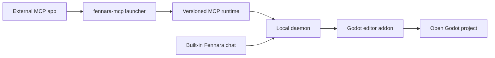

<!-- fennara-i18n: locale=es source=docs/architecture.md sha256=a69c3ec12609497a2960983409062e9483a85dc1f4eb10a49343d5e568c0a7db -->
<a id="architecture"></a>
# Arquitectura

<!-- fennara-doc-nav:start -->
[English](../../architecture.md) · [简体中文](../zh-CN/architecture.md) · **Español** · [Português do Brasil](../pt-BR/architecture.md) · [日本語](../ja/architecture.md) · [한국어](../ko/architecture.md) · [Русский](../ru/architecture.md) · [Français](../fr/architecture.md) · [Deutsch](../de/architecture.md) · [Türkçe](../tr/architecture.md)

> ℹ️ Traducción redactada por IA a partir del original en inglés. Se agradece la revisión de hablantes nativos. [Fuente en inglés](../../architecture.md)
<!-- fennara-doc-nav:end -->

Fennara es un puente local entre clientes de IA y un proyecto abierto en el
editor de Godot. Esta página explica la responsabilidad de cada parte, los
límites entre procesos, la disposición de la instalación y el traspaso durante
las actualizaciones.

| Si necesitas... | Empieza por... |
| --- | --- |
| Encontrar el código fuente de un componente | [Mapa del repositorio](repo-map.md) |
| Instalar o actualizar Fennara | [Configuración](setup.md) |
| Comprender los recursos de una versión | [Proceso de publicación](release.md) |
| Inspeccionar las herramientas disponibles para el modelo | [Herramientas](tools.md) |

En el flujo OSS normal no existe un servicio de Fennara en la nube. Una
aplicación MCP externa inicia el proceso MCP local, que se comunica con el
daemon. El chat integrado se comunica directamente con ese daemon. El daemon
accede al addon de Fennara en el editor de Godot abierto.



<a id="main-pieces"></a>
## Componentes principales

| Componente | Ubicación | Función |
| --- | --- | --- |
| CLI | `local/crates/fennara-cli/` | Instala el addon en un proyecto de Godot, actualiza paquetes locales, escribe instrucciones del proyecto y configura aplicaciones MCP mediante `fennara mcp-setup`. |
| Iniciador MCP | `local/crates/fennara-mcp/` | Ejecutable estable al que llaman las aplicaciones MCP. Localiza la versión activa e inicia el runtime. |
| Runtime MCP | `local/crates/fennara-mcp/` | Se comunica mediante MCP sobre stdio y reenvía las llamadas a herramientas al puente local. |
| Iniciador del daemon | `local/crates/fennara-daemon/` | Ejecutable estable utilizado para iniciar el runtime activo del daemon. |
| Runtime del daemon | `local/crates/fennara-daemon/` | Mantiene el estado local, se coordina con Godot, sirve al runtime MCP y aloja las rutas del chat integrado. |
| Fuente de la interfaz de chat | `ui/chat/` | HTML, CSS y JavaScript para el chat integrado, su configuración, proveedores, aplicaciones MCP y actualizaciones. Se sincroniza con `godot_demo/addons/fennara/dist/` para empaquetarlo. |
| Addon de Godot | `godot_demo/addons/fennara/` | Paquete del addon que se copia en los proyectos de los usuarios. |
| Fuente de auxiliares de ejecución | `runtime/` | Scripts auxiliares de Godot sincronizados con el addon para sesiones y scripts de ejecución. |
| GDExtension | `fennara-cpp/` | Herramientas orientadas a Godot, interfaz del panel, diagnósticos, validación, captura durante la ejecución e integración con el editor. |
| Esquemas de herramientas | `local/schemas/tools/` | Contratos compartidos dirigidos al modelo. El runtime MCP y el chat integrado eligen qué esquemas exponen. |

<a id="native-update-handoff"></a>
## Traspaso de actualizaciones nativas

La interfaz de chat solicita la preparación de una actualización mediante el
daemon y el puente de Godot vinculado. El `UpdateCoordinator` nativo inicia la
CLI instalada, sigue el estado duradero de la operación y muestra el progreso
sin depender de la vista web una vez iniciada la preparación.

Los archivos verificados del addon se preparan en
`.godot/fennara-update/<operation-id>/`. Tras una confirmación explícita, una CLI
independiente espera a que desaparezcan el PID exacto de Godot y su hora de
inicio. Vuelve a comprobar un resumen que cubre todo el addon preparado, crea
instantáneas de los dos iniciadores compartidos y el manifiesto de runtime,
mueve el addon activo a `previous-addon`, mueve el preparado a `addons/fennara`
y vuelve a abrir el mismo proyecto. La GDExtension reabierta escribe un saludo
de activación. La CLI solo elimina la copia de seguridad cuando son duraderos el
recibo correcto, el saludo y el estado coincidente del daemon. De lo contrario,
el recibo permanece en `recovery_required` y la reversión restaura el addon, los
iniciadores y el manifiesto anteriores. Si una interrupción impide temporalmente
cargar el addon, la CLI instalada permanece fuera de este y ofrece
`fennara recover --project <path>` como punto único de recuperación de emergencia.

<a id="in-editor-chat-webview"></a>
## Vista web del chat dentro del editor

La capa de interfaz de la GDExtension aloja el panel de chat opcional. El
contrato común del host separa dos estilos de superficie del navegador:

| Plataforma | Comportamiento |
| --- | --- |
| Windows | WebView2 nativo como hijo o superposición de la ventana del editor, oculto mientras haya ventanas emergentes de Godot, ventanas incrustadas, capas de lienzo o controles de nivel superior superpuestos y visibles. |
| macOS | WKWebView nativo unido a la ventana del editor, con la misma ocultación ante UI de Godot superpuesta que Windows. |
| Linux | Renderizado CEF fuera de pantalla en un `TextureRect` interno de Godot, mediante un runtime CEF compartido en los datos de aplicación. |

Los usuarios también pueden configurar Chat Settings para abrir el chat
integrado en el navegador del sistema la próxima vez. En ese modo, el panel
muestra **Open chat** y sirve la misma interfaz desde el daemon local en
`127.0.0.1`, con el `chat_token` del editor propietario. Solo cambia la
superficie de visualización. La configuración del proveedor, el historial, el
ámbito del proyecto, las instantáneas, la ejecución de herramientas y el
enrutamiento MCP externo conservan las mismas rutas del daemon.

`fennara install`, `fennara update` y `fennara doctor` informan de los requisitos
de la vista web de la plataforma. Windows avisa si falta Microsoft Edge WebView2
Runtime, macOS informa del estado de WebKit.framework y Linux valida el runtime
CEF compartido administrado por la versión. Estas comprobaciones solo afectan
al panel de chat opcional. Las herramientas MCP funcionan sin vista web nativa.

En Linux, los píxeles del navegador se renderizan dentro de un `Control` de
Godot y el bucle de mensajes de CEF pasa por el hook de proceso del panel. La
GDExtension descubre el runtime compartido, valida
`fennara-cef-runtime.json` y sus archivos obligatorios, abre dinámicamente
`libcef.so` y carga `libfennara_linux_cef_bridge.so` mediante un cargador de
puente específico. Este puente se compila con el código fijado de
`libcef_dll_wrapper` de CEF 139 oficial y es responsable de los objetos C++ de
CEF (`CefClient`, `CefRenderHandler`, `CefRefPtr`) que inicializan CEF sin
ventana, crean el navegador para la URL empaquetada y copian los búferes de
pintura a una textura de Godot. El soporte completo de IME, portapapeles y cursor
se abordará por separado. El runtime CEF no forma parte del ZIP del addon.
La CLI lo instala una vez por usuario en la ubicación compartida.

Pueden estar abiertos varios editores de Godot al mismo tiempo. Cada websocket
de chat integrado se acepta con el `chat_token` de su editor propietario y
permanece vinculado a esa sesión de Godot para el ámbito de almacenamiento del
chat, las instantáneas, la ejecución de herramientas, la cancelación y la
reversión. Los clientes MCP externos siguen enrutándose mediante el destino
activo del daemon. La configuración de proveedores de chat es global por ahora,
mientras que los chats siguen limitados al proyecto. Los proveedores de chat en
la nube usan claves de API almacenadas localmente; los proveedores locales usan
URL base almacenadas por el daemon. El conjunto actual de proveedores del chat
integrado es OpenAI, Anthropic, OpenRouter, Ollama Cloud, DeepSeek, Z.AI,
Moonshot AI, Kimi For Coding, MiniMax, Ollama local y LM Studio. Ollama utiliza
`http://127.0.0.1:11434` de forma predeterminada; LM Studio utiliza
`http://127.0.0.1:1234/v1`. El runtime del chat del daemon resuelve los modelos
seleccionados mediante un pequeño catálogo de proveedores antes de realizar
solicitudes. Las referencias canónicas de modelos tienen el formato
`provider/model`. OpenRouter es la excepción principal que observan los usuarios,
porque los slugs de modelos de OpenRouter suelen incluir ya un segmento de
proveedor. Es preferible usar `openrouter/google/example` en Fennara; si un
usuario pega un slug original de OpenRouter como `google/example`, el daemon
todavía lo dirige a OpenRouter por compatibilidad. Las referencias nativas
`openai/...` y `anthropic/...` usan los proveedores oficiales; usa
`openrouter/openai/...` o `openrouter/anthropic/...` para esos proveedores
mediante OpenRouter. Cuando es posible, los proveedores comparten adaptadores de
chat compatibles con OpenAI o Anthropic, con las particularidades de cada
proveedor aisladas en módulos de proveedor y los eventos normalizados de
streaming y errores por encima del límite del adaptador.

Los turnos del chat integrado también escriben una traza de diagnóstico
exclusivamente local en la misma base de datos de datos de aplicación
`chat.sqlite`, en `chat_trace_events`, separada de las tablas de transcripciones.
Las filas de traza usan identificadores estables de turno, generación,
herramienta y puente, además de tiempos, estados, recuentos y resúmenes limitados;
los prompts sin procesar y los resultados completos de herramientas no se
capturan de forma predeterminada. El daemon expone un pequeño punto final local
de lectura y depuración en `/chat/traces`, que permite filtrar por `chat_id`,
`trace_id`, `turn_id` o `generation_id`.

<a id="anonymous-telemetry"></a>
## Telemetría anónima

Tras una conexión real de Godot, el daemon puede poner en cola un evento anónimo
de instalación activa por día UTC. La cola limitada y el proceso HTTP en
segundo plano están separados de las herramientas, el chat y el puente, de modo
que la telemetría no puede retrasar ni hacer fallar una operación.

El daemon conserva un UUID aleatorio de instalación y el último día UTC aceptado
en `Fennara/telemetry/state.json`. El evento solo contiene ese UUID, las versiones
de Fennara y la versión numérica de Godot, la plataforma y la arquitectura de
CPU. El receptor de `fennara.io` valida la carga útil exacta y convierte el UUID
en un HMAC del lado del servidor antes de reenviar a PostHog un evento sin
persona.

La preferencia guardada en Chat Settings está activada de forma predeterminada.
La interfaz puede desactivarla, y `FENNARA_DISABLE_TELEMETRY` o `DO_NOT_TRACK`
pueden imponer una excepción desde el entorno. Desactivarla elimina el estado
local. Consulta [Telemetría anónima](telemetry.md) para conocer el contrato
completo de privacidad.

<a id="install-layout"></a>
## Disposición de la instalación

En el flujo de copia manual del addon publicado, la GDExtension muestra primero
un panel de configuración nativo si falta la instalación local exacta. Su puente
de arranque descarga con el cliente HTTP de Godot el manifiesto y el archivo de
la CLI correspondientes a la versión del addon, verifica el SHA-256 declarado y
coloca solo la CLI en los datos de aplicación. Después inicia `fennara install`
y lee el estado duradero para mostrar progreso y diagnósticos. El chat y la
vista web permanecen inactivos hasta que la configuración termina y se conecta
el daemon correspondiente. El puente no inicia ni conecta un daemon antiguo
mientras la configuración sea necesaria.
Un cambio de versión requiere que el daemon compartido no tenga proyectos
conectados. El proyecto permanece desconectado mientras el addon y los
componentes instalados difieran. Tras esa comprobación, el instalador detiene el
daemon antiguo inactivo antes de activar los componentes. Si se informa de una
conexión, la instalación existente no cambia para que el usuario cierre el
editor conectado y vuelva a intentarlo.

En macOS se recomienda instalar mediante CLI. El arranque dentro del editor solo
puede ejecutarse después de cargar la biblioteca nativa, por lo que no puede
resolver un bloqueo de Gatekeeper causado por descargar y extraer manualmente el
addon no notarizado. Si está bloqueado, hay que eliminarlo antes de ejecutar
`fennara install`, ya que la CLI conserva un addon completo existente.

Un bloqueo compartido de arranque serializa la descarga y activación de la CLI
entre editores simultáneos. La propiedad del bloqueo pasa al instalador iniciado,
por lo que otro editor espera a que termine ese proceso exacto. El panel genera
un identificador, lo entrega a la CLI y solo lee su archivo de estado. Si el hijo
termina en un estado no final, el panel informa de un fallo estable en lugar de
esperar indefinidamente.

Los scripts de instalación desde terminal siguen siendo la opción no interactiva
y de recuperación.

El script de instalación instala la pequeña CLI exterior y la añade a `PATH`.
Después, las versiones modernas pueden actualizar la CLI instalada mediante
`fennara update` o `fennara self-update`; solo hay que volver a ejecutar el
script de instalación cuando la actualización automática de la CLI no esté
disponible para la versión o ubicación de instalación seleccionadas.

`fennara install` o `fennara update` obtiene después el manifiesto, verifica los
hashes, descarga los recursos y configura esta disposición:

```text
Fennara/
  bin/
    fennara
    fennara-mcp
    fennara-daemon
  daemon-control-token
  current.json
  telemetry/
    state.json
  versions/
    <version>/
      fennara-mcp-runtime
      fennara-daemon-runtime
      addon/
        addons/
          fennara/
  webview/
    cef/
      linux-x64/
        <cef-version>/
```

En Windows, los ejecutables utilizan `.exe`.

El daemon crea `daemon-control-token` con bytes aleatorios seguros al iniciarse
por primera vez. Las rutas HTTP locales privilegiadas y el websocket del puente
requieren este token en `X-Fennara-Control-Token`. El runtime MCP y el addon lo
leen del mismo directorio por usuario. Antes de enviarlo, cada cliente envía un
nonce aleatorio al punto público de desafío y exige una prueba HMAC-SHA256
válida. Esto impide que otro proceso que ocupe el puerto fijo recopile el token
reutilizable. Los recursos estáticos y el estado mínimo siguen siendo públicos
en loopback. El websocket y los medios del chat de proyecto usan además el token
independiente de ese proyecto.

`webview/cef/...` contiene motores de navegador de solo lectura compartidos por
todos los proyectos. Los perfiles, cachés y registros modificables deben quedar
fuera, en `cache/webview/profiles/cef/godot-<pid>-<timestamp>-<nonce>/` y
`logs/webview/cef/godot-<pid>-<timestamp>-<nonce>/`.

Ubicaciones predeterminadas de cada plataforma:

| SO | Directorio base |
| --- | --- |
| Windows | `%LOCALAPPDATA%\Fennara` |
| macOS | `~/Library/Application Support/Fennara` |
| Linux | `~/.local/share/fennara` |

<a id="project-layout"></a>
## Disposición del proyecto

Cuando un usuario ejecuta esto dentro de un proyecto de Godot:

```bash
fennara install
```

la CLI copia el addon si no existe uno completo:

```text
<godot-project>/
  AGENTS.md
  addons/
    fennara/
      ai/
        guidelines.md
        index.md
        operations.md
        runtime-observation.md
        visual-observation.md
        clients/
          cursor.md
```

Si ya existe un addon completo, la CLI valida su `VERSION` y la biblioteca del
editor de la plataforma actual, instala el paquete local que coincide exactamente
y no modifica el directorio del addon. El daemon compartido solo se inicia si
no se está ejecutando. La instalación solo termina correctamente después de que
su respuesta de estado informe de la versión del addon.

Una vez que termina el examen del sistema de archivos del editor de Godot, el
addon inicia inmediatamente un trabajador de su propiedad que prepara la
compatibilidad con C#. El trabajador ejecuta una compilación incremental aislada
sin bloquear el hilo principal de Godot. Los trabajadores de herramientas de C#
esperan la misma barrera de preparación. El daemon solo transporta llamadas de
herramientas y no es responsable del proceso de compilación. Todas las
compilaciones de C# propiedad del plugin comparten un coordinador porque las
compilaciones de diagnóstico y del runtime reutilizan el árbol intermedio de
MSBuild de Godot.

No se admiten diagnósticos dirigidos a archivos `.cs`. Los diagnósticos de todo
el proyecto usan un único `dotnet build` cancelable con el registrador de
compilación estructurado de Godot. Sus ensamblados finales se redirigen a una
salida de diagnóstico aislada por proyecto para que el editor abierto no los
vuelva a cargar. Si cambia el código fuente de C# mientras se ejecuta la
compilación inicial en segundo plano, esa compilación termina normalmente y el
siguiente examen explícito del proyecto realiza una actualización forzada. La
comprobación previa de una sesión del runtime usa una compilación Debug explícita
del `.csproj` raíz, que coincide con la forma de compilación de Godot anterior a
Play, y escribe el ensamblado real de `.godot/mono/temp/bin/Debug` antes de
iniciarse.

<a id="mcp-setup"></a>
## Configuración de MCP

`fennara mcp-setup` edita la configuración de una aplicación para que inicie el
iniciador local.

Ejemplos:

```bash
fennara mcp-setup --claude
fennara mcp-setup --codex
fennara mcp-setup --cursor
fennara mcp-setup --gemini
```

La configuración apunta al iniciador estable `fennara-mcp` del directorio
`bin` de Fennara. El iniciador lee `current.json` y después inicia el runtime
versionado correspondiente.

Esto mantiene estable la configuración de las aplicaciones MCP entre
actualizaciones.

Esta ruta de configuración es independiente de la ruta de proveedores del chat
integrado. Las aplicaciones MCP usan su propia cuenta de modelo; el panel de
Fennara usa el proveedor configurado en los ajustes del chat.

<a id="tool-call-flow"></a>
## Flujo de una llamada a herramienta

```text
MCP client
  calls a Fennara tool
MCP runtime
  validates the request against local schemas
  forwards the call to the local daemon
Daemon runtime
  routes the request to the connected Godot project
Godot addon
  runs the Godot-aware tool through GDExtension
  returns a concise markdown result
MCP runtime
  sends the result back to the MCP client
```

El cliente puede leer y escribir archivos normales. Fennara se centra en
información específica de Godot: escenas, propiedades, diagnósticos, validación,
estado de ejecución, capturas y cambios conscientes del editor.

Las herramientas del chat integrado añaden un control de permisos del daemon.
El modo de aprobación es `ask` o `full_access`. Las herramientas de solo lectura
se permiten de inmediato. Las mutaciones y la ejecución esperan aprobación en
`ask` y se ejecutan automáticamente en `full_access`. Las comprobaciones de
seguridad de Godot, como las rutas internas bloqueadas, se aplican en ambos.

<a id="updates"></a>
## Actualizaciones

`fennara update` lee la identidad del addon, resuelve Latest Release de GitHub o
su canal de staging aislado y fija una versión exacta. Comprueba la CLI del
manifiesto y, si es más reciente, la prepara, deja terminar el proceso antiguo,
la sustituye y continúa con el mismo destino. Después usa el mismo instalador
basado en manifiestos que `fennara install`.

El descubrimiento nativo de staging almacena punteros validados durante cinco
minutos y los revalida con ETags de GitHub. Un canal ausente significa que no
hay actualización. Los datos malformados o de otro canal fallan de forma segura
y nunca sustituyen una caché válida.

Puede actualizar:

- la CLI instalada y el paquete de runtime local
- el addon del proyecto
- las instrucciones generadas en `AGENTS.md` y `addons/fennara/ai/`
- recursos compartidos de vista web, como CEF en Linux
- advertencias de requisitos de la vista web opcional

No reescribe la configuración MCP. Ejecuta `fennara mcp-setup` de nuevo solo al
añadir un cliente, reparar su configuración o cambiar la integración.

Si una aplicación MCP usa un iniciador, la actualización puede conservarlo. El
paquete versionado se actualiza y los inicios futuros utilizan `current.json`.
Usa `fennara update --no-self-update` solo cuando quieras omitir
deliberadamente la comprobación de la CLI exterior.

Solo puede haber una versión compartida activa. El daemon rechaza el cierre para
actualizar mientras otro proyecto siga conectado. Los paquetes exactos, el
`current.json` anterior, las instantáneas de iniciadores y el addon anterior se
conservan hasta que el editor reabierto valide la nueva GDExtension.

El daemon permite actualmente una sola escena `runtime_session` administrada
entre todos los editores. La sesión se inicia en el proyecto seleccionado o
vinculado al chat, pero cualquier otra escena administrada debe detenerse antes.

<a id="export-boundary"></a>
## Límite de exportación

Fennara solo está activo en el editor. Su plugin de exportación elimina
temporalmente el autoload `_fennara_game_capture` antes de que Godot serialice
la configuración del proyecto exportado, omite todos los archivos de
`res://addons/fennara/` y `res://.fennara/`, y elimina temporalmente su entrada
del registro de GDExtension generado por Godot. Cuando termina la exportación,
restaura el autoload y el registro originales. No reescribe ni guarda cambios
en `export_presets.cfg` ni en `project.godot`.

Este límite empieza a aplicarse después de que Godot abre el proyecto. Un
checkout de CI que omita `addons/fennara/` debe ejecutar
`fennara prepare-export` o instalar el addon antes de iniciar Godot. Un plugin
de exportación no puede reparar un destino de autoload ausente antes de la
validación del inicio del proyecto.

<a id="release-assets"></a>
## Recursos de una versión

Cada publicación pública ofrece recursos separados para que las instalaciones
puedan seguir siendo modulares:

| Recurso | Finalidad |
| --- | --- |
| `fennara-cli-<platform>-<arch>-v<version>.zip` | CLI e iniciadores estables. |
| `fennara-release-local-<platform>-<arch>-v<version>.zip` | Runtimes MCP y del daemon seleccionados por el manifiesto. |
| `fennara-release-addon-v<version>.zip` / `fennara-addon-latest.zip` | Addon para todas las plataformas con cada binario mencionado en `fennara.gdextension`. |
| `fennara-webview-cef-linux-x64-<cef-version>.zip` | Runtime CEF compartido solo para Linux, instalado una vez. |
| `fennara-release-manifest-v<version>.json` | Plan versionado de instalación con nombres, hashes, CLI mínima y runtimes compartidos. |

Los usuarios instalan la versión exacta señalada como GitHub Latest. Fennara no
crea ni mueve una etiqueta literal `latest`. Las versiones anteriores siguen
disponibles para fijación y depuración.

CEF no forma parte de `fennara-addon-*`. El manifiesto lo selecciona y se
instala una vez en `webview/cef/linux-x64/<cef-version>/`.

Las instalaciones del runtime CEF se preparan en un directorio hermano temporal,
validan los archivos requeridos y el marcador del runtime, después publican el
directorio completo de la versión y actualizan `current.json` de forma atómica.
Los procesos del editor existentes siguen usando el runtime ya cargado.

<a id="design-rules"></a>
## Reglas de diseño

- Mantener herramientas primitivas e independientes del juego.
- Permitir que los agentes inspeccionen el proyecto antes de hacer suposiciones.
- Preferir información de la API de Godot a conjeturas basadas solo en archivos.
- Devolver Markdown conciso que un cliente MCP pueda utilizar directamente.
- Mantener estables los iniciadores y mover el código cambiante a runtimes versionados.
- Mantener local la ruta MCP externa. El chat opcional utiliza configuración local guardada por el daemon, como claves de API y URL de Ollama o LM Studio.
