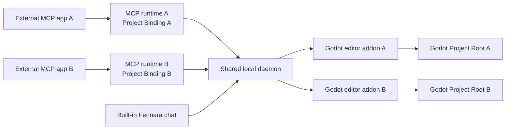

<!-- fennara-i18n: locale=fr source=docs/architecture.md sha256=1bc08d075d4b48d0c781f954d4da4752d6c7223ff1636f01f06524b06dce256a -->
<a id="architecture"></a>
# Architecture

<!-- fennara-doc-nav:start -->
[English](../../architecture.md) · [简体中文](../zh-CN/architecture.md) · [Español](../es/architecture.md) · [Português do Brasil](../pt-BR/architecture.md) · [日本語](../ja/architecture.md) · [한국어](../ko/architecture.md) · [Русский](../ru/architecture.md) · **Français** · [Deutsch](../de/architecture.md) · [Türkçe](../tr/architecture.md)

> ℹ️ Traduction rédigée par une IA à partir de la source anglaise. La relecture par des locuteurs natifs est la bienvenue. [Source anglaise](../../architecture.md)
<!-- fennara-doc-nav:end -->

Fennara est un pont local entre les clients IA et un projet ouvert dans l'éditeur
Godot. Cette page explique les responsabilités, les limites des processus, la
disposition de l'installation et le comportement de transmission des mises à jour.

| Si vous devez... | Commencez ici |
| --- | --- |
| Trouver les sources d'un composant | [Plan du dépôt](repo-map.md) |
| Installer ou mettre à jour Fennara | [Installation](setup.md) |
| Comprendre les ressources publiées | [Processus de publication](release.md) |
| Examiner les outils disponibles pour le modèle | [Outils](tools.md) |

Il n'existe aucun service cloud Fennara dans le parcours OSS normal. Chaque
connexion MCP externe démarre un processus MCP local, qui communique avec un
daemon partagé par utilisateur. Le chat intégré communique directement avec ce
daemon. Le daemon atteint les addons Fennara dans les éditeurs Godot ouverts.



<a id="main-pieces"></a>
## Composants principaux

| Composant | Emplacement | Rôle |
| --- | --- | --- |
| CLI | `local/crates/fennara-cli/` | Installe l'addon dans un projet Godot, met à jour les paquets locaux, écrit les instructions du projet et configure les applications MCP au moyen de `fennara mcp-setup`. |
| Lanceur MCP | `local/crates/fennara-mcp/` | Exécutable stable appelé par les applications MCP. Il trouve la version active et démarre l'environnement d'exécution. |
| Environnement MCP | `local/crates/fennara-mcp/` | Communique en MCP sur stdio, fige une liaison de projet facultative au démarrage et transmet les appels d'outil au pont local. |
| Lanceur du daemon | `local/crates/fennara-daemon/` | Exécutable stable utilisé pour démarrer l'environnement actif du daemon. |
| Environnement du daemon | `local/crates/fennara-daemon/` | Conserve l'état local partagé, dirige les connexions MCP vers les éditeurs correspondants, possède l'emplacement d'exécution à l'échelle de la machine, se coordonne avec Godot et héberge les routes du chat intégré. |
| Identité du projet | `local/crates/fennara-project-identity/` | Résout, valide, canonicalise et compare les racines de projet Godot pour l'environnement MCP et le daemon. |
| Sources de l'interface de chat | `ui/chat/` | HTML, CSS et JavaScript pour le chat intégré, les réglages, la configuration des fournisseurs, la configuration des applications MCP et l'interface de mise à jour. Ces fichiers sont synchronisés dans l'addon empaqueté sous `godot_demo/addons/fennara/dist/`. |
| Addon Godot | `godot_demo/addons/fennara/` | Charge utile de l'addon copiée dans les projets des utilisateurs. |
| Sources des auxiliaires d'exécution | `runtime/` | Scripts auxiliaires côté Godot synchronisés dans la charge utile de l'addon pour les sessions et les scripts d'exécution. |
| GDExtension | `fennara-cpp/` | Outils tournés vers Godot, interface du dock, diagnostics, validation, capture à l'exécution et intégration à l'éditeur. |
| Schémas d'outils | `local/schemas/tools/` | Contrats partagés des outils destinés au modèle. L'environnement MCP et le chat intégré sélectionnent chacun les schémas qu'ils exposent. |

<a id="native-update-handoff"></a>
## Transmission de la mise à jour native

L'interface de chat demande la préparation de la mise à jour par l'intermédiaire
du daemon et du pont Godot associé. Le composant natif `UpdateCoordinator` lance
la CLI installée, suit l'état durable de l'opération et affiche la progression
sans dépendre de la webview après le début de la préparation.

Les fichiers vérifiés de l'addon sont mis en attente sous
`.godot/fennara-update/<operation-id>/`. Après une confirmation explicite, une
CLI détachée attend la disparition du PID et de l'heure de démarrage précis de
Godot. Elle vérifie de nouveau un condensat couvrant l'intégralité de l'addon
mis en attente, crée un instantané des deux lanceurs partagés et du manifeste
d'exécution, déplace l'addon actif vers `previous-addon`, déplace l'addon en
attente vers `addons/fennara`, puis rouvre le même projet dans l'éditeur. La
GDExtension rouverte écrit une confirmation d'activation. La CLI supprime la
sauvegarde uniquement après la persistance du reçu de réussite, de la confirmation
et de l'état sain correspondant du daemon. Sinon, le reçu reste dans l'état
`recovery_required` et l'annulation restaure l'addon précédent, les lanceurs et
le manifeste d'exécution. Si une interruption empêche temporairement le chargement
de l'addon, la CLI installée reste hors de l'addon du projet et fournit
`fennara recover --project <path>` comme point d'entrée d'urgence unique pour
récupérer l'addon.

<a id="in-editor-chat-webview"></a>
## Webview du chat intégré à l'éditeur

Le dock de chat facultatif est hébergé par la couche d'interface de la GDExtension.
Le contrat d'hôte partagé distingue trois types de surface de navigateur :

| Parcours de plateforme | Comportement |
| --- | --- |
| Windows | Enfant ou superposition WebView2 natif attaché à la fenêtre de l'éditeur Godot, masqué lorsque des fenêtres contextuelles Godot, des fenêtres intégrées, des couches de canevas ou des contrôles de premier plan qui le recouvrent sont visibles. |
| macOS | WKWebView native attachée à la fenêtre de l'éditeur Godot, avec le même masquage en cas de recouvrement par l'interface Godot que sous Windows. |
| Linux | Rendu CEF hors écran dans un `TextureRect` interne de Godot, avec un environnement CEF partagé provenant des données d'application de Fennara. |

Les utilisateurs peuvent aussi demander dans Chat Settings que le chat intégré
s'ouvre dans leur navigateur système la prochaine fois. Dans ce mode, le dock
Godot affiche un panneau de secours **Open chat** et sert la même interface de
chat depuis le daemon local sur `127.0.0.1`, avec le `chat_token` de l'éditeur
propriétaire. Seule la surface d'affichage change. Les réglages du fournisseur,
l'historique du chat, la portée du projet, les instantanés, l'exécution des outils
et le routage MCP externe suivent les mêmes parcours dans le daemon.

`fennara install`, `fennara update` et `fennara doctor` indiquent les prérequis
de webview pour la plateforme actuelle. Windows avertit lorsque Microsoft Edge
WebView2 Runtime manque, macOS signale l'état de WebKit.framework du système et
Linux valide l'environnement CEF partagé géré par la version publiée. Ces
vérifications concernent uniquement le dock de chat intégré facultatif. Les
outils MCP continuent de fonctionner sans webview native.

Sous Linux, le navigateur rend ses pixels dans un `Control` Godot et fait passer
la boucle de messages CEF par le hook de processus du dock. La GDExtension découvre
l'environnement CEF partagé, valide son marqueur `fennara-cef-runtime.json` et
ses fichiers requis, ouvre dynamiquement `libcef.so`, puis charge par dlopen la
petite bibliothèque d'addon `libfennara_linux_cef_bridge.so` au moyen d'un
chargeur de pont spécialisé. Ce pont est compilé à partir des sources officielles
épinglées de `libcef_dll_wrapper` pour CEF 139. Il possède les objets C++ de CEF
(`CefClient`, `CefRenderHandler`, `CefRefPtr`) employés pour initialiser CEF en
mode sans fenêtre, créer le navigateur pour l'URL du chat empaqueté et copier
les tampons de dessin dans une texture Godot. La prise en charge complète de
l'IME, du presse-papiers et du curseur fait l'objet de travaux ultérieurs distincts.
L'environnement CEF est volontairement séparé du fichier ZIP de l'addon Godot.
Les installations Linux utilisent un emplacement d'exécution partagé dans les
données d'application, où la CLI installe une seule fois par utilisateur la
ressource CEF gérée par la version publiée.

Plusieurs éditeurs Godot peuvent être ouverts simultanément. Chaque websocket
du chat intégré est accepté avec le `chat_token` de l'éditeur propriétaire et
reste lié à cette session Godot pour la portée du stockage du chat, les instantanés,
l'exécution des outils, l'annulation et la restauration. Un processus MCP externe
lié à un projet est dirigé vers l'éditeur qui correspond à sa racine de projet
canonique. Seul un processus non lié utilise la cible de compatibilité sélectionnée
dans le dock et globale au daemon. Pour le moment, les réglages
des fournisseurs de chat sont globaux, tandis que les chats restent limités au
projet. Les fournisseurs de chat cloud utilisent des clés API conservées localement.
Les fournisseurs locaux utilisent des URL de base conservées par le daemon.
L'ensemble actuel de fournisseurs du chat intégré comprend OpenAI, Anthropic,
OpenRouter, Ollama Cloud, DeepSeek, Z.AI, Moonshot AI, Kimi For Coding, MiniMax,
Ollama local et LM Studio. Ollama utilise `http://127.0.0.1:11434` par défaut.
LM Studio utilise `http://127.0.0.1:1234/v1` par défaut. L'environnement de chat
du daemon résout les modèles sélectionnés au moyen d'un petit catalogue de
fournisseurs avant d'émettre les requêtes. Les références canoniques de modèle
utilisent `provider/model`. OpenRouter constitue la principale exception visible
par les utilisateurs, car les slugs de modèle OpenRouter contiennent souvent
déjà un segment de fournisseur. Préférez `openrouter/google/example` dans Fennara.
Si un utilisateur colle un slug OpenRouter brut comme `google/example`, le
daemon continue de le diriger vers OpenRouter par compatibilité. Les références
natives `openai/...` et `anthropic/...` utilisent les fournisseurs officiels.
Utilisez `openrouter/openai/...` ou `openrouter/anthropic/...` pour passer par
OpenRouter avec ces fournisseurs. Les fournisseurs partagent autant que possible
des adaptateurs de chat compatibles OpenAI ou Anthropic. Leurs particularités
sont isolées dans des modules de fournisseur, avec des événements de flux et
d'erreur normalisés au-dessus de la limite de l'adaptateur.

Les tours du chat intégré écrivent également une trace de diagnostic uniquement
locale dans la même base de données de données d'application `chat.sqlite`, dans
`chat_trace_events`, séparément des tables de transcription. Les lignes de trace
utilisent des identifiants stables de tour, de génération, d'outil et de pont,
ainsi que des durées, des états, des nombres et des résumés bornés. Les prompts
bruts et les résultats d'outil complets ne sont pas capturés par défaut. Le daemon
expose un petit point d'accès local de lecture de débogage sur `/chat/traces`, qui
permet de filtrer selon `chat_id`, `trace_id`, `turn_id` ou `generation_id`.

<a id="anonymous-telemetry"></a>
## Télémétrie anonyme

Après la connexion d'un véritable éditeur Godot, le daemon peut mettre en file
un événement anonyme d'installation active par jour UTC. La file bornée et le
worker HTTP en arrière-plan sont distincts de l'exécution des outils, de la
génération du chat et du pont Godot. La télémétrie ne peut donc ni retarder ni
faire échouer une opération utilisateur.

Le daemon conserve un UUID d'installation aléatoire et le dernier jour UTC
accepté sous `Fennara/telemetry/state.json`. L'événement contient uniquement
cet UUID, les versions de Fennara et la version numérique de Godot, la plateforme
et l'architecture du processeur. Le destinataire `fennara.io` valide la charge
utile exacte et convertit l'UUID en HMAC côté serveur avant de transmettre à
PostHog un événement sans profil de personne.

La préférence enregistrée dans Chat Settings est activée par défaut. L'interface
peut la désactiver, et `FENNARA_DISABLE_TELEMETRY` ou `DO_NOT_TRACK` peut imposer
une substitution par l'environnement. La désactivation supprime l'état local
de télémétrie. Consultez [Télémétrie anonyme](telemetry.md) pour le contrat
complet de confidentialité.

<a id="install-layout"></a>
## Disposition de l'installation

Dans le parcours où l'addon publié est copié manuellement, la GDExtension présente
d'abord un panneau d'installation natif lorsque l'installation locale précise
manque. Son pont d'amorçage télécharge avec le client HTTP de Godot le manifeste
de la version de l'addon et l'archive de la CLI, vérifie le SHA-256 déclaré et
place uniquement la CLI dans les données d'application de Fennara. Il lance
ensuite `fennara install` et lit l'état durable de l'opération pour afficher la
progression et les diagnostics. Le chat et la webview restent inactifs jusqu'à
la réussite de l'installation et la connexion du daemon correspondant. Le pont
local ne démarre pas un ancien daemon des données d'application et ne s'y connecte
pas tant que l'installation est requise. Un changement de version exige que le
daemon partagé ne signale aucun projet Godot connecté. Le projet en cours
d'installation reste déconnecté tant que son addon et les composants installés
diffèrent. Après cette vérification préalable, le programme d'installation arrête
l'ancien daemon inactif avant d'activer les composants correspondants. Si une
connexion est signalée, l'installation existante reste inchangée afin que
l'utilisateur puisse fermer l'éditeur connecté et réessayer.

Sous macOS, la documentation destinée aux utilisateurs recommande l'installation
par la CLI. L'amorçage intégré à l'éditeur peut seulement s'exécuter après le
chargement de la bibliothèque native GDExtension. Il ne peut donc pas résoudre
un blocage de Gatekeeper causé par le téléchargement et l'extraction manuels du
fichier ZIP d'addon non notarié. Les utilisateurs dont l'addon copié manuellement
est bloqué doivent le supprimer avant d'exécuter `fennara install`, car la CLI
préserve un addon complet existant.

Un verrou d'amorçage partagé dans les données d'application sérialise le
téléchargement et l'activation de la CLI entre les éditeurs Godot concurrents.
La propriété du verrou est transférée au processus du programme d'installation
lancé. Un autre éditeur attend donc la fin de ce processus précis. Le panneau
génère un identifiant d'opération, le transmet à la CLI et lit uniquement le
fichier d'état de cette opération. Si le processus enfant se termine avec un
état non terminal, le panneau signale un échec stable au lieu d'attendre indéfiniment.

Les scripts d'installation du terminal restent le parcours non interactif et de récupération.

Le script d'installation installe la petite CLI externe et l'ajoute à `PATH`.
Ensuite, les versions modernes peuvent mettre à jour la CLI installée avec
`fennara update` ou `fennara self-update`. Réexécutez le script d'installation
uniquement lorsque la mise à jour automatique de la CLI n'est pas disponible
pour la version ou l'emplacement d'installation sélectionné.

Après cela, `fennara install` ou `fennara update` récupère le manifeste de
version, vérifie les hachages des ressources référencées, télécharge les ressources
publiées et configure la disposition du paquet local.

```text
Fennara/
  bin/
    fennara
    fennara-mcp
    fennara-daemon
  daemon-control-token
  current.json
  telemetry/
    state.json
  versions/
    <version>/
      fennara-mcp-runtime
      fennara-daemon-runtime
      addon/
        addons/
          fennara/
  webview/
    cef/
      linux-x64/
        <cef-version>/
```

Sous Windows, les exécutables utilisent l'extension `.exe`.

Le daemon crée `daemon-control-token` avec des octets aléatoires sûrs à son
premier démarrage. Les routes HTTP locales privilégiées et le websocket du pont
Godot exigent ce jeton dans l'en-tête `X-Fennara-Control-Token`. L'environnement
MCP et l'addon Godot lisent le jeton dans le même répertoire de données d'application
Fennara propre à l'utilisateur. Avant d'envoyer le jeton, chaque client envoie
un nonce aléatoire au point d'accès public de défi du contrôle et exige une
preuve HMAC-SHA256 valide. Cela empêche un autre processus qui possède le port
fixe de récupérer le jeton réutilisable. Les ressources statiques du chat et le
point d'accès minimal d'état restent publics sur l'interface loopback. Les
requêtes websocket et média du chat du projet continuent d'utiliser le jeton
de chat distinct de l'éditeur propriétaire.

Le répertoire `webview/cef/...` contient les charges utiles du moteur de navigateur
en lecture seule partagées par chaque projet et éditeur Godot de cette installation
Fennara. Les données modifiables de profil, de cache et de journal CEF propres à
chaque processus doivent rester hors de cette charge utile partagée, sous
`cache/webview/profiles/cef/godot-<pid>-<timestamp>-<nonce>/` et
`logs/webview/cef/godot-<pid>-<timestamp>-<nonce>/`.

Emplacements par défaut selon la plateforme :

| Système d'exploitation | Répertoire de base |
| --- | --- |
| Windows | `%LOCALAPPDATA%\Fennara` |
| macOS | `~/Library/Application Support/Fennara` |
| Linux | `~/.local/share/fennara` |

<a id="project-layout"></a>
## Disposition du projet

Lorsqu'un utilisateur exécute la commande suivante dans un projet Godot :

```bash
fennara install
```

la CLI copie l'addon de la version publiée selon cette disposition lorsqu'aucun
addon complet n'est déjà présent :

```text
<godot-project>/
  AGENTS.md
  addons/
    fennara/
      ai/
        guidelines.md
        index.md
        operations.md
        runtime-observation.md
        visual-observation.md
        clients/
          cursor.md
```

Lorsqu'un addon complet est déjà présent, la CLI valide son fichier `VERSION`
et la bibliothèque de l'éditeur pour la plateforme actuelle, installe le paquet
local correspondant exactement et laisse le répertoire de l'addon inchangé. Le
daemon partagé est démarré uniquement s'il n'est pas déjà actif. L'installation
réussit seulement après que sa réponse d'état signale la version de l'addon.

Une fois l'analyse du système de fichiers de l'éditeur Godot terminée, l'addon
démarre immédiatement un worker qui lui appartient et prépare la prise en charge
de C#. Le worker exécute une compilation incrémentale isolée sans bloquer le
thread principal de Godot. Les workers d'outils C# attendent la même barrière
de préparation. Le daemon transporte uniquement les appels d'outil et ne possède
pas le processus de compilation. Toutes les compilations C# appartenant au plugin
partagent un coordinateur unique, car les compilations de diagnostic et d'exécution
réutilisent l'arbre MSBuild intermédiaire de Godot.

Les diagnostics `.cs` ciblés ne sont pas pris en charge. Les diagnostics C# du
projet entier utilisent une seule commande `dotnet build` annulable avec le
logger de compilation structuré de Godot. Les assemblages finaux sont redirigés
vers une sortie de diagnostic isolée propre au projet afin que l'éditeur ouvert
ne les recharge pas. Si les sources C# changent pendant la compilation initiale
en arrière-plan, cette compilation se termine normalement et la prochaine
analyse explicite du projet effectue une actualisation forcée unique. La
vérification préalable d'une session d'exécution utilise une compilation Debug
explicite du fichier `.csproj` racine, reproduit la forme de la compilation de
prélecture de Godot et écrit le véritable assemblage
`.godot/mono/temp/bin/Debug` avant le lancement.

<a id="mcp-setup"></a>
## Configuration MCP

`fennara mcp-setup` modifie la configuration d'une application MCP afin que
celle-ci puisse démarrer le lanceur local. L'entrée générée est globale et
neutre vis-à-vis du projet : exécuter la configuration depuis un projet Godot
ne lie pas tous les futurs processus MCP à ce projet.

Exemples :

```bash
fennara mcp-setup --claude
fennara mcp-setup --codex
fennara mcp-setup --cursor
fennara mcp-setup --gemini
```

La configuration pointe vers le lanceur stable `fennara-mcp` dans le répertoire
`bin` de Fennara. Le lanceur lit `current.json`, puis démarre l'environnement
versionné correspondant.

Les configurations des applications MCP restent ainsi stables après les mises à jour.

Pour isoler des dépôts ou des arbres de travail, l'hôte MCP démarre un processus
et une connexion par projet. L'environnement capture son répertoire de démarrage
et fige une liaison de projet MCP pendant toute la durée de vie du processus. La
découverte de la liaison utilise d'abord l'option explicite `--project-path`,
puis `FENNARA_PROJECT_PATH`, puis le plus proche ancêtre du répertoire de
démarrage contenant `project.godot`. Si la découverte automatique ne trouve
aucun projet, l'environnement passe en mode de compatibilité non lié. Une
liaison explicite non valide fait échouer le démarrage au lieu d'activer une
solution de repli.

Le crate partagé `fennara-project-identity` canonicalise et valide les racines
pour MCP comme pour le daemon. MCP envoie sa racine canonique comme métadonnée
de transport, en dehors des arguments d'outil destinés au modèle. Le daemon
résout à nouveau ce localisateur et les racines signalées par les éditeurs, puis
exige exactement une correspondance active dans le système de fichiers.
L'absence d'éditeur peut faire l'objet d'une nouvelle tentative, une
correspondance en double est ambiguë, et aucun de ces cas ne se replie sur la
cible du dock. Consultez [Plusieurs agents et arbres de
travail](multi-agent-worktrees.md).

Ce parcours de configuration est distinct de celui du fournisseur du chat intégré.
Les applications MCP utilisent leur propre compte de modèle. Le dock Fennara
utilise le fournisseur configuré dans les réglages du chat.

<a id="tool-call-flow"></a>
## Flux d'un appel d'outil

```text
MCP client
  calls a Fennara tool
MCP runtime
  validates the request against local schemas
  attaches its process-scoped Project Binding as transport metadata
  forwards the call to the local daemon
Daemon runtime
  resolves the binding and routes to exactly one matching Godot editor
Godot addon
  runs the Godot-aware tool through GDExtension
  returns a concise markdown result
MCP runtime
  sends the result back to the MCP client
```

Les appels internes du chat intégré transportent déjà une session d'éditeur
Godot explicite. Un processus MCP externe dépourvu de liaison de projet utilise
à la place la cible MCP héritée : d'abord la cible valide sélectionnée dans le
dock, puis l'unique éditeur connecté. Une sélection liée ne lit ni ne modifie
jamais cette cible globale au daemon.

Le client MCP peut lire et écrire lui-même les fichiers ordinaires. Les outils
Fennara se concentrent sur les informations propres à Godot : structure des
scènes, propriétés des nœuds, diagnostics, validation, état d'exécution, captures
d'écran et modifications qui tiennent compte de l'éditeur.

Les appels d'outil du chat intégré ajoutent une barrière d'autorisation appartenant
au daemon avant la transmission à Godot. Le mode d'approbation des réglages du
chat est `ask` ou `full_access`. Les outils en lecture seule sont immédiatement
autorisés. Les outils de modification du projet et d'exécution attendent une
approbation dans l'interface en mode `ask` et s'exécutent automatiquement en mode
`full_access`. Les contrôles de sécurité stricts à l'intérieur des outils Godot,
comme le blocage des chemins internes de l'addon, s'appliquent dans les deux modes.

<a id="updates"></a>
## Mises à jour

`fennara update` est la commande normale de mise à jour d'un projet. Elle lit
l'identité de publication de l'addon installé, résout le pointeur Latest Release
de GitHub ou le canal de prépublication isolé de cet addon, puis fige le résultat
sur une version précise. Elle vérifie d'abord la version de la ressource CLI de
la plateforme dans le manifeste de cette version publiée. Si celle-ci est plus
récente, elle met la CLI en attente, laisse l'ancien processus se terminer,
remplace la CLI installée et reprend avec la même cible. Elle utilise ensuite le
même résolveur et programme d'installation pilotés par le manifeste que
`fennara install`.

La découverte native des prépublications met en cache pendant cinq minutes les
pointeurs de canal validés dans les données d'application partagées de Fennara
et les revalide avec les ETags de GitHub. Un canal absent est considéré comme
l'absence de mise à jour de prépublication. Des données mal formées ou provenant
d'un autre canal entraînent un échec fermé et ne remplacent jamais une entrée
de cache valide.

La commande peut mettre à jour :

- la CLI installée et le paquet d'exécution local
- l'addon du projet
- les instructions de projet générées dans `AGENTS.md` et `addons/fennara/ai/`
- les ressources d'exécution partagées de la webview exigées par la plateforme actuelle, comme CEF sous Linux
- les avertissements sur les prérequis de webview du dock de chat intégré facultatif

Elle ne réécrit pas la configuration des applications MCP. Réexécutez
`fennara mcp-setup` uniquement pour ajouter un nouveau client MCP, réparer la
configuration de ce client ou modifier l'intégration de l'application MCP cible.

Si une application MCP exécute actuellement un lanceur, la mise à jour peut
conserver ce lanceur et continuer. Le paquet d'exécution versionné est quand même
mis à jour, et les prochains démarrages utilisent la version de `current.json`.
Utilisez `fennara update --no-self-update` uniquement lorsque vous ignorez
volontairement la vérification de la CLI externe.

L'activation partagée prend en charge une seule version active de Fennara à la
fois. Le daemon refuse son arrêt pour une mise à jour tant qu'un autre projet
Godot est connecté. Cela empêche un changement de version sous un autre éditeur.
Les paquets des versions précises, l'ancien `current.json`, les instantanés des
lanceurs et l'ancien addon du projet sont conservés jusqu'à ce que l'éditeur
rouvert valide la nouvelle GDExtension.

Le daemon possède un emplacement d'exécution unique à l'échelle de la machine
pour l'ensemble des éditeurs connectés. Une demande de démarrage revendique
atomiquement l'état `Starting` avant la création du processus, puis valide cette
revendication dans l'état `Running`. Un appelant concurrent reçoit un résultat
`busy` anonyme qui n'est pas une erreur et ne lance jamais un second jeu. Il
n'existe aucune file FIFO.

Chaque session d'exécution appartient à sa racine de projet canonique, et non à
un processus d'éditeur transitoire. Seul ce propriétaire peut consulter l'état
détaillé, renouveler la session, exécuter des scripts ou l'arrêter. Les autres
projets voient un état d'occupation anonyme et ne peuvent pas confirmer
l'identifiant d'une autre session. La propriété survit donc à la reconnexion
d'un éditeur.

Le bail d'exécution absolu par défaut dure 900 secondes et les appelants peuvent
demander une valeur positive de `max_run_seconds` allant jusqu'à 86 400 secondes.
L'état demandé par le propriétaire et ses opérations bornées renouvellent un
délai d'inactivité de 120 secondes. Les agents interrogent normalement l'état
environ toutes les 30 secondes, avec une gigue. L'échéance absolue n'est jamais
suspendue. Un superviseur arrête ou récolte le processus et libère l'emplacement
d'exécution après une fin naturelle, un arrêt explicite, un échec du démarrage,
l'expiration pour inactivité ou l'expiration absolue.

<a id="export-boundary"></a>
## Limite d'exportation

Fennara n'est actif que dans l'éditeur. Son plugin d'exportation retire
temporairement l'autoload `_fennara_game_capture` avant que Godot sérialise les
paramètres du projet exporté, ignore tous les fichiers sous
`res://addons/fennara/` et `res://.fennara/`, puis retire temporairement son
entrée du registre GDExtension généré par Godot. Il restaure l'autoload et le
registre d'origine à la fin de l'exportation. Il ne réécrit pas
`export_presets.cfg` ou `project.godot` et n'y enregistre aucune modification.

Cette limite entre en vigueur après l'ouverture du projet par Godot. Une copie
de travail CI qui omet `addons/fennara/` doit exécuter
`fennara prepare-export` ou installer l'addon avant de lancer Godot. Un plugin
d'exportation ne peut pas réparer la cible manquante d'un autoload avant la
validation effectuée au démarrage du projet.

<a id="release-assets"></a>
## Ressources des versions publiées

Chaque version publique publie des ressources distinctes pour conserver la modularité des installations :

| Ressource | Objectif |
| --- | --- |
| `fennara-cli-<platform>-<arch>-v<version>.zip` | CLI et lanceurs stables. |
| `fennara-release-local-<platform>-<arch>-v<version>.zip` | Environnements MCP et daemon versionnés sélectionnés par le manifeste de version. |
| `fennara-release-addon-v<version>.zip` / `fennara-addon-latest.zip` | Charge utile de l'addon Godot pour toutes les plateformes, avec tous les binaires GDExtension compilés et référencés par `fennara.gdextension`. |
| `fennara-webview-cef-linux-x64-<cef-version>.zip` | Environnement CEF partagé réservé à Linux et installé une seule fois dans les données d'application de Fennara. |
| `fennara-release-manifest-v<version>.json` | Plan d'installation et de mise à jour avec version de schéma, noms des ressources, hachages, version minimale de la CLI et déclarations des environnements partagés. |

Les utilisateurs ordinaires installent la version numérotée précise actuellement
désignée comme Latest par GitHub. Fennara ne crée ni ne déplace une étiquette ou
une version littérale `latest`. Les anciennes versions numérotées restent
disponibles pour le verrouillage et le débogage.

Les charges utiles CEF sous Linux ne font pas partie de `fennara-addon-*`. Elles
sont sélectionnées par le manifeste de version et installées une seule fois dans
le répertoire partagé `webview/cef/linux-x64/<cef-version>/` des données d'application.

Les installations de l'environnement CEF sont mises en attente dans un répertoire
temporaire voisin, valident les fichiers requis et le marqueur d'exécution, puis
publient le répertoire de version terminé et mettent à jour `current.json` de
façon atomique. Les processus d'éditeur existants continuent d'utiliser
l'environnement déjà chargé.

<a id="design-rules"></a>
## Règles de conception

- Garder les outils primitifs et indépendants de tout jeu.
- Laisser les agents inspecter le projet avant de formuler des hypothèses.
- Préférer les informations de l'API Godot aux suppositions fondées uniquement sur les fichiers.
- Renvoyer des résultats Markdown concis qu'un client MCP peut utiliser directement.
- Garder les lanceurs stables et déplacer le code changeant dans des environnements versionnés.
- Garder le parcours MCP externe local. Le dock de chat intégré facultatif utilise des réglages de fournisseur locaux conservés par l'intermédiaire du daemon, comme les clés API des fournisseurs cloud et les URL de base d'Ollama ou de LM Studio local.
