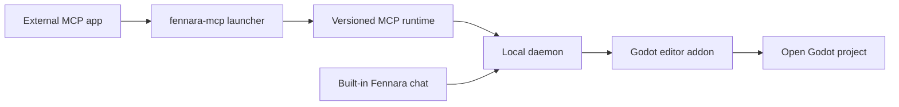

<!-- fennara-i18n: locale=ja source=docs/architecture.md sha256=a69c3ec12609497a2960983409062e9483a85dc1f4eb10a49343d5e568c0a7db -->
<a id="architecture"></a>
# アーキテクチャ

<!-- fennara-doc-nav:start -->
[English](../../architecture.md) · [简体中文](../zh-CN/architecture.md) · [Español](../es/architecture.md) · [Português do Brasil](../pt-BR/architecture.md) · **日本語** · [한국어](../ko/architecture.md) · [Русский](../ru/architecture.md) · [Français](../fr/architecture.md) · [Deutsch](../de/architecture.md) · [Türkçe](../tr/architecture.md)

> ℹ️ 英語の原文を基に AI が執筆した翻訳です。ネイティブスピーカーによるレビューを歓迎します。 [英語の原文](../../architecture.md)
<!-- fennara-doc-nav:end -->

Fennara は、AI クライアントと、開かれている Godot エディタープロジェクトをつなぐローカルブリッジです。
このページでは、所有範囲、プロセス境界、インストール構成、更新の引き継ぎ動作について説明します。

| 必要なこと | 最初に読むページ |
| --- | --- |
| コンポーネントのソースを探す | [リポジトリマップ](repo-map.md) |
| Fennara をインストールまたは更新する | [セットアップ](setup.md) |
| リリース成果物を理解する | [リリース手順](release.md) |
| 利用可能なモデル用ツールを確認する | [ツール](tools.md) |

通常の OSS 経路には Fennara のクラウドサービスはありません。外部 MCP アプリがローカル MCP プロセスを起動し、そのプロセスがデーモンと通信します。内蔵チャットはデーモンと直接通信します。デーモンは、開いている Godot エディター内の Fennara アドオンに接続します。



<a id="main-pieces"></a>
## 主な構成要素

| 要素 | 場所 | 役割 |
| --- | --- | --- |
| CLI | `local/crates/fennara-cli/` | アドオンを Godot プロジェクトへインストールし、ローカルパッケージを更新し、プロジェクトガイダンスを書き込み、`fennara mcp-setup` を通して MCP アプリを設定します。 |
| MCP ランチャー | `local/crates/fennara-mcp/` | MCP アプリが呼び出す安定した実行ファイルです。有効なバージョンを探してランタイムを起動します。 |
| MCP ランタイム | `local/crates/fennara-mcp/` | stdio 経由で MCP を使用し、ツール呼び出しをローカルブリッジへ転送します。 |
| デーモンランチャー | `local/crates/fennara-daemon/` | 有効なデーモンランタイムを起動するための安定した実行ファイルです。 |
| デーモンランタイム | `local/crates/fennara-daemon/` | ローカル状態を保持し、Godot と連携し、MCP ランタイムにサービスを提供し、内蔵チャット用ルートをホストします。 |
| チャット UI ソース | `ui/chat/` | 内蔵チャット、設定、プロバイダー設定、MCP アプリ設定、更新 UI のための HTML、CSS、JavaScript です。パッケージ済みアドオン内の `godot_demo/addons/fennara/dist/` へ同期されます。 |
| Godot アドオン | `godot_demo/addons/fennara/` | ユーザーのプロジェクトへコピーされるアドオンのペイロードです。 |
| ランタイムヘルパーソース | `runtime/` | ランタイムセッションおよびランタイムスクリプト向けにアドオンのペイロードへ同期される、Godot 側のランタイムヘルパースクリプトです。 |
| GDExtension | `fennara-cpp/` | Godot 向けツール、ドック UI、診断、検証、ランタイムキャプチャ、エディター統合です。 |
| ツールスキーマ | `local/schemas/tools/` | モデル向けに共有されるツール契約です。MCP ランタイムと内蔵チャットは、それぞれ公開するスキーマを選択します。 |

<a id="native-update-handoff"></a>
## ネイティブ更新の引き継ぎ

チャット UI は、デーモンおよび紐付けられた Godot ブリッジを通して更新準備を要求します。ネイティブの `UpdateCoordinator` がインストール済み CLI を起動し、永続化された操作状態を追跡します。そのため、準備開始後は webview に依存せずに進捗を表示できます。

検証済みのアドオンファイルは `.godot/fennara-update/<operation-id>/` の下へステージングされます。明示的な確認の後、デタッチされた CLI は、正確な Godot の PID と開始時刻を持つプロセスが消えるまで待ちます。ステージング済みアドオン全体を対象とするダイジェストを再確認し、共有ランチャーの両方とランタイムマニフェストのスナップショットを作り、有効なアドオンを `previous-addon` へ、ステージング済みアドオンを `addons/fennara` へ移動し、同じエディタープロジェクトを再度開きます。
再度開かれた GDExtension がアクティベーションハンドシェイクを書き込みます。CLI がバックアップを削除するのは、成功レシート、ハンドシェイク、一致するデーモンの正常性がすべて永続化された後だけです。それ以外の場合、レシートは `recovery_required` のままとなり、ロールバックによって以前のアドオン、ランチャー、ランタイムマニフェストが復元されます。中断によってアドオンが一時的に読み込めなくなっても、インストール済み CLI はプロジェクトのアドオン外に残り、単一アドオン用の緊急復旧エントリーポイントとして `fennara recover --project <path>` を提供します。

<a id="in-editor-chat-webview"></a>
## エディター内チャット webview

任意で利用できるチャットドックは、GDExtension の UI レイヤーによってホストされます。共有ホスト契約は、ブラウザー表示面を次の 2 つの形式に分けています。

| プラットフォーム経路 | 動作 |
| --- | --- |
| Windows | Godot エディターウィンドウに接続されたネイティブ WebView2 の子ウィンドウまたはオーバーレイです。重なっている Godot のポップアップ、埋め込みウィンドウ、CanvasLayer、またはトップレベルコントロールが表示されている間は非表示になります。 |
| macOS | Godot エディターウィンドウに接続されたネイティブ WKWebView で、Windows と同じ重なった Godot UI の非表示処理を使用します。 |
| Linux | Fennara のアプリデータにある共有 CEF ランタイムを使用し、Godot 内部の `TextureRect` へオフスクリーンレンダリングします。 |

ユーザーはチャット設定で、次回から内蔵チャットをシステムブラウザーで開くようにも設定できます。このモードでは Godot ドックに **Open chat** フォールバックパネルが表示され、所有元エディターの `chat_token` を使って、`127.0.0.1` のローカルデーモンから同じチャット UI が配信されます。変わるのは表示面だけです。プロバイダー設定、チャット履歴、プロジェクトスコープ、スナップショット、ツール実行、外部 MCP のルーティングは、引き続き同じデーモン経路を使用します。

`fennara install`、`fennara update`、`fennara doctor` は、現在のプラットフォームに必要な webview の前提条件を報告します。Windows では Microsoft Edge WebView2 Runtime がない場合に警告し、macOS ではシステムの WebKit.framework の状態を報告し、Linux ではリリースによって管理される共有 CEF ランタイムを検証します。これらの確認が影響するのは任意の内蔵チャットドックだけです。ネイティブ webview がなくても MCP ツールは引き続き動作します。

Linux 経路はブラウザーのピクセルを Godot の `Control` 内に描画し、CEF メッセージループをドックのプロセスフックを通して実行します。GDExtension は共有 CEF ランタイムを検出し、その `fennara-cef-runtime.json` マーカーと必須ファイルを検証し、`libcef.so` を動的に開きます。その後、小さな `libfennara_linux_cef_bridge.so` アドオンライブラリを、限定された責務を持つブリッジローダーを通して dlopen します。このブリッジは、固定された公式 CEF 139 の `libcef_dll_wrapper` ソースからビルドされ、ウィンドウレスモードで CEF を初期化し、パッケージ済みチャット URL 用のブラウザーを作成し、描画バッファーを Godot テクスチャへコピーするための C++ CEF オブジェクト（`CefClient`、`CefRenderHandler`、`CefRefPtr`）を所有します。完全な IME、クリップボード、カーソル処理は、別の後続作業です。CEF ランタイムは意図的に Godot アドオン ZIP から分離されています。Linux のインストールでは共有アプリデータ内のランタイム位置を使用し、CLI がリリース管理された CEF アセットをユーザーごとに一度だけそこへインストールします。

複数の Godot エディターを同時に開くことができます。埋め込みチャットの各 websocket は、所有元エディターの `chat_token` を使用して受け入れられ、チャット保存のスコープ、スナップショット、ツール実行、キャンセル、復元について、その Godot セッションに紐付けられたままになります。外部 MCP クライアントは、引き続きデーモンのアクティブターゲットへルーティングされます。現在、チャットのプロバイダー設定はグローバルですが、チャットはプロジェクト単位です。クラウドチャットプロバイダーはローカルに保存した API キーを使用し、ローカルプロバイダーはデーモンに保存されたベース URL を使用します。現在の内蔵チャットで利用できるプロバイダーは、OpenAI、Anthropic、OpenRouter、Ollama Cloud、DeepSeek、Z.AI、Moonshot AI、Kimi For Coding、MiniMax、ローカル Ollama、LM Studio です。Ollama の既定値は `http://127.0.0.1:11434`、LM Studio の既定値は `http://127.0.0.1:1234/v1` です。
デーモンのチャットランタイムは、リクエストを行う前に小さなプロバイダーカタログを通して選択されたモデルを解決します。正規のモデル参照は `provider/model` を使用します。
ユーザーが主に気づく例外は OpenRouter です。OpenRouter のモデルスラッグは、すでにプロバイダー部分を含むことが多いためです。Fennara では `openrouter/google/example` を推奨します。ユーザーが `google/example` のような生の OpenRouter スラッグを貼り付けた場合も、互換性のためデーモンは引き続き OpenRouter へルーティングします。ネイティブの `openai/...` と `anthropic/...` 参照は公式プロバイダーを使用します。それらのベンダーを OpenRouter 経由で使用する場合は、`openrouter/openai/...` または `openrouter/anthropic/...` を使用してください。可能な場合、プロバイダーは OpenAI 互換または Anthropic 互換のチャットアダプターを共有します。プロバイダー固有の挙動はプロバイダーモジュール内に隔離され、ストリームとエラーのイベントはアダプター境界より上で正規化されます。

内蔵チャットのターンは、同じアプリデータ内の `chat.sqlite` データベースにある `chat_trace_events` へ、トランスクリプト用テーブルとは別に、ローカル限定の診断トレースも書き込みます。トレース行には、安定したターン、生成、ツール、ブリッジの各 ID に加え、タイミング、ステータス、件数、上限付きの要約が含まれます。生のプロンプトと完全なツール結果は既定では取得されません。デーモンは小さなローカルデバッグ用読み取りエンドポイントを `/chat/traces` で公開し、`chat_id`、`trace_id`、`turn_id`、`generation_id` による絞り込みを提供します。

<a id="anonymous-telemetry"></a>
## 匿名テレメトリー

実際の Godot エディター接続後、デーモンは UTC 日ごとに 1 件の匿名アクティブインストールイベントをキューへ追加できます。上限付きキューとバックグラウンド HTTP ワーカーは、ツール実行、チャット生成、Godot ブリッジから分離されています。そのため、テレメトリーがユーザー操作を遅延させたり失敗させたりすることはありません。

デーモンは、ランダムなインストール UUID を 1 つと、最後に受け入れた UTC 日を `Fennara/telemetry/state.json` の下に永続化します。イベントに含まれるのは、その UUID、Fennara と数値形式の Godot のバージョン、プラットフォーム、CPU アーキテクチャだけです。`fennara.io` の受信側は正確なペイロードを検証し、UUID をサーバー側 HMAC に変換してから、個人に紐付かないイベントを PostHog へ転送します。

チャット設定に保存される設定値は既定で有効です。UI から無効化でき、`FENNARA_DISABLE_TELEMETRY` または `DO_NOT_TRACK` で環境変数による上書きを強制できます。無効化するとローカルのテレメトリー状態が削除されます。完全なプライバシー契約については、[匿名テレメトリー](telemetry.md)を参照してください。

<a id="install-layout"></a>
## インストール構成

リリースアドオンを手動コピーする経路では、正確に一致するローカルインストールがないと、GDExtension が最初にネイティブのセットアップパネルを表示します。ブートストラップブリッジは Godot の HTTP クライアントを使用して、アドオンバージョンのリリースマニフェストと CLI アーカイブをダウンロードし、宣言された SHA-256 を検証し、CLI だけを Fennara のアプリデータへ配置します。その後、`fennara install` を起動し、永続化された操作状態を読み取って進捗と診断を表示します。セットアップが成功して一致するデーモンが接続するまで、チャットと webview は無効のままです。セットアップが必要な間、ローカルブリッジは古いアプリデータデーモンを起動も接続もしません。バージョンを切り替えるには、共有デーモンが接続中の Godot プロジェクト数を 0 と報告する必要があります。セットアップ中のプロジェクトは、そのアドオンとインストール済みコンポーネントが異なる間、接続されないままです。その事前確認後、インストーラーは一致するコンポーネントを有効化する前に、アイドル状態の古いデーモンを停止します。接続が報告された場合、既存インストールは変更されません。ユーザーは接続中のエディターを閉じてから再試行できます。

macOS では、ユーザー向けドキュメントは CLI 経由のインストールを推奨します。エディター内ブートストラップを実行できるのは GDExtension ネイティブライブラリが読み込まれた後だけです。そのため、非公証のアドオン ZIP を手動でダウンロードして展開したことで発生する Gatekeeper のブロックは解消できません。手動コピーしたアドオンがブロックされているユーザーは、`fennara install` の実行前にそのアドオンを削除する必要があります。CLI は完全な既存アドオンを保持するためです。

共有アプリデータのブートストラップロックが、並行して動く Godot エディター間で CLI のダウンロードと有効化を直列化します。ロックの所有権は起動されたインストーラープロセスへ移されるため、別のエディターはその正確なプロセスが終了するまで待ちます。パネルは操作 ID を生成し、それを CLI に渡し、その操作専用の状態ファイルだけを読み取ります。子プロセスが非終了状態のまま終了した場合、パネルは際限なく待つのではなく、安定した失敗を報告します。

ターミナル用インストールスクリプトは、引き続き非対話経路および復旧経路として使用できます。

インストールスクリプトは小さな外側の CLI をインストールし、`PATH` に追加します。その後、現代のリリースでは、インストール済み CLI を `fennara update` または `fennara self-update` で更新できます。選択したリリースまたはインストール先で CLI の自己更新を利用できない場合にだけ、インストールスクリプトを再実行してください。

その後、`fennara install` または `fennara update` がリリースマニフェストを取得し、参照されるアセットのハッシュを検証し、リリースアセットをダウンロードして、ローカルパッケージ構成をセットアップします。

```text
Fennara/
  bin/
    fennara
    fennara-mcp
    fennara-daemon
  daemon-control-token
  current.json
  telemetry/
    state.json
  versions/
    <version>/
      fennara-mcp-runtime
      fennara-daemon-runtime
      addon/
        addons/
          fennara/
  webview/
    cef/
      linux-x64/
        <cef-version>/
```

Windows では、実行ファイルに `.exe` が付きます。

デーモンは初回起動時に、安全なランダムバイトを使用して `daemon-control-token` を作成します。権限を要するローカル HTTP ルートと Godot ブリッジ websocket では、`X-Fennara-Control-Token` ヘッダーを通してこのトークンが必要です。MCP ランタイムと Godot アドオンは、ユーザー単位の同じ Fennara アプリデータディレクトリからトークンを読み取ります。トークンを送る前に、各クライアントは公開コントロールチャレンジエンドポイントへランダムな nonce を送り、有効な HMAC-SHA256 証明を要求します。これにより、固定ポートを所有する別プロセスが再利用可能なトークンを収集することを防ぎます。静的チャットアセットと最小限の正常性エンドポイントは、ループバック上で引き続き公開されます。プロジェクトチャットの websocket とメディアリクエストは、引き続き所有元エディターごとに分離されたプロジェクトチャットトークンを使用します。

`webview/cef/...` ディレクトリには、対象 Fennara インストールを使うすべての Godot プロジェクトとエディターで共有される、読み取り専用のブラウザーエンジンペイロードが置かれます。プロセスごとに書き込み可能な CEF プロファイル、キャッシュ、ログのデータは、その共有ランタイムペイロードの外にある `cache/webview/profiles/cef/godot-<pid>-<timestamp>-<nonce>/` および `logs/webview/cef/godot-<pid>-<timestamp>-<nonce>/` の下へ置く必要があります。

プラットフォームごとの既定の場所は次のとおりです。

| OS | ベースディレクトリ |
| --- | --- |
| Windows | `%LOCALAPPDATA%\Fennara` |
| macOS | `~/Library/Application Support/Fennara` |
| Linux | `~/.local/share/fennara` |

<a id="project-layout"></a>
## プロジェクト構成

ユーザーが Godot プロジェクト内で次を実行すると、

```bash
fennara install
```

完全なアドオンがまだ存在しない場合、CLI はリリースアドオンを次の構成へコピーします。

```text
<godot-project>/
  AGENTS.md
  addons/
    fennara/
      ai/
        guidelines.md
        index.md
        operations.md
        runtime-observation.md
        visual-observation.md
        clients/
          cursor.md
```

完全なアドオンがすでに存在する場合、CLI はその `VERSION` と現在のプラットフォーム用エディターライブラリを検証し、正確に一致するローカルパッケージをインストールし、アドオンディレクトリは変更しません。共有デーモンはまだ実行されていない場合にだけ起動されます。インストールが成功するのは、その正常性レスポンスがアドオンのバージョンを報告した場合だけです。

Godot のエディターファイルシステムスキャンが完了すると、アドオンは直ちにプラグイン所有のワーカーを起動し、C# サポートを準備します。このワーカーは Godot のメインスレッドをブロックせずに、独立した増分ビルドを 1 回実行します。C# ツールワーカーは同じ準備バリアを待ちます。デーモンはツール呼び出しを運ぶだけで、ビルドプロセスを所有しません。診断ビルドとランタイムビルドは Godot の中間 MSBuild ツリーを再利用するため、プラグインが所有するすべての C# ビルドは 1 つのコーディネーターを共有します。

対象を絞った `.cs` 診断はサポートされません。C# プロジェクト全体の診断には、Godot の構造化ビルドロガーを使うキャンセル可能な `dotnet build` を 1 回使用します。その最終アセンブリはプロジェクトごとの独立した診断出力へリダイレクトされるため、開いているエディターはそれらを再読み込みしません。最初のバックグラウンドビルド中に C# ソースが変更された場合、そのビルドは通常どおり完了し、次の明示的なプロジェクトスキャンが強制更新を 1 回実行します。ランタイムセッションの事前確認では、ルートの `.csproj` を対象とする明示的な Debug ビルドを使用します。これは Godot の Play 前ビルドの形に一致し、起動前に実際の `.godot/mono/temp/bin/Debug` アセンブリを書き込みます。

<a id="mcp-setup"></a>
## MCP のセットアップ

`fennara mcp-setup` は、MCP アプリがローカルランチャーを起動できるように MCP アプリの設定を編集します。

例:

```bash
fennara mcp-setup --claude
fennara mcp-setup --codex
fennara mcp-setup --cursor
fennara mcp-setup --gemini
```

設定は Fennara の `bin` ディレクトリにある安定した `fennara-mcp` ランチャーを指します。ランチャーは `current.json` を読み取り、一致するバージョン管理されたランタイムを起動します。

これにより、更新をまたいでも MCP アプリの設定は安定したままです。

このセットアップ経路は、内蔵チャットのプロバイダー経路とは別です。MCP アプリはそれぞれ自身のモデルアカウントを使用します。Fennara ドックはチャット設定で設定されたプロバイダーを使用します。

<a id="tool-call-flow"></a>
## ツール呼び出しの流れ

```text
MCP client
  calls a Fennara tool
MCP runtime
  validates the request against local schemas
  forwards the call to the local daemon
Daemon runtime
  routes the request to the connected Godot project
Godot addon
  runs the Godot-aware tool through GDExtension
  returns a concise markdown result
MCP runtime
  sends the result back to the MCP client
```

MCP クライアントは通常のファイルを自身で読み書きできます。Fennara のツールは Godot 固有のフィードバックに集中します。具体的には、シーン構造、ノードプロパティ、診断、検証、ランタイム状態、スクリーンショット、エディターを認識した編集です。

内蔵チャットのツール呼び出しでは、Godot へ転送する前に、デーモンが所有する許可ゲートを 1 つ追加します。チャット設定の承認モードは `ask` または `full_access` です。読み取り専用ツールは直ちに許可されます。プロジェクトを変更するツールとランタイムを実行するツールは、`ask` モードでは UI の承認を待ち、`full_access` モードでは自動実行されます。内部アドオンパスのブロックなど、Godot ツール内の厳格な安全確認は、どちらのモードでも引き続き適用されます。

<a id="updates"></a>
## 更新

`fennara update` は通常のプロジェクト更新コマンドです。インストール済みアドオンのリリース識別情報を読み取り、GitHub の Latest Release ポインターまたはそのアドオン専用のステージングチャンネルを解決し、結果を 1 つの正確なバージョンに固定します。
最初に、そのリリースマニフェストにあるプラットフォーム別 CLI アセットのバージョンを確認します。それが新しい場合、CLI をステージングし、古いプロセスを終了させ、インストール済み CLI を置き換え、同じターゲットで処理を再開します。その後、`fennara install` と同じマニフェスト駆動のリゾルバーおよびインストーラーを使用します。

ネイティブのステージング検出は、共有 Fennara アプリデータ内で検証済みチャンネルポインターを 5 分間キャッシュし、GitHub ETag を使用して再検証します。チャンネルがない場合はステージング更新なしとして扱います。不正なデータまたはチャンネルをまたぐデータの場合は安全側に失敗し、有効なキャッシュエントリーを置き換えることはありません。

更新できるものは次のとおりです。

- インストール済み CLI とローカルランタイムパッケージ
- プロジェクトのアドオン
- `AGENTS.md` および `addons/fennara/ai/` 内の生成済みプロジェクトガイダンス
- Linux CEF など、現在のプラットフォームに必要な共有 webview ランタイムアセット
- 任意の内蔵チャットドックに関する webview 前提条件の警告

MCP アプリの設定は書き換えません。`fennara mcp-setup` を再実行するのは、新しい MCP クライアントを追加するとき、そのクライアントの設定を修復するとき、または MCP の対象アプリ統合自体を変更するときだけです。

MCP アプリが現在ランチャーを実行中でも、更新時にそのランチャーを維持して続行できる場合があります。バージョン管理されたランタイムパッケージは更新され、以降の起動は `current.json` のバージョンを使用します。外側の CLI の確認を意図的に省略する場合にだけ、`fennara update --no-self-update` を使用してください。

共有アクティベーションでは、同時に 1 つの Fennara バージョンだけを有効にできます。デーモンは、ほかの Godot プロジェクトが 1 つでも接続中の場合、更新のためのシャットダウンを拒否します。これにより、別のエディターの下でバージョンが切り替わることを防ぎます。正確なバージョンのパッケージ、以前の `current.json`、ランチャーのスナップショット、以前のプロジェクトアドオンは、再度開かれたエディターが新しい GDExtension を検証するまで保持されます。

現在、デーモンは接続中のすべての Godot エディターを通して、管理対象の `runtime_session` シーンをグローバルに 1 つだけ許可します。開始要求は選択中またはチャットに紐付けられた Godot プロジェクト内で実行されますが、別の管理対象シーンが実行中の場合、新しいシーンを開始する前に停止する必要があります。

<a id="export-boundary"></a>
## エクスポートの境界

Fennara が有効なのはエディター内だけです。エクスポートプラグインは、Godot がエクスポート対象のプロジェクト設定をシリアライズする前に `_fennara_game_capture` autoload を一時的に除去し、`res://addons/fennara/` と `res://.fennara/` の下にあるすべてのファイルを除外し、Godot が生成した GDExtension レジストリから自身のエントリーを一時的に除去します。エクスポートが終わると、元の autoload とレジストリを復元します。`export_presets.cfg` や `project.godot` を書き換えたり、変更を永続化したりすることはありません。

この境界が機能し始めるのは、Godot がプロジェクトを開いた後です。CI のチェックアウトに `addons/fennara/` が含まれない場合は、Godot を起動する前に `fennara prepare-export` を実行するか、アドオンをインストールする必要があります。エクスポートプラグインは、プロジェクト起動時の検証より前に、存在しない autoload の参照先を修復できません。

<a id="release-assets"></a>
## リリースアセット

各公開リリースは、インストールをモジュール化したままにできるよう、個別のアセットを公開します。

| アセット | 用途 |
| --- | --- |
| `fennara-cli-<platform>-<arch>-v<version>.zip` | CLI と安定したランチャーです。 |
| `fennara-release-local-<platform>-<arch>-v<version>.zip` | リリースマニフェストによって選択される、バージョン管理された MCP およびデーモンランタイムです。 |
| `fennara-release-addon-v<version>.zip` / `fennara-addon-latest.zip` | `fennara.gdextension` が参照する、ビルド済みのすべての GDExtension バイナリを含む全プラットフォーム向け Godot アドオンペイロードです。 |
| `fennara-webview-cef-linux-x64-<cef-version>.zip` | Fennara アプリデータへ一度だけインストールされる、Linux 専用の共有 CEF ランタイムです。 |
| `fennara-release-manifest-v<version>.json` | アセット名、ハッシュ、最低 CLI バージョン、共有ランタイム宣言を含む、スキーマでバージョン管理されたインストールおよび更新計画です。 |

通常のユーザーは、現在 GitHub Latest として指定されている正確なバージョンのリリースからインストールします。Fennara は、文字どおりの `latest` タグまたはリリースを作成も移動もしません。古いバージョン管理済みリリースは、固定利用およびデバッグのため引き続き利用できます。

Linux CEF ランタイムのペイロードは `fennara-addon-*` に含まれません。リリースマニフェストによって選択され、共有アプリデータの `webview/cef/linux-x64/<cef-version>/` ディレクトリへ一度だけインストールされます。

CEF ランタイムのインストールでは、一時的な兄弟ディレクトリへステージングし、必須ファイルとランタイムマーカーを検証してから、完成したバージョンディレクトリを公開し、`current.json` をアトミックに更新します。既存のエディタープロセスは、すでに読み込み済みのランタイムを使い続けます。

<a id="design-rules"></a>
## 設計原則

- ツールはプリミティブかつゲーム非依存に保ちます。
- エージェントが仮定する前に、プロジェクトを調査できるようにします。
- ファイルだけから推測するより、Godot API からのフィードバックを優先します。
- MCP クライアントが直接使用できる簡潔な Markdown 結果を返します。
- ランチャーは安定させ、変化するコードはバージョン管理されたランタイムへ移します。
- 外部 MCP 経路はローカルに保ちます。任意の内蔵チャットドックは、クラウドプロバイダーの API キーやローカル Ollama または LM Studio のベース URL など、デーモンを通して保存されたローカルプロバイダー設定を使用します。
