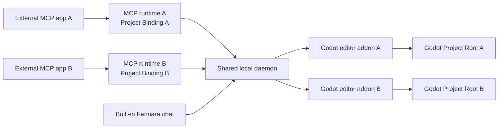

<!-- fennara-i18n: locale=ko source=docs/architecture.md sha256=1bc08d075d4b48d0c781f954d4da4752d6c7223ff1636f01f06524b06dce256a -->
<a id="architecture"></a>
# 아키텍처

<!-- fennara-doc-nav:start -->
[English](../../architecture.md) · [简体中文](../zh-CN/architecture.md) · [Español](../es/architecture.md) · [Português do Brasil](../pt-BR/architecture.md) · [日本語](../ja/architecture.md) · **한국어** · [Русский](../ru/architecture.md) · [Français](../fr/architecture.md) · [Deutsch](../de/architecture.md) · [Türkçe](../tr/architecture.md)

> ℹ️ 영문 원본을 바탕으로 AI가 작성한 번역입니다. 원어민 검토를 환영합니다. [영문 원본](../../architecture.md)
<!-- fennara-doc-nav:end -->

Fennara는 AI 클라이언트와 열려 있는 Godot 에디터 프로젝트를 연결하는 로컬 브리지입니다. 이 페이지에서는 소유권, 프로세스 경계, 설치 구조, 업데이트 인계 동작을 설명합니다.

| 필요한 작업 | 시작할 문서 |
| --- | --- |
| 구성 요소의 소스 찾기 | [저장소 지도](repo-map.md) |
| Fennara 설치 또는 업데이트 | [설정](setup.md) |
| 릴리스 아티팩트 이해 | [릴리스 절차](release.md) |
| 사용 가능한 모델 도구 검사 | [도구](tools.md) |

일반 OSS 경로에는 Fennara 클라우드 서비스가 없습니다. 각 외부 MCP 연결은 로컬 MCP
프로세스 하나를 시작하고, 이 프로세스는 사용자별 공유 데몬 하나와 통신합니다.
내장 채팅은 데몬과 직접 통신합니다. 데몬은 열려 있는 Godot 에디터들의 Fennara
애드온에 연결됩니다.



<a id="main-pieces"></a>
## 주요 구성 요소

| 구성 요소 | 위치 | 역할 |
| --- | --- | --- |
| CLI | `local/crates/fennara-cli/` | 애드온을 Godot 프로젝트에 설치하고 로컬 패키지를 업데이트하며 프로젝트 지침을 작성하고 `fennara mcp-setup`으로 MCP 앱을 구성합니다. |
| MCP 런처 | `local/crates/fennara-mcp/` | MCP 앱이 호출하는 안정적인 실행 파일입니다. 활성 버전을 찾아 런타임을 시작합니다. |
| MCP 런타임 | `local/crates/fennara-mcp/` | stdio로 MCP를 처리하고, 시작할 때 선택적 Project Binding 하나를 고정한 뒤 도구 호출을 로컬 브리지로 전달합니다. |
| 데몬 런처 | `local/crates/fennara-daemon/` | 활성 데몬 런타임을 시작하는 데 사용하는 안정적인 실행 파일입니다. |
| 데몬 런타임 | `local/crates/fennara-daemon/` | 공유 로컬 상태를 유지하고, MCP 연결을 일치하는 에디터로 라우팅하며, 시스템 전역 Runtime Slot을 소유하고, Godot과 조정하며 내장 채팅 경로를 호스팅합니다. |
| 프로젝트 식별 | `local/crates/fennara-project-identity/` | MCP 런타임과 데몬이 사용할 Godot Project Root를 해석하고, 검증하고, 정규화하고, 비교합니다. |
| 채팅 UI 소스 | `ui/chat/` | 내장 채팅, 설정, 제공업체 설정, MCP 앱 설정, 업데이트 UI용 HTML, CSS, JavaScript입니다. `godot_demo/addons/fennara/dist/` 아래의 패키징된 애드온으로 동기화됩니다. |
| Godot 애드온 | `godot_demo/addons/fennara/` | 사용자 프로젝트에 복사되는 애드온 페이로드입니다. |
| 런타임 헬퍼 소스 | `runtime/` | 런타임 세션과 런타임 스크립트를 위해 애드온 페이로드에 동기화되는 Godot 측 런타임 헬퍼 스크립트입니다. |
| GDExtension | `fennara-cpp/` | Godot 대상 도구, 독 UI, 진단, 검증, 런타임 캡처, 에디터 통합을 담당합니다. |
| 도구 스키마 | `local/schemas/tools/` | 공유 모델 대상 도구 계약입니다. MCP 런타임과 내장 채팅이 각각 노출할 스키마를 선택합니다. |

<a id="native-update-handoff"></a>
## 네이티브 업데이트 인계

채팅 UI는 데몬과 연결된 Godot 브리지를 통해 업데이트 준비를 요청합니다. 네이티브 `UpdateCoordinator`는 설치된 CLI를 시작하고 내구성 있는 작업 상태를 따라가며 준비가 시작된 뒤 웹뷰에 의존하지 않고 진행 상황을 표시합니다.

검증된 애드온 파일은 `.godot/fennara-update/<operation-id>/` 아래에 스테이징됩니다. 명시적인 확인 뒤 분리된 CLI가 정확한 Godot PID와 시작 시간이 사라질 때까지 기다립니다. 스테이징된 애드온 전체를 포함하는 다이제스트를 다시 검사하고, 두 공유 런처와 런타임 매니페스트를 스냅샷하며, 활성 애드온을 `previous-addon`으로 옮기고, 스테이징된 애드온을 `addons/fennara`로 옮긴 다음 같은 에디터 프로젝트를 다시 엽니다. 다시 열린 GDExtension은 활성화 핸드셰이크를 작성합니다. CLI는 성공 영수증, 핸드셰이크, 일치하는 데몬 상태가 내구성 있게 기록된 뒤에만 백업을 삭제합니다. 그렇지 않으면 영수증은 `recovery_required`로 남고 롤백이 이전 애드온, 런처, 런타임 매니페스트를 복원합니다. 중단으로 인해 애드온을 일시적으로 불러올 수 없더라도 설치된 CLI는 프로젝트 애드온 밖에 남아 `fennara recover --project <path>`를 단일 애드온 긴급 복구 진입점으로 제공합니다.

<a id="in-editor-chat-webview"></a>
## 에디터 내 채팅 웹뷰

선택 사항인 채팅 독은 GDExtension UI 계층이 호스팅합니다. 공유 호스트 계약은 두 가지 브라우저 화면 형식을 분리합니다.

| 플랫폼 경로 | 동작 |
| --- | --- |
| Windows | Godot 에디터 창에 연결된 네이티브 WebView2 자식 또는 오버레이로, 겹치는 Godot 팝업, 임베디드 창, CanvasLayer 또는 최상위 컨트롤이 표시되는 동안 숨겨집니다. |
| macOS | Godot 에디터 창에 연결된 네이티브 WKWebView로, Windows와 동일한 겹치는 Godot UI 숨김 처리를 사용합니다. |
| Linux | Fennara 앱 데이터의 공유 CEF 런타임을 사용해 내부 Godot `TextureRect`에 CEF 오프스크린 렌더링. |

사용자는 다음 실행부터 내장 채팅을 시스템 브라우저에서 열도록 Chat Settings를 설정할 수도 있습니다. 이 모드에서 Godot 독은 **Open chat** 대체 패널을 표시하고 소유 에디터의 `chat_token`을 사용하여 `127.0.0.1`의 로컬 데몬에서 같은 채팅 UI를 제공합니다. 표시 화면만 바뀌며 제공업체 설정, 채팅 기록, 프로젝트 범위, 스냅샷, 도구 실행, 외부 MCP 라우팅은 같은 데몬 경로를 유지합니다.

`fennara install`, `fennara update`, `fennara doctor`는 현재 플랫폼의 웹뷰 필수 구성 요소를 보고합니다. Windows는 Microsoft Edge WebView2 Runtime이 없으면 경고하고, macOS는 시스템 WebKit.framework 상태를 보고하며, Linux는 릴리스가 관리하는 공유 CEF 런타임을 검증합니다. 이 검사는 선택 사항인 내장 채팅 독에만 영향을 주며 네이티브 웹뷰 없이도 MCP 도구는 계속 작동합니다.

Linux 경로는 Godot `Control` 안에 브라우저 픽셀을 렌더링하고 독 프로세스 훅을 통해 CEF 메시지 루프를 라우팅합니다. GDExtension은 공유 CEF 런타임을 찾고 `fennara-cef-runtime.json` 마커와 필수 파일을 검증하며 `libcef.so`를 동적으로 연 다음 집중된 브리지 로더를 통해 작은 `libfennara_linux_cef_bridge.so` 애드온 라이브러리를 dlopen합니다. 해당 브리지는 고정된 공식 CEF 139 `libcef_dll_wrapper` 소스에서 빌드되며, 창 없는 모드에서 CEF를 초기화하고 패키징된 채팅 URL용 브라우저를 만들며 페인트 버퍼를 Godot 텍스처로 복사하는 C++ CEF 객체(`CefClient`, `CefRenderHandler`, `CefRefPtr`)를 소유합니다. 전체 IME, 클립보드, 커서 처리는 별도 후속 작업입니다. CEF 런타임은 의도적으로 Godot 애드온 ZIP과 분리됩니다. Linux 설치는 사용자별 공유 앱 데이터 런타임 위치를 사용하며 CLI가 릴리스 관리 CEF 자산을 그곳에 한 번 설치합니다.

Godot 에디터를 여러 개 동시에 열 수 있습니다. 각 임베디드 채팅 웹소켓은 소유 에디터의 `chat_token`으로 수락되고 채팅 저장 범위, 스냅샷, 도구 실행, 취소, 되돌리기에서 해당 Godot 세션에 계속 연결됩니다. 프로젝트에 바인딩된 외부 MCP 프로세스는 정규 Project Root가 일치하는 에디터로 라우팅됩니다. 바인딩되지 않은 프로세스만 데몬의 독 선택 호환 대상을 사용합니다. 현재 채팅 제공업체 설정은 전역이지만 채팅은 프로젝트 범위로 유지됩니다. 클라우드 채팅 제공업체는 로컬에 저장된 API 키를 사용하고 로컬 제공업체는 데몬이 저장한 기본 URL을 사용합니다. 현재 내장 채팅 제공업체 집합은 OpenAI, Anthropic, OpenRouter, Ollama Cloud, DeepSeek, Z.AI, Moonshot AI, Kimi For Coding, MiniMax, 로컬 Ollama, LM Studio입니다. Ollama 기본값은 `http://127.0.0.1:11434`, LM Studio 기본값은 `http://127.0.0.1:1234/v1`입니다. 데몬 채팅 런타임은 요청 전에 작은 제공업체 카탈로그를 통해 선택한 모델을 해석합니다. 정식 모델 참조는 `provider/model` 형식을 사용합니다. 사용자가 눈치채는 주요 예외는 OpenRouter입니다. OpenRouter 모델 슬러그 자체에 이미 제공업체 구간이 들어 있기 때문입니다. Fennara에서는 `openrouter/google/example`을 권장합니다. 사용자가 `google/example` 같은 원시 OpenRouter 슬러그를 붙여 넣어도 호환성을 위해 데몬이 계속 OpenRouter로 라우팅합니다. 네이티브 `openai/...` 및 `anthropic/...` 참조는 공식 제공업체를 사용합니다. OpenRouter를 통해 해당 업체를 사용하려면 `openrouter/openai/...` 또는 `openrouter/anthropic/...`을 사용하세요. 가능한 경우 제공업체는 OpenAI 호환 또는 Anthropic 호환 채팅 어댑터를 공유하고, 제공업체별 특이 사항은 제공업체 모듈에 격리하며 어댑터 경계 위에서는 스트림 및 오류 이벤트를 정규화합니다.

내장 채팅 턴은 대화 기록 테이블과 분리된 `chat_trace_events`에 있는 같은 `chat.sqlite` 앱 데이터 데이터베이스에 로컬 전용 진단 추적도 작성합니다. 추적 행은 안정적인 턴, 생성, 도구, 브리지 ID와 함께 타이밍, 상태, 개수, 제한된 요약을 사용합니다. 원시 프롬프트와 전체 도구 결과는 기본적으로 캡처하지 않습니다. 데몬은 `chat_id`, `trace_id`, `turn_id`, `generation_id`로 필터링하는 작은 로컬 디버그 읽기 엔드포인트 `/chat/traces`를 제공합니다.

<a id="anonymous-telemetry"></a>
## 익명 텔레메트리

실제 Godot 에디터가 연결된 뒤 데몬은 UTC 기준 하루에 한 번 익명 활성 설치 이벤트를 큐에 넣을 수 있습니다. 제한된 큐와 백그라운드 HTTP 작업자는 도구 실행, 채팅 생성, Godot 브리지와 분리되어 있어 텔레메트리가 사용자 작업을 지연시키거나 실패시킬 수 없습니다.

데몬은 `Fennara/telemetry/state.json` 아래에 무작위 설치 UUID 하나와 마지막으로 승인된 UTC 날짜를 저장합니다. 이벤트에는 해당 UUID, Fennara 및 숫자형 Godot 버전, 플랫폼, CPU 아키텍처만 포함됩니다. `fennara.io` 수신기는 정확한 페이로드를 검증하고 UUID를 서버 측 HMAC로 변환한 뒤 개인 프로필 없는 이벤트를 PostHog로 전달합니다.

저장된 Chat Settings 기본 설정은 기본적으로 활성화됩니다. UI에서 비활성화할 수 있으며 `FENNARA_DISABLE_TELEMETRY` 또는 `DO_NOT_TRACK`으로 환경 변수 재정의를 강제할 수 있습니다. 비활성화하면 로컬 텔레메트리 상태가 삭제됩니다. 전체 개인정보 보호 계약은 [익명 텔레메트리](telemetry.md)를 참고하세요.

<a id="install-layout"></a>
## 설치 구조

직접 복사한 릴리스 애드온 흐름에서는 정확한 로컬 설치가 없을 때 GDExtension이 먼저 네이티브 설정 패널을 표시합니다. 부트스트랩 브리지는 Godot HTTP 클라이언트로 애드온 버전의 릴리스 매니페스트와 CLI 아카이브를 내려받고 선언된 SHA-256을 검증한 뒤 Fennara 앱 데이터에 CLI만 배치합니다. 그런 다음 `fennara install`을 시작하고 내구성 있는 작업 상태를 읽어 진행 상황과 진단을 표시합니다. 설정이 성공하고 일치하는 데몬이 연결되기 전까지 채팅과 웹뷰는 비활성 상태입니다. 설정이 필요한 동안 로컬 브리지는 이전 앱 데이터 데몬을 시작하거나 연결하지 않습니다. 버전 전환에는 공유 데몬이 연결된 Godot 프로젝트가 없다고 보고해야 합니다. 설정 중인 프로젝트는 애드온과 설치 구성 요소가 다른 동안 연결되지 않은 상태로 유지됩니다. 사전 검사가 끝나면 설치 프로그램은 일치하는 구성 요소를 활성화하기 전에 유휴 상태인 이전 데몬을 중지합니다. 연결이 보고되면 사용자가 연결된 에디터를 닫고 다시 시도할 수 있도록 기존 설치를 바꾸지 않습니다.

macOS에서는 사용자 대상 문서가 CLI 설치를 권장합니다. 에디터 내 부트스트랩은 GDExtension 네이티브 라이브러리가 로드된 뒤에만 실행할 수 있으므로, 공증되지 않은 애드온 ZIP을 직접 내려받아 압축 해제하여 발생한 Gatekeeper 차단을 해결할 수 없습니다. CLI는 완전한 기존 애드온을 보존하므로 직접 복사한 애드온이 차단된 사용자는 `fennara install` 전에 해당 애드온을 제거해야 합니다.

공유 앱 데이터 부트스트랩 잠금은 여러 Godot 에디터의 동시 CLI 다운로드와 활성화를 직렬화합니다. 잠금 소유권은 시작된 설치 프로그램 프로세스로 이전되므로 다른 에디터는 그 정확한 프로세스가 끝날 때까지 기다립니다. 패널은 작업 ID를 생성하고 CLI에 전달하며 해당 작업의 상태 파일만 읽습니다. 자식 프로세스가 끝났지만 상태가 종료 상태가 아니면 패널은 무한정 기다리지 않고 안정적인 실패를 보고합니다.

터미널 설치 스크립트는 비대화형 및 복구 경로로 유지됩니다.

설치 스크립트는 작은 외부 CLI를 설치하고 `PATH`에 추가합니다. 그 뒤 최신 릴리스는 `fennara update` 또는 `fennara self-update`를 통해 설치된 CLI를 업데이트할 수 있습니다. 선택한 릴리스나 설치 위치에서 CLI 자체 업데이트를 사용할 수 없는 경우에만 설치 스크립트를 다시 실행하세요.

그다음 `fennara install` 또는 `fennara update`는 릴리스 매니페스트를 가져오고 참조된 자산 해시를 검증하며 릴리스 자산을 내려받고 로컬 패키지 구조를 설정합니다.

```text
Fennara/
  bin/
    fennara
    fennara-mcp
    fennara-daemon
  daemon-control-token
  current.json
  telemetry/
    state.json
  versions/
    <version>/
      fennara-mcp-runtime
      fennara-daemon-runtime
      addon/
        addons/
          fennara/
  webview/
    cef/
      linux-x64/
        <cef-version>/
```

Windows에서 실행 파일은 `.exe`를 사용합니다.

데몬은 처음 시작할 때 안전한 무작위 바이트로 `daemon-control-token`을 만듭니다. 권한 있는 로컬 HTTP 경로와 Godot 브리지 웹소켓은 `X-Fennara-Control-Token` 헤더를 통해 이 토큰을 요구합니다. MCP 런타임과 Godot 애드온은 같은 사용자별 Fennara 앱 데이터 디렉터리에서 토큰을 읽습니다. 각 클라이언트는 토큰을 보내기 전에 공개 제어 챌린지 엔드포인트에 무작위 nonce를 보내고 유효한 HMAC-SHA256 증명을 요구합니다. 이를 통해 고정 포트를 소유한 다른 프로세스가 재사용 가능한 토큰을 수집하지 못하게 합니다. 정적 채팅 자산과 최소 상태 엔드포인트는 루프백에서 계속 공개됩니다. 프로젝트 채팅 웹소켓과 미디어 요청은 소유 에디터의 별도 프로젝트 채팅 토큰을 계속 사용합니다.

`webview/cef/...` 디렉터리는 해당 Fennara 설치를 사용하는 모든 Godot 프로젝트와 에디터가 공유하는 읽기 전용 브라우저 엔진 페이로드용입니다. 프로세스별 쓰기 가능 CEF 프로필, 캐시, 로그 데이터는 공유 런타임 페이로드 밖의 `cache/webview/profiles/cef/godot-<pid>-<timestamp>-<nonce>/` 및 `logs/webview/cef/godot-<pid>-<timestamp>-<nonce>/` 아래에 있어야 합니다.

기본 플랫폼 위치:

| OS | 기본 디렉터리 |
| --- | --- |
| Windows | `%LOCALAPPDATA%\Fennara` |
| macOS | `~/Library/Application Support/Fennara` |
| Linux | `~/.local/share/fennara` |

<a id="project-layout"></a>
## 프로젝트 구조

사용자가 Godot 프로젝트 안에서 다음을 실행하면:

```bash
fennara install
```

완전한 애드온이 아직 없을 때 CLI가 릴리스 애드온을 다음 구조로 복사합니다.

```text
<godot-project>/
  AGENTS.md
  addons/
    fennara/
      ai/
        guidelines.md
        index.md
        operations.md
        runtime-observation.md
        visual-observation.md
        clients/
          cursor.md
```

완전한 애드온이 이미 있으면 CLI가 해당 `VERSION`과 현재 플랫폼 에디터 라이브러리를 검증하고 정확히 일치하는 로컬 패키지를 설치하며 애드온 디렉터리를 바꾸지 않습니다. 공유 데몬은 아직 실행 중이지 않을 때만 시작하며, 데몬 상태 응답이 애드온 버전을 보고한 뒤에만 설치가 성공합니다.

Godot 에디터 파일 시스템 검사가 끝나면 애드온이 즉시 플러그인 소유 작업자를 시작해 C# 지원을 준비합니다. 작업자는 Godot 메인 스레드를 차단하지 않고 격리된 증분 빌드 하나를 실행합니다. C# 도구 작업자는 같은 준비 장벽을 기다립니다. 데몬은 도구 호출만 전송하며 빌드 프로세스를 소유하지 않습니다. 진단 빌드와 런타임 빌드가 Godot의 중간 MSBuild 트리를 재사용하므로 모든 플러그인 소유 C# 빌드는 하나의 조정자를 공유합니다.

대상 지정 `.cs` 진단은 지원하지 않습니다. 전체 프로젝트 C# 진단은 Godot의 구조화된 빌드 로거와 함께 취소 가능한 `dotnet build` 하나를 사용합니다. 최종 어셈블리는 에디터가 다시 불러오지 않도록 프로젝트별 격리 진단 출력으로 리디렉션됩니다. 초기 백그라운드 빌드가 실행 중인 동안 C# 소스가 바뀌면 해당 빌드는 정상적으로 끝나고 다음 명시적 프로젝트 검사가 강제 새로 고침을 한 번 수행합니다. 런타임 세션 사전 검사는 명시적인 루트 `.csproj` Debug 빌드를 사용하여 Godot의 Play 전 빌드 형태와 일치시키고 시작 전에 실제 `.godot/mono/temp/bin/Debug` 어셈블리를 작성합니다.

<a id="mcp-setup"></a>
## MCP 설정

`fennara mcp-setup`은 MCP 앱 구성을 편집하여 앱이 로컬 런처를 시작하게 합니다. 생성된
항목은 전역적이고 프로젝트와 무관하며, Godot 프로젝트 안에서 설정을 실행해도 앞으로
시작할 모든 MCP 프로세스가 해당 프로젝트에 바인딩되지는 않습니다.

예:

```bash
fennara mcp-setup --claude
fennara mcp-setup --codex
fennara mcp-setup --cursor
fennara mcp-setup --gemini
```

구성은 Fennara `bin` 디렉터리의 안정적인 `fennara-mcp` 런처를 가리킵니다. 런처가 `current.json`을 읽고 일치하는 버전별 런타임을 시작합니다.

따라서 업데이트 뒤에도 MCP 앱 구성이 안정적으로 유지됩니다.

격리된 저장소나 워크트리의 경우 MCP 호스트는 프로젝트마다 하나의 프로세스와 연결을
시작합니다. 런타임은 시작 디렉터리를 캡처하고 프로세스 수명 동안 사용할 MCP Project
Binding 하나를 고정합니다. 바인딩 검색 순서는 명시적 `--project-path`,
`FENNARA_PROJECT_PATH`, `project.godot`이 있는 가장 가까운 시작 디렉터리 조상
순입니다. 자동 검색에서 프로젝트를 찾지 못하면 런타임은 레거시 미바인딩 호환 모드로
진입합니다. 잘못된 명시적 바인딩은 다른 대상으로 대체하지 않고 시작을 실패합니다.

공유 `fennara-project-identity` 크레이트는 MCP와 데몬 모두가 사용할 루트를 정규화하고
검증합니다. MCP는 정규 루트를 모델 대상 도구 인수 밖의 전송 메타데이터로 보냅니다.
데몬은 해당 위치 표시자와 에디터가 보고한 루트를 다시 해석한 뒤, 실행 중인 파일 시스템
일치가 정확히 하나일 때만 허용합니다. 에디터가 없으면 재시도할 수 있고, 중복 일치는 모호하며,
두 경우 모두 독 대상으로 대체하지 않습니다. [여러 에이전트와 워크트리](multi-agent-worktrees.md)를
참고하세요.

이 설정 경로는 내장 채팅 제공업체 경로와 별개입니다. MCP 앱은 자체 모델 계정을 사용하고 Fennara 독은 채팅 설정에서 구성한 제공업체를 사용합니다.

<a id="tool-call-flow"></a>
## 도구 호출 흐름

```text
MCP client
  calls a Fennara tool
MCP runtime
  validates the request against local schemas
  attaches its process-scoped Project Binding as transport metadata
  forwards the call to the local daemon
Daemon runtime
  resolves the binding and routes to exactly one matching Godot editor
Godot addon
  runs the Godot-aware tool through GDExtension
  returns a concise markdown result
MCP runtime
  sends the result back to the MCP client
```

내부 내장 채팅 호출에는 이미 명시적 Godot Editor Session이 포함됩니다. Project Binding이 없는
외부 MCP는 대신 레거시 MCP Target, 즉 유효한 독 선택 대상을 우선 사용하고 그다음으로
연결된 유일한 에디터를 사용합니다. 바인딩 선택은 데몬 전역 대상을 읽거나 변경하지 않습니다.

MCP 클라이언트는 일반 파일을 직접 읽고 쓸 수 있습니다. Fennara 도구는 씬 구조, 노드 속성, 진단, 검증, 런타임 상태, 스크린샷, 에디터 인식 편집 같은 Godot 전용 피드백에 집중합니다.

내장 채팅 도구 호출은 Godot으로 전달하기 전에 데몬 소유 권한 게이트 하나를 추가합니다. 채팅 설정 승인 모드는 `ask` 또는 `full_access`입니다. 읽기 전용 도구는 즉시 허용됩니다. 프로젝트 변경 및 런타임 실행 도구는 `ask` 모드에서 UI 승인을 기다리고 `full_access` 모드에서 자동 실행됩니다. 차단된 내부 애드온 경로 같은 Godot 도구 내부의 강제 안전 검사는 두 모드 모두에 적용됩니다.

<a id="updates"></a>
## 업데이트

`fennara update`는 일반 프로젝트 업데이트 명령입니다. 설치된 애드온 릴리스 식별자를 읽고 GitHub의 Latest Release 포인터 또는 해당 애드온의 격리된 스테이징 채널을 해석한 뒤 결과를 정확한 버전 하나로 고정합니다. 먼저 해당 릴리스 매니페스트의 플랫폼별 CLI 자산 버전을 검사하고, 더 새로우면 CLI를 스테이징하고 이전 프로세스를 종료한 뒤 설치된 CLI를 교체하고 같은 대상으로 다시 시작합니다. 그다음 `fennara install`과 같은 매니페스트 기반 해석기와 설치 프로그램을 사용합니다.

네이티브 스테이징 탐색은 검증된 채널 포인터를 공유 Fennara 앱 데이터에 5분 동안 캐시하고 GitHub ETag로 재검증합니다. 채널이 없으면 스테이징 업데이트 없음으로 처리하고, 잘못된 형식이나 다른 채널 데이터는 닫힌 방식으로 실패하여 유효한 캐시 항목을 절대 교체하지 않습니다.

업데이트 가능한 항목:

- 설치된 CLI와 로컬 런타임 패키지
- 프로젝트 애드온
- `AGENTS.md` 및 `addons/fennara/ai/`의 생성 프로젝트 지침
- Linux CEF처럼 현재 플랫폼에 필요한 공유 웹뷰 런타임 자산
- 선택 사항인 내장 채팅 독의 웹뷰 필수 구성 요소 경고

MCP 앱 구성은 다시 작성하지 않습니다. 새 MCP 클라이언트를 추가하거나 해당 클라이언트 구성을 복구하거나 MCP 대상 앱 통합 자체를 바꿀 때만 `fennara mcp-setup`을 다시 실행하세요.

MCP 앱이 현재 런처를 실행 중이면 업데이트가 해당 런처를 유지하고 계속할 수 있습니다. 버전별 런타임 패키지는 여전히 업데이트되고 이후 시작은 `current.json`의 버전을 사용합니다. 외부 CLI 검사를 의도적으로 건너뛸 때만 `fennara update --no-self-update`를 사용하세요.

공유 활성화는 한 번에 하나의 활성 Fennara 버전을 지원합니다. 다른 Godot 프로젝트가 연결된 동안 데몬은 업데이트 종료를 거부하여 다른 에디터가 사용 중일 때 버전이 바뀌지 않게 합니다. 정확한 버전 패키지, 이전 `current.json`, 런처 스냅샷, 이전 프로젝트 애드온은 다시 열린 에디터가 새 GDExtension을 검증할 때까지 유지됩니다.

데몬은 연결된 모든 에디터가 공유하는 시스템 전역 Runtime Slot 하나를 소유합니다. 시작
요청은 프로세스를 생성하기 전에 `Starting`을 원자적으로 확보하고 해당 확보를 `Running`으로
커밋합니다. 경쟁에서 진 호출자는 오류가 아닌 익명의 `busy` 결과를 받고 두 번째 게임을
절대 시작하지 않습니다. FIFO 대기열은 없습니다.

각 Runtime Session은 일시적인 에디터 프로세스가 아닌 정규 Project Root에 속합니다. 해당 소유자만
상세 상태를 검사하고, 갱신하고, 스크립트를 실행하거나 세션을 중지할 수 있습니다. 다른 프로젝트는
익명의 busy 상태만 보며 다른 세션 식별자가 있는지도 확인할 수 없습니다. 따라서 에디터가 재연결되어도
소유권이 유지됩니다.

기본 절대 Runtime Lease는 900초이며, 호출자는 최대 86,400초의 양의 `max_run_seconds`를 요청할
수 있습니다. 소유자 상태와 제한된 소유자 작업은 120초의 비활성 마감을 갱신하며,
에이전트는 일반적으로 약 30초마다 지터를 적용해 상태를 폴링합니다. 절대 마감은 중지되지
않습니다. 감독기는 자연 종료, 명시적 중지, 시작 실패, 비활성 만료 또는 절대 만료 후 프로세스를
중지하거나 회수하고 Runtime Slot을 해제합니다.

<a id="export-boundary"></a>
## 내보내기 경계

Fennara는 에디터에서만 활성화됩니다. 내보내기 플러그인은 Godot이 내보낼 프로젝트 설정을 직렬화하기 전에 `_fennara_game_capture` autoload를 일시적으로 제거하고, `res://addons/fennara/` 및 `res://.fennara/` 아래의 모든 파일을 제외하며, Godot이 생성한 GDExtension 레지스트리에서 자체 항목을 일시적으로 제거합니다. 내보내기가 끝나면 원래 autoload와 레지스트리를 복원합니다. `export_presets.cfg` 또는 `project.godot`을 다시 작성하거나 변경 사항을 영구 저장하지 않습니다.

이 경계는 Godot이 프로젝트를 연 뒤부터 적용됩니다. CI 체크아웃에 `addons/fennara/`가 없다면 Godot을 시작하기 전에 `fennara prepare-export`를 실행하거나 애드온을 설치해야 합니다. 내보내기 플러그인은 프로젝트 시작 검증보다 먼저 누락된 autoload 대상을 복구할 수 없습니다.

<a id="release-assets"></a>
## 릴리스 자산

각 공개 릴리스는 설치를 모듈식으로 유지할 수 있도록 별도 자산을 게시합니다.

| 자산 | 목적 |
| --- | --- |
| `fennara-cli-<platform>-<arch>-v<version>.zip` | CLI와 안정적인 런처. |
| `fennara-release-local-<platform>-<arch>-v<version>.zip` | 릴리스 매니페스트가 선택하는 버전별 MCP 및 데몬 런타임. |
| `fennara-release-addon-v<version>.zip` / `fennara-addon-latest.zip` | `fennara.gdextension`이 참조하는 모든 빌드된 GDExtension 바이너리가 포함된 전 플랫폼 Godot 애드온 페이로드. |
| `fennara-webview-cef-linux-x64-<cef-version>.zip` | Fennara 앱 데이터에 한 번 설치되는 Linux 전용 공유 CEF 런타임. |
| `fennara-release-manifest-v<version>.json` | 자산 이름, 해시, 최소 CLI 버전, 공유 런타임 선언이 있는 스키마 버전형 설치 및 업데이트 계획. |

일반 사용자는 현재 GitHub Latest로 지정된 정확한 버전 릴리스에서 설치합니다. Fennara는 리터럴 `latest` 태그나 릴리스를 만들거나 이동하지 않습니다. 이전 버전 릴리스는 버전 고정과 디버깅을 위해 계속 사용할 수 있습니다.

Linux CEF 런타임 페이로드는 `fennara-addon-*`에 포함되지 않습니다. 릴리스 매니페스트가 선택하여 공유 앱 데이터 `webview/cef/linux-x64/<cef-version>/` 디렉터리에 한 번 설치합니다.

CEF 런타임 설치는 임시 형제 디렉터리에 스테이징하고 필수 파일과 런타임 마커를 검증한 뒤 완성된 버전 디렉터리를 게시하고 `current.json`을 원자적으로 업데이트합니다. 기존 에디터 프로세스는 이미 불러온 런타임을 계속 사용합니다.

<a id="design-rules"></a>
## 설계 규칙

- 도구를 기본 기능 중심이며 게임에 종속되지 않게 유지합니다.
- 에이전트가 가정하기 전에 프로젝트를 살펴보게 합니다.
- 파일만 보고 추측하기보다 Godot API 피드백을 우선합니다.
- MCP 클라이언트가 바로 사용할 수 있는 간결한 Markdown 결과를 반환합니다.
- 런처를 안정적으로 유지하고 변경되는 코드는 버전별 런타임으로 옮깁니다.
- 외부 MCP 경로를 로컬로 유지합니다. 선택 사항인 내장 채팅 독은 클라우드 제공업체 API 키나 로컬 Ollama 또는 LM Studio 기본 URL처럼 데몬을 통해 저장되는 로컬 제공업체 설정을 사용합니다.
