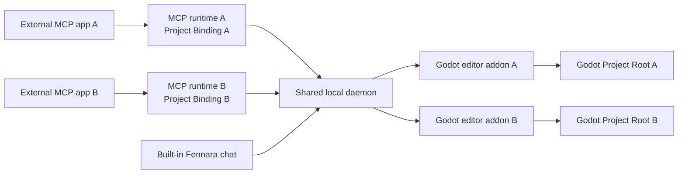

<!-- fennara-i18n: locale=pt-BR source=docs/architecture.md sha256=1bc08d075d4b48d0c781f954d4da4752d6c7223ff1636f01f06524b06dce256a -->
<a id="architecture"></a>
# Arquitetura

<!-- fennara-doc-nav:start -->
[English](../../architecture.md) · [简体中文](../zh-CN/architecture.md) · [Español](../es/architecture.md) · **Português do Brasil** · [日本語](../ja/architecture.md) · [한국어](../ko/architecture.md) · [Русский](../ru/architecture.md) · [Français](../fr/architecture.md) · [Deutsch](../de/architecture.md) · [Türkçe](../tr/architecture.md)

> ℹ️ Tradução redigida por IA a partir do original em inglês. A revisão por falantes nativos é bem-vinda. [Fonte em inglês](../../architecture.md)
<!-- fennara-doc-nav:end -->

O Fennara é uma ponte local entre clientes de IA e um projeto aberto no editor
Godot. Esta página explica a propriedade, os limites entre processos, a
estrutura da instalação e o comportamento de transferência durante atualizações.

| Se você precisar... | Comece aqui |
| --- | --- |
| Encontrar o código-fonte de um componente | [Mapa do repositório](repo-map.md) |
| Instalar ou atualizar o Fennara | [Configuração](setup.md) |
| Entender os artefatos de lançamento | [Processo de lançamento](release.md) |
| Inspecionar as ferramentas disponíveis ao modelo | [Ferramentas](tools.md) |

Não há um serviço de nuvem do Fennara no fluxo OSS normal. Cada conexão MCP
externa inicia um processo MCP local, que se comunica com um único daemon
compartilhado por usuário. O chat integrado se comunica diretamente com esse
daemon. O daemon alcança os addons Fennara nos editores Godot abertos.



<a id="main-pieces"></a>
## Componentes principais

| Componente | Onde fica | O que faz |
| --- | --- | --- |
| CLI | `local/crates/fennara-cli/` | Instala o addon em um projeto Godot, atualiza pacotes locais, grava orientações do projeto e configura aplicativos MCP por meio de `fennara mcp-setup`. |
| Inicializador MCP | `local/crates/fennara-mcp/` | Executável estável chamado pelos aplicativos MCP. Ele encontra a versão ativa e inicia o runtime. |
| Runtime MCP | `local/crates/fennara-mcp/` | Fala MCP via stdio, congela uma Vinculação de projeto opcional na inicialização e encaminha chamadas de ferramentas à ponte local. |
| Inicializador do daemon | `local/crates/fennara-daemon/` | Executável estável usado para iniciar o runtime ativo do daemon. |
| Runtime do daemon | `local/crates/fennara-daemon/` | Mantém o estado local compartilhado, encaminha conexões MCP aos editores correspondentes, é proprietário do Slot de execução de toda a máquina, coordena com o Godot e hospeda as rotas do chat integrado. |
| Identidade do projeto | `local/crates/fennara-project-identity/` | Resolve, valida, transforma em forma canônica e compara Raízes de projeto para o runtime MCP e o daemon. |
| Código-fonte da interface de chat | `ui/chat/` | HTML, CSS e JavaScript do chat integrado, configurações, configuração de provedores, configuração de aplicativos MCP e interface de atualização. Ele é sincronizado com o addon empacotado em `godot_demo/addons/fennara/dist/`. |
| Addon Godot | `godot_demo/addons/fennara/` | O payload do addon copiado para os projetos dos usuários. |
| Código-fonte dos auxiliares de runtime | `runtime/` | Scripts auxiliares de runtime do lado do Godot sincronizados com o payload do addon para sessões e scripts de runtime. |
| GDExtension | `fennara-cpp/` | Ferramentas voltadas ao Godot, interface do dock, diagnósticos, validação, captura em execução e integração com o editor. |
| Esquemas das ferramentas | `local/schemas/tools/` | Contratos compartilhados de ferramentas voltados ao modelo. O runtime MCP e o chat integrado selecionam os esquemas que expõem. |

<a id="native-update-handoff"></a>
## Transferência da atualização nativa

A interface de chat solicita a preparação da atualização por meio do daemon e
da ponte vinculada ao Godot. O `UpdateCoordinator` nativo inicia a CLI
instalada, acompanha o estado durável da operação e apresenta o progresso sem
depender da webview depois que a preparação começa.

Os arquivos verificados do addon são preparados em
`.godot/fennara-update/<operation-id>/`. Após uma confirmação explícita, uma
CLI destacada aguarda o PID e o horário de início exatos do Godot desaparecerem.
Ela verifica novamente um digest que cobre todo o addon preparado, cria
snapshots dos dois inicializadores compartilhados e do manifesto de runtime,
move o addon ativo para `previous-addon`, move o addon preparado para
`addons/fennara` e reabre o mesmo projeto no editor. A GDExtension reaberta
grava um handshake de ativação. A CLI exclui o backup somente depois que o
recibo de sucesso, o handshake e a integridade correspondente do daemon estão
duráveis. Caso contrário, o recibo permanece como `recovery_required`, e a
reversão restaura o addon anterior, os inicializadores e o manifesto de runtime.
Se uma interrupção deixar temporariamente o addon incapaz de carregar, a CLI
instalada permanece fora do addon do projeto e oferece
`fennara recover --project <path>` como ponto único de recuperação emergencial.

<a id="in-editor-chat-webview"></a>
## Webview do chat dentro do editor

O dock de chat opcional é hospedado pela camada de interface da GDExtension. O
contrato compartilhado do host separa dois estilos de superfície de navegador:

| Caminho da plataforma | Comportamento |
| --- | --- |
| Windows | Filho ou overlay nativo do WebView2 anexado à janela do editor Godot, ocultado enquanto pop-ups do Godot, janelas incorporadas, camadas de tela ou controles de nível superior sobrepostos estiverem visíveis. |
| macOS | WKWebView nativo anexado à janela do editor Godot, com a mesma ocultação de UI sobreposta do Godot usada no Windows. |
| Linux | Renderização off-screen do CEF em um `TextureRect` interno do Godot, usando um runtime CEF compartilhado nos dados de aplicativo do Fennara. |

Os usuários também podem definir em Chat Settings que o chat integrado seja
aberto no navegador do sistema na próxima vez. Nesse modo, o dock do Godot
mostra um painel alternativo **Open chat** e disponibiliza a mesma interface de
chat a partir do daemon local em `127.0.0.1`, usando o `chat_token` do editor
proprietário. Isso altera apenas a superfície de exibição. Configurações de
provedores, histórico do chat, escopo do projeto, snapshots, execução de
ferramentas e roteamento MCP externo permanecem nos mesmos caminhos do daemon.

`fennara install`, `fennara update` e `fennara doctor` relatam os pré-requisitos
de webview da plataforma atual. O Windows avisa quando Microsoft Edge WebView2
Runtime está ausente, o macOS relata o status do WebKit.framework do sistema e
o Linux valida o runtime CEF compartilhado gerenciado pelo lançamento. Essas
verificações afetam apenas o dock opcional do chat integrado. As ferramentas
MCP continuam funcionando sem uma webview nativa.

O caminho do Linux renderiza pixels do navegador dentro de um `Control` do
Godot e encaminha o loop de mensagens do CEF pelo hook de processo do dock. A
GDExtension encontra o runtime CEF compartilhado, valida seu marcador
`fennara-cef-runtime.json` e os arquivos obrigatórios, abre dinamicamente
`libcef.so` e depois carrega a pequena biblioteca
`libfennara_linux_cef_bridge.so` do addon por meio de um carregador de ponte
focado. Essa ponte é compilada do código-fonte oficial fixado
`libcef_dll_wrapper` do CEF 139 e é responsável pelos objetos C++ do CEF
(`CefClient`, `CefRenderHandler`, `CefRefPtr`) usados para inicializar o CEF em
modo sem janela, criar o navegador para a URL do chat empacotado e copiar os
buffers de pintura para uma textura do Godot. O suporte completo a IME, área de
transferência e cursor é um trabalho posterior separado. O runtime CEF é
intencionalmente separado do zip do addon Godot. As instalações no Linux usam
um local compartilhado nos dados de aplicativo, e a CLI instala ali o recurso
CEF gerenciado pelo lançamento uma vez por usuário.

Vários editores Godot podem estar abertos ao mesmo tempo. Cada websocket de chat
incorporado é aceito com o `chat_token` do editor proprietário e permanece
vinculado àquela sessão do Godot para escopo de armazenamento do chat,
snapshots, execução de ferramentas, cancelamento e reversão. Um processo MCP
externo vinculado a um projeto é encaminhado ao editor correspondente à sua
Raiz do projeto canônica. Somente um processo não vinculado usa o destino de
compatibilidade selecionado no dock e pertencente ao daemon. As configurações
de provedores de chat são globais por enquanto, enquanto os chats permanecem
limitados ao projeto. Provedores de chat na nuvem usam chaves de API armazenadas
localmente. Provedores locais usam URLs-base armazenadas pelo daemon. O conjunto
atual de provedores do chat integrado inclui OpenAI, Anthropic, OpenRouter,
Ollama Cloud, DeepSeek, Z.AI, Moonshot AI, Kimi For Coding, MiniMax, Ollama local
e LM Studio. O padrão do Ollama é `http://127.0.0.1:11434`. O padrão do LM Studio
é `http://127.0.0.1:1234/v1`. O runtime de chat do daemon resolve os modelos
selecionados por meio de um pequeno catálogo de provedores antes de fazer as
solicitações. Referências canônicas de modelo usam `provider/model`.
A principal exceção percebida pelos usuários é o OpenRouter, pois seus slugs de
modelo muitas vezes já contêm um segmento de provedor. Prefira
`openrouter/google/example` no Fennara. Se um usuário colar um slug bruto do
OpenRouter, como `google/example`, o daemon ainda o encaminha ao OpenRouter por
compatibilidade. Referências nativas `openai/...` e `anthropic/...` usam os
provedores oficiais. Use `openrouter/openai/...` ou
`openrouter/anthropic/...` para esses fornecedores por meio do OpenRouter.
Quando possível, os provedores compartilham adaptadores de chat compatíveis com
OpenAI ou Anthropic, com particularidades dos provedores isoladas em módulos e
eventos normalizados de streaming e erro acima do limite do adaptador.

Os turnos do chat integrado também gravam um rastro de diagnóstico somente
local no mesmo banco de dados `chat.sqlite` dos dados de aplicativo, em
`chat_trace_events`, separado das tabelas de transcrição. As linhas de rastro
usam IDs estáveis de turno, geração, ferramenta e ponte, além de tempos, status,
contagens e resumos limitados. Prompts brutos e resultados completos das
ferramentas não são capturados por padrão. O daemon expõe um pequeno endpoint
local de leitura para depuração em `/chat/traces`, com filtragem por `chat_id`,
`trace_id`, `turn_id` ou `generation_id`.

<a id="anonymous-telemetry"></a>
## Telemetria anônima

Depois de uma conexão real do editor Godot, o daemon pode enfileirar um evento
anônimo de instalação ativa por dia UTC. A fila limitada e o worker HTTP em
segundo plano são separados da execução de ferramentas, da geração do chat e
da ponte do Godot, portanto a telemetria não pode atrasar nem provocar falha em
uma operação do usuário.

O daemon persiste um UUID aleatório da instalação e o último dia UTC aceito em
`Fennara/telemetry/state.json`. O evento contém apenas esse UUID, as versões do
Fennara e a versão numérica do Godot, a plataforma e a arquitetura da CPU. O
receptor `fennara.io` valida o payload exato e converte o UUID em um HMAC do
lado do servidor antes de encaminhar ao PostHog um evento sem pessoa.

A preferência salva em Chat Settings é ativada por padrão. A interface pode
desativá-la, e `FENNARA_DISABLE_TELEMETRY` ou `DO_NOT_TRACK` podem impor uma
substituição pelo ambiente. A desativação exclui o estado local da telemetria.
Consulte [Telemetria anônima](telemetry.md) para ver o contrato completo de privacidade.

<a id="install-layout"></a>
## Estrutura da instalação

No fluxo em que o addon do lançamento é copiado manualmente, a GDExtension
primeiro apresenta um painel de configuração nativo quando a instalação local
exata está ausente. Sua ponte de bootstrap baixa o manifesto de lançamento da
versão do addon e o arquivo da CLI usando o cliente HTTP do Godot, verifica o
SHA-256 declarado e coloca apenas a CLI nos dados de aplicativo do Fennara.
Depois, ela inicia `fennara install` e lê o estado durável da operação para
mostrar progresso e diagnósticos. O chat e a webview permanecem inativos até que
a configuração tenha sucesso e o daemon correspondente se conecte. A ponte
local não inicia nem se conecta a um daemon mais antigo nos dados de aplicativo
enquanto a configuração for necessária. Uma troca de versão exige que o daemon
compartilhado relate zero projetos Godot conectados. O projeto em configuração
permanece desconectado enquanto seu addon e os componentes instalados forem
diferentes. Depois dessa verificação preliminar, o instalador interrompe o
daemon antigo ocioso antes de ativar os componentes correspondentes. Uma conexão
relatada mantém a instalação existente inalterada, para que o usuário possa
fechar o editor conectado e tentar novamente.

No macOS, a documentação voltada ao usuário recomenda a instalação pela CLI. O
bootstrap dentro do editor só pode ser executado depois que a biblioteca nativa
da GDExtension é carregada, portanto não pode corrigir um bloqueio do Gatekeeper
causado pelo download e pela extração manual do ZIP não notarizado do addon.
Usuários cujo addon copiado manualmente foi bloqueado devem removê-lo antes de
executar `fennara install`, pois a CLI preserva um addon completo existente.

Um bloqueio compartilhado de bootstrap nos dados de aplicativo serializa o
download e a ativação da CLI entre editores Godot simultâneos. A propriedade do
bloqueio é transferida ao processo instalador iniciado, para que outro editor
aguarde até esse processo exato terminar. O painel gera um ID de operação,
passa-o à CLI e lê somente o arquivo de estado dessa operação. Se o processo
filho terminar com um estado não terminal, o painel relata uma falha estável em
vez de aguardar indefinidamente.

Os scripts de instalação pelo terminal continuam sendo o caminho não interativo
e de recuperação.

O script de instalação instala a pequena CLI externa e a adiciona ao `PATH`.
Depois disso, lançamentos modernos podem atualizar a CLI instalada por meio de
`fennara update` ou `fennara self-update`. Execute novamente o script de
instalação somente quando a autoatualização da CLI não estiver disponível para
o lançamento ou local de instalação selecionado.

Depois disso, `fennara install` ou `fennara update` obtém o manifesto de
lançamento, verifica os hashes dos recursos referenciados, baixa os recursos e
configura a estrutura local dos pacotes.

```text
Fennara/
  bin/
    fennara
    fennara-mcp
    fennara-daemon
  daemon-control-token
  current.json
  telemetry/
    state.json
  versions/
    <version>/
      fennara-mcp-runtime
      fennara-daemon-runtime
      addon/
        addons/
          fennara/
  webview/
    cef/
      linux-x64/
        <cef-version>/
```

No Windows, os executáveis usam `.exe`.

O daemon cria `daemon-control-token` com bytes aleatórios seguros na primeira
inicialização. Rotas HTTP locais privilegiadas e o websocket da ponte do Godot
exigem esse token no cabeçalho `X-Fennara-Control-Token`. O runtime MCP e o addon
Godot leem o token do mesmo diretório de dados de aplicativo por usuário do
Fennara. Antes de enviar o token, cada cliente envia um nonce aleatório ao
endpoint público de desafio de controle e exige uma prova HMAC-SHA256 válida.
Isso impede que outro processo que detenha a porta fixa colete o token
reutilizável. Recursos estáticos do chat e o endpoint mínimo de integridade
continuam públicos no loopback. Solicitações de websocket e mídia do chat do
projeto continuam usando o token separado do chat do editor proprietário.

O diretório `webview/cef/...` destina-se aos payloads somente leitura do motor
do navegador, compartilhados por cada projeto ou editor Godot que use essa
instalação do Fennara. Dados graváveis por processo de perfil, cache e logs do
CEF devem ficar fora desse payload compartilhado, em
`cache/webview/profiles/cef/godot-<pid>-<timestamp>-<nonce>/` e
`logs/webview/cef/godot-<pid>-<timestamp>-<nonce>/`.

Locais padrão das plataformas:

| SO | Diretório-base |
| --- | --- |
| Windows | `%LOCALAPPDATA%\Fennara` |
| macOS | `~/Library/Application Support/Fennara` |
| Linux | `~/.local/share/fennara` |

<a id="project-layout"></a>
## Estrutura do projeto

Quando um usuário executa isto dentro de um projeto Godot:

```bash
fennara install
```

a CLI copia o addon do lançamento para esta estrutura quando ainda não existe
um addon completo:

```text
<godot-project>/
  AGENTS.md
  addons/
    fennara/
      ai/
        guidelines.md
        index.md
        operations.md
        runtime-observation.md
        visual-observation.md
        clients/
          cursor.md
```

Quando já há um addon completo, a CLI valida seu `VERSION` e a biblioteca do
editor da plataforma atual, instala o pacote local correspondente exato e não
altera o diretório do addon. O daemon compartilhado é iniciado apenas quando
ainda não estiver em execução, e a instalação só é bem-sucedida depois que sua
resposta de integridade relata a versão do addon.

Depois que a varredura do sistema de arquivos do editor Godot termina, o addon
inicia imediatamente um worker próprio do plugin que prepara o suporte a C#.
O worker executa uma compilação incremental isolada sem bloquear a thread
principal do Godot. Workers de ferramentas C# aguardam a mesma barreira de
preparação. O daemon apenas transporta chamadas de ferramentas e não é
responsável pelo processo de compilação. Todas as compilações C# do plugin
compartilham um coordenador, pois as compilações de diagnóstico e runtime
reutilizam a árvore intermediária do MSBuild do Godot.

Diagnósticos direcionados de `.cs` não são compatíveis. Diagnósticos de todo o
projeto C# usam um único `dotnet build` cancelável com o logger estruturado de
compilação do Godot. As assemblies finais são redirecionadas para uma saída
isolada de diagnóstico por projeto, para que o editor aberto não as recarregue.
Se o código-fonte C# mudar durante a compilação inicial em segundo plano, essa
compilação termina normalmente, e a próxima varredura explícita do projeto faz
uma atualização forçada. A verificação preliminar da sessão de runtime usa uma
compilação Debug explícita do `.csproj` da raiz, correspondente ao formato de
compilação do Godot anterior ao Play, e grava a assembly real em
`.godot/mono/temp/bin/Debug` antes da inicialização.

<a id="mcp-setup"></a>
## Configuração de MCP

`fennara mcp-setup` edita a configuração de um aplicativo MCP para que ele
possa iniciar o inicializador local. A entrada gerada é global e neutra em
relação ao projeto; executar a configuração a partir de um projeto Godot não
vincula todos os processos MCP futuros a esse projeto.

Exemplos:

```bash
fennara mcp-setup --claude
fennara mcp-setup --codex
fennara mcp-setup --cursor
fennara mcp-setup --gemini
```

A configuração aponta para o inicializador estável `fennara-mcp` no diretório
`bin` do Fennara. O inicializador lê `current.json` e então inicia o runtime
versionado correspondente.

Isso mantém as configurações dos aplicativos MCP estáveis entre atualizações.

Para repositórios ou worktrees isolados, o host MCP inicia um processo e uma
conexão por projeto. O runtime captura seu diretório de inicialização e congela
uma Vinculação de projeto MCP durante toda a vida útil do processo. A descoberta
da vinculação segue `--project-path` explícito, depois
`FENNARA_PROJECT_PATH`, e depois o ancestral mais próximo do diretório de
inicialização que contenha `project.godot`. Se a descoberta automática não
encontrar um projeto, o runtime entra no modo de compatibilidade não vinculado
legado. Vinculações explícitas inválidas causam falha na inicialização, em vez
de recorrer a uma alternativa.

O crate compartilhado `fennara-project-identity` transforma as raízes em forma
canônica e as valida tanto para o MCP quanto para o daemon. O MCP envia sua raiz
canônica como metadados de transporte, fora dos argumentos de ferramentas
voltados ao modelo. O daemon resolve novamente esse localizador e as raízes
informadas pelos editores e, então, exige exatamente uma correspondência ativa
no sistema de arquivos. Um editor ausente permite nova tentativa, uma
correspondência duplicada é ambígua e nenhum desses casos recorre ao destino do
dock. Consulte [Vários agentes e worktrees](multi-agent-worktrees.md).

Esse caminho de configuração é separado do caminho de provedores do chat
integrado. Aplicativos MCP usam sua própria conta de modelo. O dock do Fennara
usa o provedor configurado nas configurações de chat.

<a id="tool-call-flow"></a>
## Fluxo de chamada de ferramenta

```text
MCP client
  calls a Fennara tool
MCP runtime
  validates the request against local schemas
  attaches its process-scoped Project Binding as transport metadata
  forwards the call to the local daemon
Daemon runtime
  resolves the binding and routes to exactly one matching Godot editor
Godot addon
  runs the Godot-aware tool through GDExtension
  returns a concise markdown result
MCP runtime
  sends the result back to the MCP client
```

Chamadas internas do chat integrado já carregam uma Sessão do editor Godot
explícita. Um MCP externo sem Vinculação de projeto usa, em vez disso, o Destino
MCP legado: primeiro o destino válido selecionado no dock e depois o único editor
conectado. A seleção vinculada nunca lê nem altera esse destino global do daemon.

O cliente MCP consegue ler e gravar arquivos normais por conta própria. As
ferramentas do Fennara se concentram em feedback específico do Godot: estrutura
de cenas, propriedades dos nós, diagnósticos, validação, estado de execução,
capturas de tela e edições cientes do editor.

As chamadas de ferramentas do chat integrado acrescentam um controle de
permissão pertencente ao daemon antes do encaminhamento ao Godot. O modo de
aprovação nas configurações de chat é `ask` ou `full_access`. Ferramentas
somente leitura são permitidas imediatamente. Ferramentas de alteração do
projeto e execução de runtime aguardam aprovação da interface no modo `ask` e
são executadas automaticamente no modo `full_access`. Verificações rígidas de
segurança dentro das ferramentas do Godot, como caminhos internos bloqueados do
addon, continuam válidas nos dois modos.

<a id="updates"></a>
## Atualizações

`fennara update` é o comando normal de atualização do projeto. Ele lê a
identidade de lançamento do addon instalado, resolve o ponteiro Latest Release
do GitHub ou o canal de staging isolado desse addon e fixa o resultado em uma
versão exata. Primeiro, ele verifica a versão do recurso de CLI por plataforma
do manifesto desse lançamento e, quando ela é mais recente, prepara a CLI,
permite que o processo antigo termine, substitui a CLI instalada e retoma com o
mesmo destino. Depois, usa o mesmo resolvedor e instalador orientado pelo
manifesto que `fennara install`.

A descoberta nativa de staging armazena em cache ponteiros de canal validados
por cinco minutos nos dados compartilhados de aplicativo e os revalida com
ETags do GitHub. Um canal ausente é tratado como ausência de atualização de
staging, enquanto dados malformados ou de outro canal provocam falha fechada e
nunca substituem uma entrada de cache válida.

Ele pode atualizar:

- a CLI instalada e o pacote de runtime local
- o addon do projeto
- as orientações geradas do projeto em `AGENTS.md` e `addons/fennara/ai/`
- recursos compartilhados de runtime da webview necessários para a plataforma atual, como CEF no Linux
- avisos de pré-requisitos da webview para o dock opcional do chat integrado

Ele não reescreve a configuração dos aplicativos MCP. Execute
`fennara mcp-setup` novamente apenas ao adicionar um novo cliente MCP, reparar a
configuração desse cliente ou alterar a própria integração do aplicativo MCP de destino.

Se um aplicativo MCP estiver executando um inicializador, a atualização poderá
manter esse inicializador e continuar. O pacote de runtime versionado ainda é
atualizado, e inicializações futuras usam a versão de `current.json`. Use
`fennara update --no-self-update` apenas quando quiser ignorar
intencionalmente a verificação da CLI externa.

A ativação compartilhada oferece suporte a uma versão ativa do Fennara por vez.
O daemon rejeita o encerramento para atualização enquanto outro projeto Godot
permanecer conectado, o que impede a troca de versão sob outro editor. Pacotes
de versão exata, o `current.json` anterior, snapshots dos inicializadores e o
addon anterior do projeto são mantidos até que o editor reaberto valide a nova GDExtension.

O daemon é proprietário de um único Slot de execução para toda a máquina entre
todos os editores conectados. Uma solicitação de início reivindica `Starting`
de forma atômica antes da criação do processo e confirma essa reivindicação
como `Running`; uma chamada concorrente recebe um resultado `busy` anônimo e
sem erro, e nunca inicia um segundo jogo. Não há fila FIFO.

Cada Sessão de execução pertence à sua Raiz do projeto canônica, e não a um
processo transitório do editor. Somente esse proprietário pode inspecionar o
status detalhado, renovar, executar scripts ou interromper a sessão. Outros
projetos veem um estado ocupado anônimo e não podem confirmar o identificador de
outra sessão. Portanto, a propriedade sobrevive à reconexão de um editor.

O Lease de execução absoluto padrão é de 900 segundos, e as chamadas podem
solicitar um `max_run_seconds` positivo de até 86.400 segundos. O status do
proprietário e suas operações limitadas renovam um prazo de inatividade de 120
segundos; normalmente, os agentes consultam o status aproximadamente a cada 30
segundos, com jitter. O prazo absoluto nunca é pausado. Um supervisor interrompe
ou recolhe o processo e libera o Slot de execução após saída natural,
interrupção explícita, falha de inicialização, expiração por inatividade ou
expiração absoluta.

<a id="export-boundary"></a>
## Limite de exportação

O Fennara fica ativo somente no editor. Seu plugin de exportação remove
temporariamente o autoload `_fennara_game_capture` antes que o Godot serialize
as configurações do projeto exportado, ignora todos os arquivos em
`res://addons/fennara/` e `res://.fennara/` e remove temporariamente sua entrada
do registro de GDExtension gerado pelo Godot. Quando a exportação termina, ele
restaura o autoload e o registro originais. Ele não reescreve nem persiste
alterações em `export_presets.cfg` ou `project.godot`.

Esse limite começa depois que o Godot abre o projeto. Um checkout de CI que
omita `addons/fennara/` precisa executar `fennara prepare-export` ou instalar o
addon antes de iniciar o Godot. Um plugin de exportação não consegue reparar um
destino de autoload ausente antes da validação da inicialização do projeto.

<a id="release-assets"></a>
## Recursos de lançamento

Cada lançamento público publica recursos separados para que as instalações permaneçam modulares:

| Recurso | Finalidade |
| --- | --- |
| `fennara-cli-<platform>-<arch>-v<version>.zip` | CLI e inicializadores estáveis. |
| `fennara-release-local-<platform>-<arch>-v<version>.zip` | Runtimes versionados de MCP e daemon selecionados pelo manifesto de lançamento. |
| `fennara-release-addon-v<version>.zip` / `fennara-addon-latest.zip` | Payload do addon Godot para todas as plataformas com cada binário GDExtension compilado e referenciado por `fennara.gdextension`. |
| `fennara-webview-cef-linux-x64-<cef-version>.zip` | Runtime CEF compartilhado apenas para Linux, instalado uma vez nos dados de aplicativo do Fennara. |
| `fennara-release-manifest-v<version>.json` | Plano de instalação e atualização com versão de esquema, nomes de recursos, hashes, versão mínima da CLI e declarações de runtimes compartilhados. |

Usuários normais instalam a partir do lançamento exato com versão atualmente
designado como Latest pelo GitHub. O Fennara não cria nem move uma tag ou
lançamento literal `latest`. Lançamentos mais antigos com versão continuam
disponíveis para fixação e depuração.

Payloads de runtime CEF do Linux não fazem parte de `fennara-addon-*`. Eles são
selecionados pelo manifesto de lançamento e instalados uma vez no diretório
compartilhado `webview/cef/linux-x64/<cef-version>/` dos dados de aplicativo.

As instalações do runtime CEF são preparadas em um diretório irmão temporário,
validam os arquivos obrigatórios e o marcador de runtime, e então publicam o
diretório completo da versão e atualizam `current.json` atomicamente. Processos
de editor existentes continuam usando o runtime já carregado.

<a id="design-rules"></a>
## Regras de design

- Mantenha as ferramentas primitivas e independentes do jogo.
- Permita que agentes inspecionem o projeto antes de fazer suposições.
- Prefira feedback da API do Godot a deduções baseadas apenas em arquivos.
- Retorne resultados Markdown concisos que um cliente MCP possa usar diretamente.
- Mantenha os inicializadores estáveis e mova o código variável para runtimes versionados.
- Mantenha local o caminho MCP externo. O dock opcional do chat integrado usa configurações locais de provedores armazenadas pelo daemon, como chaves de API de provedores na nuvem e URLs-base locais do Ollama ou LM Studio.
