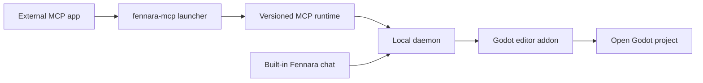

<!-- fennara-i18n: locale=ru source=docs/architecture.md sha256=a69c3ec12609497a2960983409062e9483a85dc1f4eb10a49343d5e568c0a7db -->
<a id="architecture"></a>
# Архитектура

<!-- fennara-doc-nav:start -->
[English](../../architecture.md) · [简体中文](../zh-CN/architecture.md) · [Español](../es/architecture.md) · [Português do Brasil](../pt-BR/architecture.md) · [日本語](../ja/architecture.md) · [한국어](../ko/architecture.md) · **Русский** · [Français](../fr/architecture.md) · [Deutsch](../de/architecture.md) · [Türkçe](../tr/architecture.md)

> ℹ️ Перевод написан ИИ на основе английского оригинала. Приветствуется проверка носителями языка. [Источник на английском](../../architecture.md)
<!-- fennara-doc-nav:end -->

Fennara является локальным мостом между клиентами ИИ и проектом, открытым в
редакторе Godot. На этой странице объясняются владение компонентами, границы
процессов, структура установки и передача управления при обновлении.

| Если вам нужно... | Начните здесь |
| --- | --- |
| Найти исходный код компонента | [Карта репозитория](repo-map.md) |
| Установить или обновить Fennara | [Настройка](setup.md) |
| Разобраться в ресурсах выпуска | [Процесс выпуска](release.md) |
| Изучить доступные модели инструменты | [Инструменты](tools.md) |

В обычном пути открытого проекта облачного сервиса Fennara нет. Внешнее
приложение MCP запускает локальный процесс MCP, который взаимодействует с
фоновой службой. Встроенный чат обращается к этой службе напрямую. Фоновая
служба связывается с дополнением Fennara в открытом редакторе Godot.



<a id="main-pieces"></a>
## Основные компоненты

| Компонент | Расположение | Назначение |
| --- | --- | --- |
| CLI | `local/crates/fennara-cli/` | Устанавливает дополнение в проект Godot, обновляет локальные пакеты, записывает инструкции проекта и настраивает приложения MCP с помощью `fennara mcp-setup`. |
| Программа запуска MCP | `local/crates/fennara-mcp/` | Стабильный исполняемый файл, который вызывают приложения MCP. Он находит активную версию и запускает среду выполнения. |
| Среда выполнения MCP | `local/crates/fennara-mcp/` | Работает с MCP через stdio и перенаправляет вызовы инструментов локальному мосту. |
| Программа запуска фоновой службы | `local/crates/fennara-daemon/` | Стабильный исполняемый файл для запуска активной среды выполнения фоновой службы. |
| Среда выполнения фоновой службы | `local/crates/fennara-daemon/` | Хранит локальное состояние, координирует работу с Godot, обслуживает среду выполнения MCP и предоставляет маршруты встроенного чата. |
| Исходный код интерфейса чата | `ui/chat/` | HTML, CSS и JavaScript для встроенного чата, настроек, настройки поставщиков, настройки приложений MCP и интерфейса обновления. Он синхронизируется с упакованным дополнением в `godot_demo/addons/fennara/dist/`. |
| Дополнение Godot | `godot_demo/addons/fennara/` | Данные дополнения, копируемые в проекты пользователей. |
| Исходный код вспомогательных средств среды выполнения | `runtime/` | Сценарии вспомогательных средств на стороне Godot, синхронизируемые с данными дополнения для сеансов и сценариев среды выполнения. |
| GDExtension | `fennara-cpp/` | Инструменты, интерфейс панели, диагностика, проверка, захват среды выполнения и интеграция с редактором на стороне Godot. |
| Схемы инструментов | `local/schemas/tools/` | Общие контракты инструментов, видимые модели. Среда выполнения MCP и встроенный чат выбирают предоставляемые ими схемы отдельно. |

<a id="native-update-handoff"></a>
## Нативная передача управления при обновлении

Интерфейс чата запрашивает подготовку обновления через фоновую службу и
привязанный мост Godot. Нативный `UpdateCoordinator` запускает установленный
CLI, следит за долговечным состоянием операции и отображает ход выполнения,
не завися от веб-представления после начала подготовки.

Проверенные файлы дополнения размещаются в
`.godot/fennara-update/<operation-id>/`. После явного подтверждения отделенный
CLI ожидает исчезновения точного PID и времени запуска Godot. Он повторно
проверяет дайджест всего подготовленного дополнения, создает снимки обеих общих
программ запуска и манифеста среды выполнения, перемещает активное дополнение в
`previous-addon`, перемещает подготовленное дополнение в `addons/fennara` и
снова открывает тот же проект редактора. Повторно открытая GDExtension записывает
рукопожатие активации. CLI удаляет резервную копию только после надежной записи
успешной квитанции, рукопожатия и совпадающего состояния фоновой службы. В
противном случае квитанция остается в состоянии `recovery_required`, а откат
восстанавливает предыдущее дополнение, программы запуска и манифест среды
выполнения. Если из-за прерывания дополнение временно не может загрузиться,
установленный CLI остается вне дополнения проекта и предоставляет
`fennara recover --project <path>` как единую аварийную точку восстановления
дополнения.

<a id="in-editor-chat-webview"></a>
## Веб-представление чата в редакторе

Необязательная панель чата размещается в слое интерфейса GDExtension. Общий
контракт узла отделяет три варианта поверхности браузера:

| Путь платформы | Поведение |
| --- | --- |
| Windows | Нативный дочерний или наложенный WebView2, присоединенный к окну редактора Godot и скрываемый, пока видны перекрывающие его всплывающие окна Godot, встроенные окна, слои холста или элементы управления верхнего уровня. |
| macOS | Нативный WKWebView, присоединенный к окну редактора Godot и использующий то же скрытие при перекрытии интерфейсом Godot, что и Windows. |
| Linux | Внеэкранный рендеринг CEF во внутренний `TextureRect` Godot с общей средой выполнения CEF из данных приложения Fennara. |

Пользователи также могут выбрать в настройках чата открытие встроенного чата в
системном браузере при следующем запуске. В этом режиме панель Godot показывает
резервную панель **Open chat** и обслуживает тот же интерфейс чата через
локальную фоновую службу по адресу `127.0.0.1` с `chat_token` соответствующего
редактора. Меняется только поверхность отображения. Настройки поставщика,
история чата, область проекта, снимки, выполнение инструментов и внешняя
маршрутизация MCP продолжают использовать те же пути фоновой службы.

Команды `fennara install`, `fennara update` и `fennara doctor` сообщают
предварительные условия веб-представления для текущей платформы. Windows
предупреждает об отсутствии Microsoft Edge WebView2 Runtime, macOS сообщает
состояние системного WebKit.framework, а Linux проверяет управляемую выпуском
общую среду выполнения CEF. Эти проверки влияют только на необязательную
встроенную панель чата. Инструменты MCP продолжают работать без нативного
веб-представления.

В Linux пиксели браузера отрисовываются внутри `Control` Godot, а цикл сообщений
CEF проходит через обработчик процесса панели. GDExtension обнаруживает общую
среду выполнения CEF, проверяет ее маркер `fennara-cef-runtime.json` и
обязательные файлы, динамически открывает `libcef.so`, затем через узкий
загрузчик моста выполняет dlopen небольшой библиотеки дополнения
`libfennara_linux_cef_bridge.so`. Этот мост собирается из закрепленного исходного
кода официальной оболочки `libcef_dll_wrapper` CEF 139 и владеет объектами CEF
C++ (`CefClient`, `CefRenderHandler`, `CefRefPtr`), используемыми для
инициализации CEF в безоконном режиме, создания браузера для упакованного URL
чата и копирования буферов отрисовки в текстуру Godot. Полная поддержка IME,
буфера обмена и курсора относится к отдельной последующей работе. Среда
выполнения CEF намеренно отделена от ZIP-архива дополнения Godot. При установке
в Linux используется общий каталог среды выполнения в данных приложения, а CLI
один раз для каждого пользователя устанавливает туда управляемый выпуском
ресурс CEF.

Одновременно может быть открыто несколько редакторов Godot. Каждое соединение
веб-сокета встроенного чата принимается с `chat_token` соответствующего
редактора и остается привязанным к этому сеансу Godot для области хранения
чата, снимков, выполнения инструментов, отмены и возврата изменений. Внешние
клиенты MCP по-прежнему маршрутизируются через активную цель фоновой службы.
Настройки поставщика чата пока глобальны, а чаты привязаны к проекту. Облачные
поставщики чата используют локально сохраненные ключи API, а локальные
поставщики используют базовые URL, сохраненные фоновой службой. Текущий набор
поставщиков встроенного чата включает OpenAI, Anthropic, OpenRouter, Ollama
Cloud, DeepSeek, Z.AI, Moonshot AI, Kimi For Coding, MiniMax, локальный Ollama
и LM Studio. Стандартный адрес Ollama равен `http://127.0.0.1:11434`, а LM
Studio использует `http://127.0.0.1:1234/v1`. Среда чата фоновой службы
определяет выбранные модели через небольшой каталог поставщиков до отправки
запросов. Канонические ссылки на модели имеют вид `provider/model`.
Основным заметным исключением является OpenRouter, поскольку его идентификаторы
моделей часто уже содержат сегмент поставщика. В Fennara предпочтителен вид
`openrouter/google/example`. Если пользователь вставит необработанный
идентификатор OpenRouter, например `google/example`, фоновая служба все равно
направит его в OpenRouter для совместимости. Нативные ссылки `openai/...` и
`anthropic/...` используют официальных поставщиков. Для работы с этими
производителями через OpenRouter используйте `openrouter/openai/...` или
`openrouter/anthropic/...`. По возможности поставщики совместно используют
адаптеры чата, совместимые с OpenAI или Anthropic, а особенности поставщиков
изолируются в их модулях. Нормализация событий потока и ошибок происходит над
границей адаптера.

Ходы встроенного чата также записывают локальную диагностическую трассировку в
ту же базу данных `chat.sqlite` в данных приложения, в таблицу
`chat_trace_events`, отдельно от таблиц расшифровки. Строки трассировки используют
стабильные идентификаторы хода, поколения, инструмента и моста, а также время,
состояния, счетчики и ограниченные сводки. Необработанные запросы и полные
результаты инструментов по умолчанию не сохраняются. Фоновая служба предоставляет
небольшую локальную конечную точку чтения для отладки по адресу `/chat/traces`
с фильтрацией по `chat_id`, `trace_id`, `turn_id` или `generation_id`.

<a id="anonymous-telemetry"></a>
## Анонимная телеметрия

После настоящего подключения редактора Godot фоновая служба может ставить в
очередь одно анонимное событие активной установки в сутки по UTC. Ограниченная
очередь и фоновый работник HTTP отделены от выполнения инструментов, генерации
чата и моста Godot, поэтому телеметрия не может задержать пользовательскую
операцию или вызвать ее сбой.

Фоновая служба сохраняет один случайный UUID установки и последний принятый день
UTC в `Fennara/telemetry/state.json`. Событие содержит только этот UUID, версии
Fennara и числовую версию Godot, платформу и архитектуру процессора. Получатель
`fennara.io` проверяет точную структуру данных и преобразует UUID в серверный
HMAC, прежде чем передать обезличенное событие в PostHog.

Сохраненная настройка Chat Settings включена по умолчанию. Интерфейс позволяет
отключить ее, а `FENNARA_DISABLE_TELEMETRY` или `DO_NOT_TRACK` могут обеспечить
переопределение через окружение. При отключении локальное состояние телеметрии
удаляется. Полный договор о конфиденциальности приведен в разделе
[Анонимная телеметрия](telemetry.md).

<a id="install-layout"></a>
## Структура установки

В процессе с ручным копированием дополнения из выпуска GDExtension сначала
показывает нативную панель настройки, если точная локальная установка
отсутствует. Ее загрузочный мост скачивает манифест выпуска и архив CLI для
версии дополнения с помощью HTTP-клиента Godot, проверяет заявленный SHA-256 и
помещает в данные приложения Fennara только CLI. Затем он запускает
`fennara install` и читает долговечное состояние операции для отображения хода
и диагностики. Чат и веб-представление остаются неактивными до успешной
настройки и подключения совпадающей фоновой службы. Пока требуется настройка,
локальный мост не запускает и не подключается к более старой фоновой службе из
данных приложения. Для переключения версии общая фоновая служба должна
сообщить, что подключено ноль проектов Godot. Настраиваемый проект остается
отключенным, пока его дополнение и установленные компоненты различаются. После
этой предварительной проверки установщик останавливает простаивающую старую
фоновую службу до активации совпадающих компонентов. Если сообщается о
подключении, существующая установка не меняется, чтобы пользователь мог закрыть
подключенный редактор и повторить попытку.

В пользовательской документации для macOS рекомендуется установка через CLI.
Загрузчик в редакторе может работать только после загрузки нативной библиотеки
GDExtension, поэтому он не может устранить блокировку Gatekeeper, вызванную
ручным скачиванием и распаковкой ненотарифицированного ZIP-архива дополнения.
Пользователи, у которых вручную скопированное дополнение заблокировано, должны
удалить его перед запуском `fennara install`, поскольку CLI сохраняет полное
существующее дополнение.

Общая блокировка загрузки в данных приложения последовательно выполняет
скачивание и активацию CLI из параллельно работающих редакторов Godot. Владение
блокировкой передается запущенному процессу установщика, поэтому другой редактор
ждет завершения именно этого процесса. Панель создает идентификатор операции,
передает его CLI и читает только файл состояния этой операции. Если дочерний
процесс завершается с незавершенным состоянием, панель сообщает стабильный
сбой, а не ожидает бесконечно.

Сценарии установки в терминале остаются неинтерактивным путем и способом
восстановления.

Сценарий установки устанавливает небольшой внешний CLI и добавляет его в
`PATH`. После этого современные выпуски могут обновлять установленный CLI через
`fennara update` или `fennara self-update`. Повторно запускайте сценарий
установки только тогда, когда самостоятельное обновление CLI недоступно для
выбранного выпуска или места установки.

После этого `fennara install` или `fennara update` получает манифест выпуска,
проверяет хеши указанных ресурсов, скачивает ресурсы выпуска и настраивает
структуру локального пакета.

```text
Fennara/
  bin/
    fennara
    fennara-mcp
    fennara-daemon
  daemon-control-token
  current.json
  telemetry/
    state.json
  versions/
    <version>/
      fennara-mcp-runtime
      fennara-daemon-runtime
      addon/
        addons/
          fennara/
  webview/
    cef/
      linux-x64/
        <cef-version>/
```

В Windows исполняемые файлы имеют расширение `.exe`.

При первом запуске фоновая служба создает `daemon-control-token` из безопасных
случайных байтов. Привилегированные локальные маршруты HTTP и веб-сокет моста
Godot требуют этот токен в заголовке `X-Fennara-Control-Token`. Среда выполнения
MCP и дополнение Godot читают токен из одного пользовательского каталога данных
приложения Fennara. Перед отправкой токена каждый клиент отправляет случайное
одноразовое значение в общедоступную конечную точку контрольного запроса и
требует действительное доказательство HMAC-SHA256. Это не позволяет другому
процессу, занявшему фиксированный порт, получить многократно используемый токен.
Статические данные чата и минимальная конечная точка состояния остаются
общедоступными на кольцевом интерфейсе. Веб-сокет чата проекта и запросы
мультимедиа продолжают использовать отдельный токен чата соответствующего
редактора.

Каталог `webview/cef/...` предназначен для доступных только для чтения данных
движка браузера, общих для каждого проекта и редактора Godot, использующего эту
установку Fennara. Изменяемые данные профиля, кеша и журналов отдельных
процессов CEF должны находиться вне общего набора среды выполнения в
`cache/webview/profiles/cef/godot-<pid>-<timestamp>-<nonce>/` и
`logs/webview/cef/godot-<pid>-<timestamp>-<nonce>/`.

Стандартные расположения для платформ:

| ОС | Базовый каталог |
| --- | --- |
| Windows | `%LOCALAPPDATA%\Fennara` |
| macOS | `~/Library/Application Support/Fennara` |
| Linux | `~/.local/share/fennara` |

<a id="project-layout"></a>
## Структура проекта

Когда пользователь выполняет внутри проекта Godot:

```bash
fennara install
```

CLI копирует дополнение выпуска в следующую структуру, если полное дополнение
еще отсутствует:

```text
<godot-project>/
  AGENTS.md
  addons/
    fennara/
      ai/
        guidelines.md
        index.md
        operations.md
        runtime-observation.md
        visual-observation.md
        clients/
          cursor.md
```

Если полное дополнение уже существует, CLI проверяет его `VERSION` и библиотеку
редактора для текущей платформы, устанавливает локальный пакет точно
соответствующей версии и оставляет каталог дополнения без изменений. Общая
фоновая служба запускается только тогда, когда она еще не работает, а установка
считается успешной только после того, как ее ответ о состоянии сообщает версию
дополнения.

После завершения сканирования файловой системы редактора Godot дополнение сразу
запускает принадлежащий плагину рабочий процесс подготовки поддержки C#.
Рабочий процесс выполняет одну изолированную инкрементальную сборку, не блокируя
основной поток Godot. Работники инструментов C# ожидают на том же барьере
подготовки. Фоновая служба только передает вызовы инструментов и не владеет
процессом сборки. Все сборки C#, принадлежащие плагину, совместно используют
один координатор, поскольку диагностические сборки и сборки среды выполнения
повторно используют промежуточное дерево MSBuild Godot.

Целевая диагностика отдельных файлов `.cs` не поддерживается. Диагностика всего
проекта C# использует одну отменяемую команду `dotnet build` со
структурированным журналом сборки Godot. Итоговые сборки перенаправляются в
изолированный диагностический вывод для каждого проекта, поэтому открытый
редактор не перезагружает их. Если исходный код C# меняется во время
первоначальной фоновой сборки, эта сборка завершается обычным образом, а
следующее явное сканирование проекта выполняет одно принудительное обновление.
Предварительная проверка сеанса среды выполнения использует явную сборку Debug
корневого `.csproj`, соответствующую форме сборки Godot перед Play, и записывает
настоящую сборку `.godot/mono/temp/bin/Debug` до запуска.

<a id="mcp-setup"></a>
## Настройка MCP

Команда `fennara mcp-setup` изменяет конфигурацию приложения MCP, чтобы оно могло
запускать локальную программу запуска.

Примеры:

```bash
fennara mcp-setup --claude
fennara mcp-setup --codex
fennara mcp-setup --cursor
fennara mcp-setup --gemini
```

Конфигурация указывает на стабильную программу запуска `fennara-mcp` в каталоге
Fennara `bin`. Программа запуска читает `current.json`, затем запускает
соответствующую версионную среду выполнения.

Благодаря этому конфигурации приложений MCP остаются стабильными после
обновлений.

Этот путь настройки отделен от пути поставщика встроенного чата. Приложения MCP
используют собственную учетную запись модели, а панель Fennara использует
поставщика, настроенного в параметрах чата.

<a id="tool-call-flow"></a>
## Поток вызова инструмента

```text
MCP client
  calls a Fennara tool
MCP runtime
  validates the request against local schemas
  forwards the call to the local daemon
Daemon runtime
  routes the request to the connected Godot project
Godot addon
  runs the Godot-aware tool through GDExtension
  returns a concise markdown result
MCP runtime
  sends the result back to the MCP client
```

Клиент MCP может самостоятельно читать и записывать обычные файлы. Инструменты
Fennara сосредоточены на обратной связи, специфичной для Godot: структуре сцен,
свойствах узлов, диагностике, проверке, состоянии среды выполнения, снимках
экрана и изменениях с учетом редактора.

Вызовы инструментов встроенного чата добавляют один принадлежащий фоновой службе
шлюз разрешений перед перенаправлением в Godot. Режим подтверждения в настройках
чата имеет значение `ask` или `full_access`. Инструменты только для чтения
разрешаются сразу. Инструменты изменения проекта и выполнения среды ожидают
подтверждения в интерфейсе в режиме `ask` и запускаются автоматически в режиме
`full_access`. Жесткие проверки безопасности внутри инструментов Godot, например
блокировка внутренних путей дополнения, продолжают действовать в обоих режимах.

<a id="updates"></a>
## Обновления

`fennara update` является обычной командой обновления проекта. Она считывает
идентификатор выпуска установленного дополнения, выбирает указатель последнего
выпуска GitHub или изолированный тестовый канал этого дополнения и фиксирует
результат как одну точную версию. Сначала она проверяет версию ресурса CLI для
платформы в манифесте этого выпуска. Если версия новее, команда подготавливает
этот CLI, позволяет старому процессу завершиться, заменяет установленный CLI и
продолжает с той же целью. Затем она использует тот же определитель и установщик
на основе манифеста, что и `fennara install`.

Нативное обнаружение тестового канала кеширует проверенные указатели канала на
пять минут в общих данных приложения Fennara и повторно проверяет их через ETag
GitHub. Отсутствующий канал означает отсутствие тестового обновления, а
поврежденные или межканальные данные отклоняются и никогда не заменяют
действительную запись кеша.

Команда может обновлять:

- установленный CLI и локальный пакет среды выполнения;
- дополнение проекта;
- сгенерированные инструкции проекта в `AGENTS.md` и `addons/fennara/ai/`;
- общие ресурсы веб-представления, необходимые текущей платформе, например CEF
  для Linux;
- предупреждения о предварительных условиях веб-представления для необязательной
  встроенной панели чата.

Она не перезаписывает конфигурацию приложения MCP. Повторно запускайте
`fennara mcp-setup` только при добавлении нового клиента MCP, исправлении
конфигурации этого клиента или изменении самой интеграции целевого приложения
MCP.

Если приложение MCP сейчас использует программу запуска, обновление может
сохранить эту программу и продолжить работу. Версионный пакет среды выполнения
все равно обновляется, а последующие запуски используют версию из
`current.json`. Используйте `fennara update --no-self-update` только при
намеренном пропуске проверки внешнего CLI.

Общая активация поддерживает одну активную версию Fennara одновременно.
Фоновая служба отклоняет завершение работы для обновления, пока подключен любой
другой проект Godot, что предотвращает переключение версии под другим
редактором. Пакеты точных версий, предыдущий `current.json`, снимки программ
запуска и предыдущее дополнение проекта сохраняются, пока повторно открытый
редактор не проверит новую GDExtension.

Сейчас фоновая служба разрешает одну управляемую сцену `runtime_session`
глобально для всех подключенных редакторов Godot. Запрос запуска выполняется в
выбранном или привязанном к чату проекте Godot, но до запуска новой сцены нужно
остановить другую уже работающую управляемую сцену.

<a id="export-boundary"></a>
## Граница экспорта

Fennara активна только в редакторе. Перед тем как Godot сериализует настройки
экспортируемого проекта, плагин экспорта временно удаляет автозагрузку
`_fennara_game_capture`, исключает все файлы в `res://addons/fennara/` и
`res://.fennara/`, а также временно удаляет свою запись из сгенерированного Godot
реестра GDExtension. По завершении экспорта он восстанавливает исходную
автозагрузку и реестр. Он не перезаписывает `export_presets.cfg` или
`project.godot` и не сохраняет изменения в этих файлах.

Эта граница начинает действовать после того, как Godot откроет проект. Если в
рабочей копии CI нет `addons/fennara/`, перед запуском Godot необходимо выполнить
`fennara prepare-export` или установить аддон. Плагин экспорта не может исправить
отсутствующий путь автозагрузки до проверки проекта при запуске.

<a id="release-assets"></a>
## Ресурсы выпуска

Каждый общедоступный выпуск публикует отдельные ресурсы, чтобы установки
оставались модульными:

| Ресурс | Назначение |
| --- | --- |
| `fennara-cli-<platform>-<arch>-v<version>.zip` | CLI и стабильные программы запуска. |
| `fennara-release-local-<platform>-<arch>-v<version>.zip` | Версионные среды выполнения MCP и фоновой службы, выбранные манифестом выпуска. |
| `fennara-release-addon-v<version>.zip` / `fennara-addon-latest.zip` | Данные дополнения Godot для всех платформ со всеми собранными двоичными файлами GDExtension, указанными в `fennara.gdextension`. |
| `fennara-webview-cef-linux-x64-<cef-version>.zip` | Общая среда выполнения CEF только для Linux, один раз устанавливаемая в данные приложения Fennara. |
| `fennara-release-manifest-v<version>.json` | Версионный план установки и обновления с именами ресурсов, хешами, минимальной версией CLI и объявлениями общих сред выполнения. |

Обычные пользователи устанавливают точный версионный выпуск, который сейчас
обозначен последним выпуском GitHub. Fennara не создает и не перемещает
буквальный тег или выпуск `latest`. Старые версионные выпуски остаются доступны
для закрепления и отладки.

Среды выполнения CEF для Linux не входят в `fennara-addon-*`. Они выбираются
манифестом выпуска и один раз устанавливаются в общий каталог данных приложения
`webview/cef/linux-x64/<cef-version>/`.

Установка среды выполнения CEF сначала помещает файлы во временный соседний
каталог, проверяет обязательные файлы и маркер среды, затем публикует готовый
каталог версии и атомарно обновляет `current.json`. Уже запущенные процессы
редактора продолжают использовать загруженную ранее среду выполнения.

<a id="design-rules"></a>
## Правила проектирования

- Сохраняйте инструменты примитивными и независимыми от конкретной игры.
- Позволяйте агентам изучить проект до принятия предположений.
- Предпочитайте обратную связь API Godot догадкам только по файлам.
- Возвращайте краткие результаты Markdown, которые клиент MCP может использовать
  напрямую.
- Сохраняйте стабильность программ запуска, а изменяющийся код помещайте в
  версионные среды выполнения.
- Сохраняйте внешний путь MCP локальным. Необязательная встроенная панель чата
  использует локальные настройки поставщика, сохраненные через фоновую службу,
  например ключи API облачных поставщиков и базовые URL локальных Ollama или
  LM Studio.
