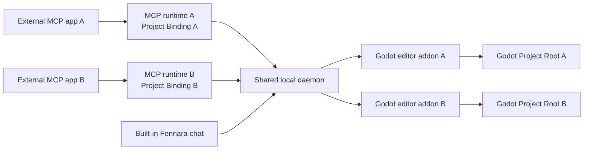

<!-- fennara-i18n: locale=tr source=docs/architecture.md sha256=1bc08d075d4b48d0c781f954d4da4752d6c7223ff1636f01f06524b06dce256a -->
<a id="architecture"></a>
# Mimari

<!-- fennara-doc-nav:start -->
[English](../../architecture.md) · [简体中文](../zh-CN/architecture.md) · [Español](../es/architecture.md) · [Português do Brasil](../pt-BR/architecture.md) · [日本語](../ja/architecture.md) · [한국어](../ko/architecture.md) · [Русский](../ru/architecture.md) · [Français](../fr/architecture.md) · [Deutsch](../de/architecture.md) · **Türkçe**

> ℹ️ Bu çeviri İngilizce kaynak temel alınarak yapay zeka tarafından yazılmıştır. Ana dil konuşurlarının incelemesi memnuniyetle karşılanır. [İngilizce kaynak](../../architecture.md)
<!-- fennara-doc-nav:end -->

Fennara, AI istemcileri ile açık bir Godot düzenleyici projesi arasında çalışan yerel bir köprüdür.
Bu sayfa sahipliği, süreç sınırlarını, kurulum yerleşimini ve güncelleme
devretme davranışını açıklar.

| Şunu Yapmanız Gerekiyorsa... | Buradan Başlayın |
| --- | --- |
| Bir bileşenin kaynağını bulmak | [Depo Haritası](repo-map.md) |
| Fennara'yı kurmak veya güncellemek | [Kurulum](setup.md) |
| Sürüm yapılarını anlamak | [Sürüm Süreci](release.md) |
| Kullanılabilir model araçlarını incelemek | [Araçlar](tools.md) |

Normal OSS yolunda bir Fennara bulut hizmeti yoktur. Her harici MCP bağlantısı,
kullanıcı başına paylaşılan tek bir daemon ile konuşan yerel bir MCP işlemi
başlatır. Yerleşik sohbet doğrudan bu daemon ile konuşur. Daemon, açık Godot
editörlerindeki Fennara eklentilerine ulaşır.



<a id="main-pieces"></a>
## Ana Parçalar

| Parça | Bulunduğu Yer | Yaptığı İş |
| --- | --- | --- |
| CLI | `local/crates/fennara-cli/` | Eklentiyi bir Godot projesine kurar, yerel paketleri günceller, proje rehberini yazar ve MCP uygulamalarını `fennara mcp-setup` aracılığıyla yapılandırır. |
| MCP başlatıcısı | `local/crates/fennara-mcp/` | MCP uygulamalarının çağırdığı kararlı çalıştırılabilir dosya. Etkin sürümü bulur ve çalışma zamanını başlatır. |
| MCP çalışma zamanı | `local/crates/fennara-mcp/` | stdio üzerinden MCP konuşur, başlangıçta isteğe bağlı tek bir Proje Bağlamasını sabitler ve araç çağrılarını yerel köprüye iletir. |
| Daemon başlatıcısı | `local/crates/fennara-daemon/` | Etkin daemon çalışma zamanını başlatmak için kullanılan kararlı çalıştırılabilir dosya. |
| Daemon çalışma zamanı | `local/crates/fennara-daemon/` | Paylaşılan yerel durumu tutar, MCP bağlantılarını eşleşen editörlere yönlendirir, makine genelindeki Çalışma Zamanı Yuvasının sahibidir, Godot ile koordinasyon sağlar ve yerleşik sohbet yollarını barındırır. |
| Proje kimliği | `local/crates/fennara-project-identity/` | MCP çalışma zamanı ve daemon için Godot Proje Köklerini çözümler, doğrular, kanonikleştirir ve karşılaştırır. |
| Sohbet arayüzü kaynağı | `ui/chat/` | Yerleşik sohbet, ayarlar, sağlayıcı kurulumu, MCP uygulaması kurulumu ve güncelleme arayüzü için HTML, CSS ve JavaScript. `godot_demo/addons/fennara/dist/` altındaki paketlenmiş eklentiye eşitlenir. |
| Godot eklentisi | `godot_demo/addons/fennara/` | Kullanıcı projelerine kopyalanan eklenti yükü. |
| Çalışma zamanı yardımcı kaynağı | `runtime/` | Çalışma zamanı oturumları ve çalışma zamanı betikleri için eklenti yüküne eşitlenen Godot tarafı çalışma zamanı yardımcı betikleri. |
| GDExtension | `fennara-cpp/` | Godot'a dönük araçlar, dock arayüzü, tanılama, doğrulama, çalışma zamanı yakalama ve düzenleyici entegrasyonu. |
| Araç şemaları | `local/schemas/tools/` | Modelin gördüğü ortak araç sözleşmeleri. MCP çalışma zamanı ve yerleşik sohbet, açığa çıkardıkları şemaları ayrı ayrı seçer. |

<a id="native-update-handoff"></a>
## Yerel Güncelleme Devri

Sohbet arayüzü, daemon ve bağlı Godot köprüsü aracılığıyla güncelleme
hazırlığını ister. Yerel `UpdateCoordinator`, kurulu CLI'ı başlatır, kalıcı işlem
durumunu izler ve hazırlık başladıktan sonra webview'a bağlı kalmadan ilerlemeyi
sunar.

Doğrulanmış eklenti dosyaları
`.godot/fennara-update/<operation-id>/` altında hazırlanır. Açık onaydan sonra
ayrık bir CLI, tam Godot PID'si ve başlangıç zamanı ortadan kalkana kadar bekler.
Hazırlanan eklentinin tamamını kapsayan özeti yeniden denetler, hem paylaşılan
başlatıcıların hem de çalışma zamanı manifestinin anlık görüntüsünü alır, etkin
eklentiyi `previous-addon` konumuna taşır, hazırlanan eklentiyi
`addons/fennara` konumuna taşır ve aynı düzenleyici projesini yeniden açar.
Yeniden açılan GDExtension bir etkinleştirme el sıkışması yazar. CLI, yedeği
yalnızca başarı makbuzu, el sıkışma ve eşleşen daemon sağlığı kalıcı olduktan
sonra siler. Aksi durumda makbuz `recovery_required` olarak kalır ve geri alma
önceki eklentiyi, başlatıcıları ve çalışma zamanı manifestini geri yükler. Bir
kesinti eklentiyi geçici olarak yüklenemez durumda bırakırsa kurulu CLI, proje
eklentisinin dışında kalır ve tek eklentili acil kurtarma giriş noktası olarak
`fennara recover --project <path>` komutunu sağlar.

<a id="in-editor-chat-webview"></a>
## Düzenleyici İçi Sohbet Webview'ı

İsteğe bağlı sohbet dock'u, GDExtension arayüz katmanı tarafından barındırılır.
Paylaşılan ana bilgisayar sözleşmesi iki tarayıcı yüzeyi biçimini ayırır:

| Platform Yolu | Davranış |
| --- | --- |
| Windows | Godot düzenleyici penceresine bağlanan ve çakışan Godot açılır pencereleri, gömülü pencereler, tuval katmanları veya üst düzey denetimler görünürken gizlenen yerel WebView2 alt penceresi/katmanı. |
| macOS | Godot düzenleyici penceresine bağlanan ve Windows ile aynı çakışan Godot arayüzü gizleme davranışını kullanan yerel WKWebView. |
| Linux | Fennara uygulama verilerindeki paylaşılan CEF çalışma zamanını kullanan, dahili bir Godot `TextureRect` içine CEF ekran dışı işleme. |

Kullanıcılar ayrıca Chat Settings içinde yerleşik sohbetin bir sonraki sefer
sistem tarayıcılarında açılmasını ayarlayabilir. Bu modda Godot dock'u bir
**Open chat** yedek paneli gösterir ve aynı sohbet arayüzünü sahip düzenleyicinin
`chat_token` değeriyle `127.0.0.1` üzerindeki yerel daemon'dan sunar. Bu yalnızca
görüntüleme yüzeyini değiştirir; sağlayıcı ayarları, sohbet geçmişi, proje
kapsamı, anlık görüntüler, araç yürütme ve harici MCP yönlendirmesi aynı daemon
yollarında kalır.

`fennara install`, `fennara update` ve `fennara doctor`, geçerli platformun
webview ön koşullarını bildirir. Windows, Microsoft Edge WebView2 Runtime eksik
olduğunda uyarır; macOS sistem WebKit.framework durumunu bildirir; Linux ise
sürüm tarafından yönetilen paylaşılan CEF çalışma zamanını doğrular. Bu
denetimler yalnızca isteğe bağlı yerleşik sohbet dock'unu etkiler; MCP araçları
yerel bir webview olmadan çalışmaya devam eder.

Linux yolu tarayıcı piksellerini bir Godot `Control` içinde işler ve CEF mesaj
döngüsünü dock süreç kancası üzerinden yönlendirir. GDExtension paylaşılan CEF
çalışma zamanını keşfeder, `fennara-cef-runtime.json` işaretçisini ve gerekli
dosyaları doğrular, `libcef.so` dosyasını dinamik olarak açar, ardından küçük
`libfennara_linux_cef_bridge.so` eklenti kitaplığını odaklı bir köprü yükleyici
üzerinden dlopen ile açar. Bu köprü, sabitlenmiş resmi CEF 139
`libcef_dll_wrapper` kaynağından oluşturulur ve CEF'i penceresiz modda başlatmak,
paketlenmiş sohbet URL'si için tarayıcıyı oluşturmak ve boyama tamponlarını bir
Godot dokusuna kopyalamak amacıyla kullanılan C++ CEF nesnelerinin
(`CefClient`, `CefRenderHandler`, `CefRefPtr`) sahibidir. Tam IME, pano ve imleç
işleme ayrı takip çalışmalarıdır. CEF çalışma zamanı kasıtlı olarak Godot
eklenti zip'inden ayrıdır: Linux kurulumları paylaşılan bir uygulama verisi
çalışma zamanı konumu kullanır ve CLI, sürüm tarafından yönetilen CEF yapısını
kullanıcı başına bir kez buraya kurar.

Aynı anda birden fazla Godot editörü açık olabilir. Her gömülü sohbet
websocket'i, sahip editörün `chat_token` değeriyle kabul edilir ve sohbet
depolama kapsamı, anlık görüntüler, araç yürütme, iptal ve geri alma için o Godot
oturumuna bağlı kalır. Projeye bağlı harici bir MCP işlemi, kanonik Proje
Köküyle eşleşen editöre yönlendirilir. Yalnızca bağlı olmayan bir işlem,
daemon'ın panelden seçilen uyumluluk hedefini kullanır. Sohbet sağlayıcısı
ayarları şimdilik geneldir, sohbetler ise proje kapsamlı kalır. Bulut sohbet sağlayıcıları yerel olarak saklanan API
anahtarlarını kullanır; yerel sağlayıcılar daemon tarafından saklanan temel
URL'leri kullanır. Geçerli yerleşik sohbet sağlayıcısı kümesi OpenAI,
Anthropic, OpenRouter, Ollama Cloud, DeepSeek, Z.AI, Moonshot AI, Kimi For
Coding, MiniMax, local Ollama ve LM Studio'dur. Ollama varsayılan olarak
`http://127.0.0.1:11434`; LM Studio ise varsayılan olarak
`http://127.0.0.1:1234/v1` kullanır. Daemon sohbet çalışma zamanı, istek yapmadan
önce seçilen modelleri küçük bir sağlayıcı kataloğu üzerinden çözümler. Kanonik
model başvuruları `provider/model` kullanır. OpenRouter, kullanıcıların fark
ettiği başlıca istisnadır çünkü OpenRouter model kısa adları çoğu zaman zaten
bir sağlayıcı bölümü içerir. Fennara'da `openrouter/google/example` biçimini
tercih edin; kullanıcı `google/example` gibi ham bir OpenRouter kısa adı
yapıştırırsa daemon uyumluluk için yine OpenRouter'a yönlendirir. Yerel
`openai/...` ve `anthropic/...` başvuruları resmi sağlayıcıları kullanır; bu
satıcılar için OpenRouter üzerinden `openrouter/openai/...` veya
`openrouter/anthropic/...` kullanın. Sağlayıcılar mümkün olduğunda
OpenAI uyumlu veya Anthropic uyumlu sohbet bağdaştırıcılarını paylaşır;
sağlayıcıya özgü davranışlar sağlayıcı modüllerinde yalıtılır ve normalleştirilmiş
akış/hata olayları bağdaştırıcı sınırının üzerinde tutulur.

Yerleşik sohbet turları ayrıca aynı `chat.sqlite` uygulama verisi veritabanında,
transkript tablolarından ayrı olan `chat_trace_events` içine yalnızca yerelde
tutulan bir tanılama izi yazar. İz satırları; zamanlamalar, durumlar, sayımlar ve
sınırlı özetlerle birlikte kararlı tur/üretim/araç/köprü kimlikleri kullanır;
ham istemler ve tam araç sonuçları varsayılan olarak yakalanmaz. Daemon,
`chat_id`, `trace_id`, `turn_id` veya `generation_id` ile filtreleme için
`/chat/traces` konumunda küçük bir yerel hata ayıklama okuma uç noktası sunar.

<a id="anonymous-telemetry"></a>
## Anonim Telemetri

Gerçek bir Godot düzenleyicisi bağlantısından sonra daemon, UTC günü başına bir
anonim etkin kurulum olayını kuyruğa alabilir. Sınırlı kuyruk ve arka plan HTTP
çalışanı araç yürütmeden, sohbet üretiminden ve Godot köprüsünden ayrıdır; bu
nedenle telemetri bir kullanıcı işlemini geciktiremez veya başarısız kılamaz.

Daemon, rastgele bir kurulum UUID'sini ve son kabul edilen UTC gününü
`Fennara/telemetry/state.json` altında kalıcılaştırır. Olay yalnızca bu UUID'yi,
Fennara ve sayısal Godot sürümlerini, platformu ve CPU mimarisini içerir.
`fennara.io` alıcısı tam yükü doğrular ve kişisiz bir olayı PostHog'a iletmeden
önce UUID'yi sunucu tarafında bir HMAC'e dönüştürür.

Kaydedilmiş Chat Settings tercihi varsayılan olarak etkindir. Arayüz bunu devre
dışı bırakabilir; `FENNARA_DISABLE_TELEMETRY` veya `DO_NOT_TRACK` ise bir ortam
geçersiz kılması uygulayabilir. Devre dışı bırakma yerel telemetri durumunu
siler. Tam gizlilik sözleşmesi için [Anonim Telemetri](telemetry.md) sayfasına
bakın.

<a id="install-layout"></a>
## Kurulum Yerleşimi

Elle kopyalanan sürüm eklentisi akışında GDExtension, tam yerel kurulum eksik
olduğunda önce yerel bir kurulum paneli sunar. Önyükleme köprüsü Godot'un HTTP
istemcisiyle eklenti sürümünün sürüm manifestini ve CLI arşivini indirir, beyan
edilen SHA-256 değerini doğrular ve yalnızca CLI'ı Fennara uygulama verilerine
yerleştirir. Ardından `fennara install` komutunu başlatır ve ilerleme ile
tanılamalar için kalıcı işlem durumunu okur. Kurulum başarılı olana ve eşleşen
daemon bağlanana kadar sohbet ve webview devre dışı kalır. Kurulum gerekirken
yerel köprü eski bir uygulama verisi daemon'ını başlatmaz veya ona bağlanmaz.
Bir sürüm geçişi, paylaşılan daemon'ın sıfır bağlı Godot projesi bildirmesini
gerektirir. Kurulmakta olan proje, eklentisi ile kurulu bileşenleri farklıyken
bağlantısız kalır. Bu ön denetimden sonra yükleyici, eşleşen bileşenleri
etkinleştirmeden önce boşta olan eski daemon'ı durdurur. Bildirilen bir bağlantı
mevcut kurulumu değiştirmeden bırakır; böylece kullanıcı bağlı düzenleyiciyi
kapatıp yeniden deneyebilir.

macOS'ta kullanıcıya dönük belgeler CLI üzerinden kurulumu önerir. Düzenleyici
içi önyükleme yalnızca GDExtension yerel kitaplığı yüklendikten sonra
çalışabildiği için noter onayı olmayan eklenti ZIP'inin elle indirilip
çıkarılmasından kaynaklanan bir Gatekeeper engelini gideremez. Elle kopyalanan
eklentisi engellenen kullanıcılar `fennara install` çalıştırmadan önce eklentiyi
kaldırmalıdır çünkü CLI eksiksiz bir mevcut eklentiyi korur.

Paylaşılan bir uygulama verisi önyükleme kilidi, eşzamanlı Godot
düzenleyicilerinde CLI indirme ve etkinleştirmeyi sıraya koyar. Kilit sahipliği
başlatılan yükleyici sürecine aktarılır, böylece başka bir düzenleyici tam olarak
bu süreç sonlanana kadar bekler. Panel bir işlem kimliği üretir, bunu CLI'a
aktarır ve yalnızca o işlemin durum dosyasını okur. Alt süreç sonlanmayan bir
durumla çıkarsa panel süresiz beklemek yerine kararlı bir hata bildirir.

Terminal kurulum betikleri etkileşimsiz ve kurtarma yolu olarak kalır.

Kurulum betiği küçük dış CLI'ı kurar ve `PATH` değişkenine ekler. Bundan sonra
modern sürümler kurulu CLI'ı `fennara update` veya `fennara self-update`
aracılığıyla güncelleyebilir; kurulum betiğini yalnızca seçilen sürüm veya
kurulum konumu için CLI'ın kendini güncellemesi kullanılamadığında yeniden
çalıştırın.

Bundan sonra `fennara install` veya `fennara update` sürüm manifestini getirir,
başvurulan yapı özetlerini doğrular, sürüm yapılarını indirir ve yerel paket
yerleşimini kurar.

```text
Fennara/
  bin/
    fennara
    fennara-mcp
    fennara-daemon
  daemon-control-token
  current.json
  telemetry/
    state.json
  versions/
    <version>/
      fennara-mcp-runtime
      fennara-daemon-runtime
      addon/
        addons/
          fennara/
  webview/
    cef/
      linux-x64/
        <cef-version>/
```

Windows'ta çalıştırılabilir dosyalar `.exe` uzantısını kullanır.

Daemon ilk başlangıçta güvenli rastgele baytlarla `daemon-control-token`
oluşturur. Ayrıcalıklı yerel HTTP yolları ve Godot köprü websocket'i,
`X-Fennara-Control-Token` başlığı üzerinden bu belirteci gerektirir. MCP çalışma
zamanı ve Godot eklentisi, belirteci kullanıcı başına aynı Fennara uygulama
verisi dizininden okur. Belirteci göndermeden önce her istemci genel denetim
sınama uç noktasına rastgele bir nonce gönderir ve geçerli bir HMAC-SHA256
kanıtı ister. Bu, sabit bağlantı noktasına sahip başka bir sürecin yeniden
kullanılabilir belirteci toplamasını önler. Statik sohbet yapıları ve en küçük
sağlık uç noktası loopback üzerinde genel kalır; proje sohbet websocket'i ve
medya istekleri sahip düzenleyicinin ayrı proje sohbet belirtecini kullanmaya
devam eder.

`webview/cef/...` dizini, ilgili Fennara kurulumunu kullanan her Godot
projesi/düzenleyicisi tarafından paylaşılan salt okunur tarayıcı motoru yükleri
içindir. Süreç başına yazılabilir CEF profili, önbellek ve günlük verileri bu
paylaşılan çalışma zamanı yükünün dışında,
`cache/webview/profiles/cef/godot-<pid>-<timestamp>-<nonce>/` ve
`logs/webview/cef/godot-<pid>-<timestamp>-<nonce>/` altında kalmalıdır.

Varsayılan platform konumları:

| İşletim Sistemi | Temel Dizin |
| --- | --- |
| Windows | `%LOCALAPPDATA%\Fennara` |
| macOS | `~/Library/Application Support/Fennara` |
| Linux | `~/.local/share/fennara` |

<a id="project-layout"></a>
## Proje Yerleşimi

Bir kullanıcı bunu bir Godot projesinin içinde çalıştırdığında:

```bash
fennara install
```

CLI, halihazırda eksiksiz bir eklenti yoksa sürüm eklentisini şu yerleşime
kopyalar:

```text
<godot-project>/
  AGENTS.md
  addons/
    fennara/
      ai/
        guidelines.md
        index.md
        operations.md
        runtime-observation.md
        visual-observation.md
        clients/
          cursor.md
```

Eksiksiz bir eklenti zaten mevcut olduğunda CLI, bunun `VERSION` dosyasını ve
geçerli platform düzenleyici kitaplığını doğrular, tam eşleşen yerel paketi
kurar ve eklenti dizinini değiştirmeden bırakır. Paylaşılan daemon yalnızca
zaten çalışmıyorsa başlatılır ve kurulum yalnızca sağlık yanıtı eklenti sürümünü
bildirdikten sonra başarılı olur.

Godot'un düzenleyici dosya sistemi taraması tamamlandıktan sonra eklenti,
C# desteğini hazırlayan, eklentiye ait bir çalışanı hemen başlatır. Çalışan,
Godot ana iş parçacığını engellemeden yalıtılmış bir artımlı derleme çalıştırır.
C# araç çalışanları aynı hazırlık bariyerini bekler. Daemon yalnızca araç
çağrılarını taşır ve derleme sürecinin sahibi değildir. Tanılama ve çalışma
zamanı derlemeleri Godot'un ara MSBuild ağacını yeniden kullandığı için eklentiye
ait tüm C# derlemeleri tek bir koordinatörü paylaşır.

Hedeflenmiş `.cs` tanılamaları desteklenmez. Tüm proje C# tanılamaları,
Godot'un yapılandırılmış derleme günlükleyicisiyle iptal edilebilir tek bir
`dotnet build` kullanır. Son derlemeleri, açık düzenleyicinin bunları yeniden
yüklememesi için yalıtılmış proje başına tanılama çıktısına yönlendirilir. İlk
arka plan derlemesi çalışırken C# kaynağı değişirse bu derleme normal şekilde
tamamlanır ve sonraki açık proje taraması bir zorunlu yenileme gerçekleştirir.
Çalışma zamanı oturumu ön denetimi, Godot'un Play öncesi derleme biçimiyle
eşleşen açık bir kök `.csproj` Debug derlemesi kullanır ve başlatmadan önce
gerçek `.godot/mono/temp/bin/Debug` derlemesini yazar.

<a id="mcp-setup"></a>
## MCP Kurulumu

`fennara mcp-setup`, uygulamanın yerel başlatıcıyı başlatabilmesi için MCP
uygulaması yapılandırmasını düzenler. Oluşturulan giriş genel ve projeden
bağımsızdır; kurulumu bir Godot projesinden çalıştırmak gelecekteki her MCP
işlemini o projeye bağlamaz.

Örnekler:

```bash
fennara mcp-setup --claude
fennara mcp-setup --codex
fennara mcp-setup --cursor
fennara mcp-setup --gemini
```

Yapılandırma, Fennara `bin` dizinindeki kararlı `fennara-mcp` başlatıcısını
gösterir. Başlatıcı `current.json` dosyasını okur, ardından eşleşen sürümlü
çalışma zamanını başlatır.

Bu, MCP uygulaması yapılandırmalarını güncellemeler boyunca kararlı tutar.

Yalıtılmış depolar veya worktree'ler için MCP ana bilgisayarı, proje başına bir
işlem ve bağlantı başlatır. Çalışma zamanı başlangıç dizinini yakalar ve işlem
ömrü boyunca tek bir MCP Proje Bağlamasını sabitler. Bağlama keşfi sırasıyla
açık `--project-path`, ardından `FENNARA_PROJECT_PATH`, ardından `project.godot`
içeren en yakın başlangıç dizini üst öğesidir. Otomatik keşif bir proje bulamazsa
çalışma zamanı eski bağlı olmayan uyumluluk moduna girer. Geçersiz açık
bağlamalar geri dönüş yapmak yerine başlangıcı başarısız kılar.

Paylaşılan `fennara-project-identity` crate'i hem MCP hem de daemon için kökleri
kanonikleştirir ve doğrular. MCP, kanonik kökünü modelin gördüğü araç bağımsız
değişkenlerinin dışında taşıma meta verisi olarak gönderir. Daemon bu konum
belirleyicisini ve editörlerin bildirdiği kökleri yeniden çözümler, ardından tam
olarak bir canlı dosya sistemi eşleşmesi olmasını şart koşar. Eksik bir editör
yeniden denenebilir, yinelenen bir eşleşme belirsizdir ve iki durumda da panel
hedefine geri dönülmez. Bkz.
[Birden Fazla Ajan ve Worktree](multi-agent-worktrees.md).

Bu kurulum yolu yerleşik sohbet sağlayıcısı yolundan ayrıdır. MCP uygulamaları
kendi model hesaplarını kullanır; Fennara dock'u sohbet ayarlarında
yapılandırılan sağlayıcıyı kullanır.

<a id="tool-call-flow"></a>
## Araç Çağrısı Akışı

```text
MCP client
  calls a Fennara tool
MCP runtime
  validates the request against local schemas
  attaches its process-scoped Project Binding as transport metadata
  forwards the call to the local daemon
Daemon runtime
  resolves the binding and routes to exactly one matching Godot editor
Godot addon
  runs the Godot-aware tool through GDExtension
  returns a concise markdown result
MCP runtime
  sends the result back to the MCP client
```

Dahili yerleşik sohbet çağrıları zaten açık bir Godot Editör Oturumu taşır.
MCP Proje Bağlaması olmayan harici bir MCP ise eski MCP Hedefini kullanır: önce
geçerli panel seçimi, ardından tek bağlı editör. Bağlı seçim, daemon genelindeki
bu hedefi hiçbir zaman okumaz veya değiştirmez.

MCP istemcisi normal dosyaları kendi başına okuyabilir ve yazabilir. Fennara
araçları Godot'a özgü geri bildirime odaklanır: sahne yapısı, düğüm özellikleri,
tanılamalar, doğrulama, çalışma zamanı durumu, ekran görüntüleri ve düzenleyici
farkındalığı olan düzenlemeler.

Yerleşik sohbet araç çağrıları, Godot'a iletilmeden önce daemon'a ait bir izin
kapısı daha ekler. Sohbet ayarları onay modu `ask` veya `full_access` olur.
Salt okunur araçlara hemen izin verilir. Proje değişikliği ve çalışma zamanı
yürütme araçları `ask` modunda bir arayüz onayı bekler, `full_access` modunda
ise otomatik çalışır. Engellenmiş dahili eklenti yolları gibi Godot araçlarının
içindeki katı güvenlik denetimleri her iki modda da uygulanmaya devam eder.

<a id="updates"></a>
## Güncellemeler

`fennara update`, normal proje güncelleme komutudur. Kurulu eklentinin sürüm
kimliğini okur, GitHub'ın Latest Release işaretçisini veya bu eklentinin
yalıtılmış hazırlık kanalını çözümler ve sonucu tek bir tam sürüme sabitler.
Önce bu sürüm manifestinin platform başına CLI yapısının sürümünü denetler ve
daha yeniyse bu CLI'ı hazırlar, eski sürecin çıkmasına izin verir, kurulu CLI'ı
değiştirir ve aynı hedefle devam eder. Ardından `fennara install` ile aynı
manifest odaklı çözümleyiciyi ve yükleyiciyi kullanır.

Yerel hazırlık keşfi, doğrulanmış kanal işaretçilerini paylaşılan Fennara
uygulama verilerinde beş dakika boyunca önbelleğe alır ve GitHub ETag'leriyle
yeniden doğrular. Eksik bir kanal hazırlık güncellemesi yokmuş gibi ele alınır;
bozuk veya kanallar arası veriler ise kapalı biçimde başarısız olur ve geçerli
bir önbellek girdisini asla değiştirmez.

Şunları güncelleyebilir:

- kurulu CLI ve yerel çalışma zamanı paketi
- proje eklentisi
- `AGENTS.md` ve `addons/fennara/ai/` içindeki oluşturulmuş proje rehberi
- Linux CEF gibi geçerli platformun gerektirdiği paylaşılan webview çalışma zamanı yapıları
- isteğe bağlı yerleşik sohbet dock'u için webview ön koşulu uyarıları

MCP uygulaması yapılandırmasını yeniden yazmaz. `fennara mcp-setup` komutunu
yalnızca yeni bir MCP istemcisi eklerken, o istemcinin yapılandırmasını
onarırken veya MCP hedef uygulaması entegrasyonunun kendisini değiştirirken
yeniden çalıştırın.

Bir MCP uygulaması şu anda bir başlatıcı çalıştırıyorsa güncelleme bu
başlatıcıyı tutup devam edebilir. Sürümlü çalışma zamanı paketi yine güncellenir
ve sonraki başlangıçlar `current.json` içindeki sürümü kullanır. Yalnızca dış
CLI denetimini bilinçli olarak atlamak istediğinizde
`fennara update --no-self-update` kullanın.

Paylaşılan etkinleştirme aynı anda tek etkin Fennara sürümünü destekler. Daemon,
başka bir Godot projesi bağlıyken güncelleme kapatmasını reddeder; bu da başka
bir düzenleyicinin altından sürüm değiştirilmesini önler. Tam sürüm paketleri,
önceki `current.json`, başlatıcı anlık görüntüleri ve önceki proje eklentisi,
yeniden açılan düzenleyici yeni GDExtension'ı doğrulayana kadar tutulur.

Daemon, bağlı tüm editörler genelinde makine çapında tek bir Çalışma Zamanı
Yuvasına sahiptir. Bir başlatma isteği, işlem oluşturulmadan önce atomik olarak
`Starting` durumunu talep eder ve bu talebi `Running` durumuna geçirir; yarışan
bir çağıran, hata olmayan anonim bir `busy` sonucu alır ve hiçbir zaman ikinci
bir oyun başlatmaz. FIFO kuyruğu yoktur.

Her Çalışma Zamanı Oturumu, geçici bir editör işleminin değil kendi kanonik
Proje Kökünün mülkiyetindedir. Yalnızca bu sahip ayrıntılı durumu inceleyebilir,
kirayı yenileyebilir, betik çalıştırabilir veya oturumu durdurabilir. Diğer
projeler anonim meşgul durumunu görür ve başka bir oturum tanımlayıcısını
doğrulayamaz. Böylece sahiplik, editör yeniden bağlandığında da korunur.

Varsayılan mutlak Çalışma Zamanı Kirası 900 saniyedir ve çağıranlar en fazla
86.400 saniye olmak üzere pozitif bir `max_run_seconds` değeri isteyebilir.
Sahip durum sorguları ve sınırlı sahip işlemleri 120 saniyelik hareketsizlik son
tarihini yeniler; ajanlar normalde durumu jitter uygulayarak yaklaşık her 30
saniyede bir sorgular. Mutlak son tarih hiçbir zaman duraklatılmaz. Bir gözetmen
doğal çıkış, açık durdurma, başlangıç hatası, hareketsizlik süresinin dolması
veya mutlak sürenin dolmasının ardından işlemi durdurur ya da toplar ve Çalışma
Zamanı Yuvasını serbest bırakır.

<a id="export-boundary"></a>
## Dışa Aktarma Sınırı

Fennara yalnızca editörde etkindir. Dışa aktarma eklentisi, Godot dışa aktarılan
proje ayarlarını serileştirmeden önce `_fennara_game_capture` autoload'unu geçici
olarak kaldırır, `res://addons/fennara/` ve `res://.fennara/` altındaki tüm
dosyaları atlar ve kendi girdisini Godot tarafından oluşturulan GDExtension
kaydından geçici olarak kaldırır. Dışa aktarma sona erdiğinde özgün autoload'u ve
kaydı geri yükler. `export_presets.cfg` veya `project.godot` dosyasını yeniden
yazmaz ya da bu dosyalarda kalıcı değişiklik yapmaz.

Bu sınır Godot projeyi açtıktan sonra devreye girer. `addons/fennara/` dizinini
içermeyen bir CI checkout'u, Godot'yu başlatmadan önce
`fennara prepare-export` komutunu çalıştırmalı veya eklentiyi kurmalıdır. Bir
dışa aktarma eklentisi, proje başlangıç doğrulamasından önce eksik bir autoload
hedefini onaramaz.

<a id="release-assets"></a>
## Sürüm Yapıları

Her genel sürüm, kurulumların modüler kalabilmesi için ayrı yapılar yayımlar:

| Yapı | Amaç |
| --- | --- |
| `fennara-cli-<platform>-<arch>-v<version>.zip` | CLI ve kararlı başlatıcılar. |
| `fennara-release-local-<platform>-<arch>-v<version>.zip` | Sürüm manifestinin seçtiği sürümlü MCP ve daemon çalışma zamanları. |
| `fennara-release-addon-v<version>.zip` / `fennara-addon-latest.zip` | `fennara.gdextension` tarafından başvurulan her derlenmiş GDExtension ikili dosyasını içeren tüm platformlara yönelik Godot eklenti yükü. |
| `fennara-webview-cef-linux-x64-<cef-version>.zip` | Fennara uygulama verilerine bir kez kurulan yalnızca Linux'a yönelik paylaşılan CEF çalışma zamanı. |
| `fennara-release-manifest-v<version>.json` | Yapı adları, özetler, en düşük CLI sürümü ve paylaşılan çalışma zamanı bildirimlerini içeren şema sürümlü kurulum/güncelleme planı. |

Normal kullanıcılar, o anda GitHub Latest olarak belirlenmiş tam sürümlü
sürümden kurulum yapar. Fennara gerçek bir `latest` etiketi veya sürümü oluşturmaz
ya da taşımaz. Eski sürümlü sürümler sabitleme ve hata ayıklama için kullanılabilir
kalmaya devam eder.

Linux CEF çalışma zamanı yükleri `fennara-addon-*` parçası değildir. Sürüm
manifesti tarafından seçilir ve paylaşılan uygulama verisi
`webview/cef/linux-x64/<cef-version>/` dizinine bir kez kurulur.

CEF çalışma zamanı kurulumları geçici bir kardeş dizinde hazırlanır, gerekli
dosyaları ve çalışma zamanı işaretçisini doğrular, ardından tamamlanan sürüm
dizinini yayımlar ve `current.json` dosyasını atomik olarak günceller. Mevcut
düzenleyici süreçleri önceden yüklenmiş çalışma zamanını kullanmaya devam eder.

<a id="design-rules"></a>
## Tasarım Kuralları

- Araçları temel ve oyundan bağımsız tutun.
- Varsayımlar yapmadan önce aracıların projeyi incelemesine izin verin.
- Yalnızca dosyaya dayalı tahminler yerine Godot API geri bildirimini tercih edin.
- Bir MCP istemcisinin doğrudan kullanabileceği kısa markdown sonuçları döndürün.
- Başlatıcıları kararlı tutun ve değişen kodu sürümlü çalışma zamanlarına taşıyın.
- Harici MCP yolunu yerel tutun. İsteğe bağlı yerleşik sohbet dock'u, bulut sağlayıcısı API anahtarları ve yerel Ollama veya LM Studio temel URL'leri gibi daemon aracılığıyla saklanan yerel sağlayıcı ayarlarını kullanır.
