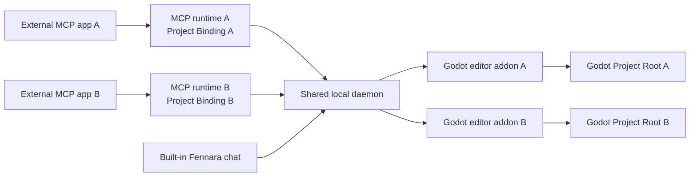

<!-- fennara-i18n: locale=zh-CN source=docs/architecture.md sha256=1bc08d075d4b48d0c781f954d4da4752d6c7223ff1636f01f06524b06dce256a -->
<a id="architecture"></a>
# 架构

<!-- fennara-doc-nav:start -->
[English](../../architecture.md) · **简体中文** · [Español](../es/architecture.md) · [Português do Brasil](../pt-BR/architecture.md) · [日本語](../ja/architecture.md) · [한국어](../ko/architecture.md) · [Русский](../ru/architecture.md) · [Français](../fr/architecture.md) · [Deutsch](../de/architecture.md) · [Türkçe](../tr/architecture.md)

> ℹ️ 由 AI 根据英文原文撰写，欢迎母语者审阅。 [英文原文](../../architecture.md)
<!-- fennara-doc-nav:end -->

Fennara 是 AI 客户端与已打开的 Godot 编辑器项目之间的本地桥接。
本页说明所有权、进程边界、安装布局和更新
移交行为。

| 如果你需要... | 从这里开始 |
| --- | --- |
| 查找某个组件的源码 | [仓库地图](repo-map.md) |
| 安装或更新 Fennara | [设置](setup.md) |
| 了解发布工件 | [发布流程](release.md) |
| 检查可用的模型工具 | [工具](tools.md) |

在正常 OSS 路径中不存在 Fennara 云服务。每个外部 MCP 连接都会启动一个本地 MCP
进程，各进程与每用户共享的单个守护进程通信。内置聊天直接与该守护进程通信。守护进程连接到
已打开 Godot 编辑器中的 Fennara 插件。



<a id="main-pieces"></a>
## 主要组成部分

| 组成部分 | 所在位置 | 作用 |
| --- | --- | --- |
| CLI | `local/crates/fennara-cli/` | 将插件安装到 Godot 项目、更新本地软件包、写入项目指导，并通过 `fennara mcp-setup` 配置 MCP 应用。 |
| MCP 启动器 | `local/crates/fennara-mcp/` | MCP 应用调用的稳定可执行文件。它查找活动版本并启动运行时。 |
| MCP 运行时 | `local/crates/fennara-mcp/` | 通过 stdio 使用 MCP 协议，启动时固定一个可选的项目绑定，并将工具调用转发给本地桥接。 |
| 守护进程启动器 | `local/crates/fennara-daemon/` | 用于启动活动守护进程运行时的稳定可执行文件。 |
| 守护进程运行时 | `local/crates/fennara-daemon/` | 保留共享本地状态、将 MCP 连接路由到匹配的编辑器、拥有整台机器的运行时槽位、与 Godot 协调，并托管内置聊天路由。 |
| 项目身份 | `local/crates/fennara-project-identity/` | 为 MCP 运行时和守护进程解析、验证、规范化并比较 Godot 项目根目录。 |
| 聊天 UI 源码 | `ui/chat/` | 内置聊天、设置、提供方设置、MCP 应用设置和更新 UI 的 HTML、CSS 和 JavaScript。它会同步到 `godot_demo/addons/fennara/dist/` 下的打包插件中。 |
| Godot 插件 | `godot_demo/addons/fennara/` | 复制到用户项目中的插件载荷。 |
| 运行时辅助源码 | `runtime/` | 同步到插件载荷中的 Godot 端运行时辅助脚本，用于运行时会话和运行时脚本。 |
| GDExtension | `fennara-cpp/` | 面向 Godot 的工具、停靠面板 UI、诊断、验证、运行时捕获和编辑器集成。 |
| 工具模式 | `local/schemas/tools/` | 共享的面向模型工具契约。MCP 运行时和内置聊天分别选择它们所暴露的模式。 |

<a id="native-update-handoff"></a>
## 原生更新移交

聊天 UI 通过守护进程和绑定的 Godot
桥接请求更新准备。原生 `UpdateCoordinator` 启动已安装的 CLI，跟踪
持久操作状态，并在准备开始后不依赖
webview 来显示进度。

经过验证的插件文件会暂存在
`.godot/fennara-update/<operation-id>/` 下。得到明确确认后，一个分离式
CLI 会等待精确的 Godot PID 和启动时间消失。它会重新检查
覆盖完整暂存插件的摘要，对两个共享启动器和
运行时清单拍摄快照，将活动插件移动到 `previous-addon`，将
暂存插件移动到 `addons/fennara`，然后重新打开同一个编辑器项目。
重新打开的 GDExtension 会写入激活握手。只有在成功回执、握手和匹配的守护进程健康状态
都已持久化后，CLI 才会删除
备份。否则，回执会保持 `recovery_required`，回滚会
恢复先前的插件、启动器和运行时清单。如果中断
暂时导致插件无法加载，已安装的 CLI 仍位于
项目插件之外，并提供 `fennara recover --project <path>` 作为
单插件紧急恢复入口点。

<a id="in-editor-chat-webview"></a>
## 编辑器内聊天 Webview

可选聊天停靠面板由 GDExtension UI 层托管。共享主机
契约将两种浏览器表面样式分开：

| 平台路径 | 行为 |
| --- | --- |
| Windows | 附加到 Godot 编辑器窗口的原生 WebView2 子窗口或覆盖层；当重叠的 Godot 弹出窗口、嵌入式窗口、画布层或顶层控件可见时，它会被隐藏。 |
| macOS | 附加到 Godot 编辑器窗口的原生 WKWebView，使用与 Windows 相同的重叠 Godot UI 隐藏机制。 |
| Linux | 使用 Fennara 应用数据中的共享 CEF 运行时，将 CEF 屏幕外渲染到内部 Godot `TextureRect`。 |

用户还可以在 Chat Settings 中设置下次在系统
浏览器中打开内置聊天。在该模式下，Godot 停靠面板会显示 **Open chat** 回退
面板，并通过位于 `127.0.0.1` 的本地守护进程，使用所属编辑器的
`chat_token` 提供相同聊天 UI。这只会更改显示表面，提供方
设置、聊天历史、项目范围、快照、工具执行和外部
MCP 路由仍使用相同的守护进程路径。

`fennara install`、`fennara update` 和 `fennara doctor` 会报告当前平台的
webview 先决条件。Windows 会在缺少 Microsoft Edge
WebView2 Runtime 时发出警告，macOS 会报告系统 WebKit.framework 状态，
Linux 会验证由发布管理的共享 CEF 运行时。这些检查只影响
可选的内置聊天停靠面板，没有原生 webview 时 MCP 工具仍可
工作。

Linux 路径在 Godot `Control` 内渲染浏览器像素，并通过
停靠面板进程钩子运行 CEF 消息循环。GDExtension 会发现
共享 CEF 运行时，验证其 `fennara-cef-runtime.json` 标记和
必需文件，动态打开 `libcef.so`，然后通过聚焦的桥接加载器对小型
`libfennara_linux_cef_bridge.so` 插件库调用 dlopen。
该桥接由
固定版本的官方 CEF 139 `libcef_dll_wrapper` 源码构建，并拥有在
无窗口模式下初始化 CEF、为打包聊天 URL 创建浏览器并将绘制
缓冲区复制到 Godot 纹理所使用的 C++ CEF
对象（`CefClient`、`CefRenderHandler`、`CefRefPtr`）。
完整的 IME、剪贴板和光标处理属于单独的后续工作。CEF 运行时有意与
Godot 插件 zip 分离：Linux 安装使用共享应用数据运行时位置，
CLI 每位用户只在那里安装一次由发布管理的 CEF 资产。

可以同时打开多个 Godot 编辑器。每个嵌入式聊天
websocket 都使用所属编辑器的 `chat_token` 接受，并继续绑定到
该 Godot 会话，用于聊天存储范围、快照、工具执行、取消
和还原。已绑定项目的外部 MCP 进程会路由到规范项目根目录与之匹配的编辑器。只有未绑定的进程
会使用守护进程中由停靠面板选定的兼容性目标。
聊天提供方设置目前是全局的，而聊天仍限定在项目范围内。
云端聊天提供方使用本地存储的 API 密钥，本地提供方使用
守护进程存储的基础 URL。当前内置聊天提供方集合包括 OpenAI、
Anthropic、OpenRouter、Ollama Cloud、DeepSeek、Z.AI、Moonshot AI、Kimi For
Coding、MiniMax、本地 Ollama 和 LM Studio。Ollama 默认为
`http://127.0.0.1:11434`，LM Studio 默认为 `http://127.0.0.1:1234/v1`。
守护进程聊天运行时在发出请求之前，通过小型提供方目录
解析选定模型。规范模型引用使用 `provider/model`。
OpenRouter 是用户会注意到的主要例外，因为 OpenRouter 模型 slug
通常已经包含提供方段。在 Fennara 中请优先使用
`openrouter/google/example`。如果用户粘贴诸如 `google/example` 的原始 OpenRouter slug，
守护进程仍会将它路由到 OpenRouter，以保持
兼容性。原生 `openai/...` 和 `anthropic/...` 引用使用官方
提供方。若要通过 OpenRouter 使用这些供应商，请使用 `openrouter/openai/...` 或 `openrouter/anthropic/...`。
提供方尽可能共享 OpenAI 兼容或
Anthropic 兼容聊天适配器，提供方差异隔离在
提供方模块中，并在适配器边界之上使用规范化流或错误事件。

内置聊天回合还会向同一个
`chat.sqlite` 应用数据数据库中的 `chat_trace_events` 写入仅限本地的诊断追踪，与转录
表分离。追踪行使用稳定的回合、生成、工具和桥接 ID，以及计时、
状态、计数和有界摘要。默认不捕获原始提示词和完整工具结果。
守护进程在 `/chat/traces` 暴露一个小型本地调试读取端点，
用于按 `chat_id`、`trace_id`、`turn_id` 或
`generation_id` 过滤。

<a id="anonymous-telemetry"></a>
## 匿名遥测

在真实 Godot 编辑器连接后，守护进程每天可以排队一个匿名
活跃安装事件。该有界队列和后台 HTTP
工作器与工具执行、聊天生成和 Godot 桥接分离，
因此遥测不会延迟用户操作，也不会导致用户操作失败。

守护进程在 `Fennara/telemetry/state.json` 下持久化一个随机安装 UUID 和上次接受的 UTC 日。
事件只包含该 UUID、Fennara 和数字形式的 Godot
版本、平台及 CPU 架构。
`fennara.io` 接收端会验证精确载荷，并将 UUID 转换为
服务器端 HMAC，再把不与个人关联的事件转发到 PostHog。

保存的 Chat Settings 偏好设置默认启用。UI 可以将其禁用，
`FENNARA_DISABLE_TELEMETRY` 或 `DO_NOT_TRACK` 可以强制执行环境
覆盖。禁用后会删除本地遥测状态。完整隐私契约请参阅
[匿名遥测](telemetry.md)。

<a id="install-layout"></a>
## 安装布局

对于手动复制发布插件的流程，当精确的本地安装缺失时，GDExtension 会先显示一个原生
设置面板。它的引导桥接使用 Godot
HTTP 客户端下载该插件版本的发布清单和 CLI 归档，验证声明的 SHA-256，并仅把 CLI 放入 Fennara
应用数据。然后它会启动 `fennara install`，并读取持久操作
状态以显示进度和诊断。在设置成功且匹配的守护进程连接之前，
聊天和 webview 保持不活动。需要设置时，本地桥接不会
启动或连接到应用数据中的旧守护进程。版本切换要求共享守护进程报告连接的 Godot 项目数量为零。
正在设置的项目在其插件与已安装
组件不同时保持断开连接。通过该预检后，安装程序会在激活匹配组件之前停止空闲的旧
守护进程。报告存在连接时会保持
现有安装不变，使用户可以关闭已连接的编辑器
并重试。

在 macOS 上，面向用户的文档建议通过 CLI 安装。
只有在 GDExtension 原生库加载后，编辑器内引导程序才能运行，因此
它无法修复手动下载并
解压未经公证的插件 ZIP 所造成的 Gatekeeper 阻止。手动复制的插件被阻止的用户必须
在运行 `fennara install` 之前将其移除，因为 CLI 会
保留完整的现有插件。

共享应用数据引导锁会将并发 Godot 编辑器之间的 CLI 下载和激活
串行化。锁所有权会转移给已启动的安装程序
进程，因此另一个编辑器会等待该精确进程退出。面板
会生成操作 ID，将其传给 CLI，并且只读取该操作的
状态文件。如果子进程退出时处于非终结状态，面板会报告
稳定故障，而不是无限等待。

终端安装脚本仍是非交互式和恢复路径。

安装脚本会安装小型外层 CLI，并将其添加到 `PATH`。此后，
现代发布可以通过 `fennara update` 或
`fennara self-update` 更新已安装的 CLI。只有当所选发布或安装位置不支持 CLI 自更新时，
才需要重新运行安装脚本。

之后，`fennara install` 或 `fennara update` 会获取发布清单、
验证引用的资产哈希、下载发布资产并设置
本地软件包布局。

```text
Fennara/
  bin/
    fennara
    fennara-mcp
    fennara-daemon
  daemon-control-token
  current.json
  telemetry/
    state.json
  versions/
    <version>/
      fennara-mcp-runtime
      fennara-daemon-runtime
      addon/
        addons/
          fennara/
  webview/
    cef/
      linux-x64/
        <cef-version>/
```

在 Windows 上，可执行文件使用 `.exe`。

守护进程首次启动时会使用安全随机字节创建 `daemon-control-token`。
特权本地 HTTP 路由和 Godot 桥接 websocket 要求通过
`X-Fennara-Control-Token` 标头提供此 token。MCP 运行时和 Godot
插件从同一个按用户 Fennara 应用数据目录中读取 token。在
发送 token 之前，每个客户端会向公开控制
质询端点发送随机 nonce，并要求有效的 HMAC-SHA256 证明。这样可防止
另一个占有固定端口的进程收集可重复使用的 token。
静态聊天资产和最小健康端点在环回地址上保持公开，
项目聊天 websocket 和媒体请求继续使用所属编辑器单独的项目聊天 token。

`webview/cef/...` 目录用于由使用该 Fennara 安装的每个 Godot 项目或编辑器共享的只读浏览器引擎载荷。
每进程可写的 CEF 配置文件、缓存和日志数据必须保留在该共享运行时载荷之外，
分别位于 `cache/webview/profiles/cef/godot-<pid>-<timestamp>-<nonce>/` 和
`logs/webview/cef/godot-<pid>-<timestamp>-<nonce>/` 下。

默认平台位置：

| 操作系统 | 基础目录 |
| --- | --- |
| Windows | `%LOCALAPPDATA%\Fennara` |
| macOS | `~/Library/Application Support/Fennara` |
| Linux | `~/.local/share/fennara` |

<a id="project-layout"></a>
## 项目布局

当用户在 Godot 项目内运行：

```bash
fennara install
```

且完整插件尚不存在时，CLI 会将发布插件复制到以下布局：

```text
<godot-project>/
  AGENTS.md
  addons/
    fennara/
      ai/
        guidelines.md
        index.md
        operations.md
        runtime-observation.md
        visual-observation.md
        clients/
          cursor.md
```

如果完整插件已经存在，CLI 会验证其 `VERSION` 和
当前平台编辑器库，安装精确匹配的本地软件包，并
保持插件目录不变。只有当共享守护进程尚未运行时才会
启动它，并且只有在其健康响应
报告插件版本后，安装才会成功。

Godot 的编辑器文件系统扫描完成后，插件会立即启动一个由插件拥有的工作器，以准备 C# 支持。
该工作器会运行一次隔离的
增量构建，不阻塞 Godot 主线程。C# 工具工作器会等待
同一个准备屏障。守护进程只传输工具调用，不负责
构建进程。所有由插件拥有的 C# 构建共用一个协调器，
因为诊断和运行时构建会复用 Godot 的中间 MSBuild 树。

不支持有针对性的 `.cs` 诊断。全项目 C# 诊断使用
一次可取消的 `dotnet build` 和 Godot 的结构化构建记录器。其最终
程序集会重定向到隔离的按项目诊断
输出，使已打开的编辑器不会重新加载它们。如果 C# 源码在
初始后台构建运行期间发生变化，该构建会正常完成，下一次
显式项目扫描会执行一次强制刷新。运行时会话预检
使用显式的根 `.csproj` Debug
构建，与 Godot 的 Play 前构建形式一致，并在启动前写入真实的
`.godot/mono/temp/bin/Debug` 程序集。

<a id="mcp-setup"></a>
## MCP 设置

`fennara mcp-setup` 会编辑 MCP 应用配置，使应用能够启动本地启动器。生成的条目是全局且与项目无关的；
在 Godot 项目内运行设置不会将今后每个 MCP 进程都绑定到该项目。

示例：

```bash
fennara mcp-setup --claude
fennara mcp-setup --codex
fennara mcp-setup --cursor
fennara mcp-setup --gemini
```

配置会指向 Fennara `bin`
目录中的稳定 `fennara-mcp` 启动器。该启动器读取 `current.json`，然后启动匹配的
带版本运行时。

这使 MCP 应用配置在更新后保持稳定。

对于相互隔离的仓库或工作树，MCP 主机会为每个项目启动一个进程和连接。运行时会捕获启动目录，
并在该进程的整个生命周期中固定一个 MCP 项目绑定。绑定发现的优先级依次为：显式
`--project-path`、`FENNARA_PROJECT_PATH`、启动目录中包含 `project.godot` 的最近祖先目录。如果自动发现
未找到项目，运行时会进入旧式未绑定兼容模式。无效的显式绑定会导致启动失败，而不是回退。

共享的 `fennara-project-identity` crate 会为 MCP 和守护进程规范化并验证根目录。MCP 会将其规范根目录作为传输元数据发送，
位于面向模型的工具参数之外。守护进程会重新解析该定位器和编辑器报告的根目录，然后要求有且仅有一个实时文件系统匹配。
缺少编辑器时可重试，多个匹配则存在歧义，且两种情况都不会回退到停靠面板目标。请参阅
[多智能体与工作树](multi-agent-worktrees.md)。

此设置路径与内置聊天提供方路径分离。MCP 应用使用
自己的模型账户，Fennara 停靠面板使用聊天
设置中配置的提供方。

<a id="tool-call-flow"></a>
## 工具调用流程

```text
MCP client
  calls a Fennara tool
MCP runtime
  validates the request against local schemas
  attaches its process-scoped Project Binding as transport metadata
  forwards the call to the local daemon
Daemon runtime
  resolves the binding and routes to exactly one matching Godot editor
Godot addon
  runs the Godot-aware tool through GDExtension
  returns a concise markdown result
MCP runtime
  sends the result back to the MCP client
```

内部的内置聊天调用已携带显式的 Godot 编辑器会话。没有项目绑定的外部 MCP 则使用旧式 MCP 目标：
首先使用有效的停靠面板选定目标，其次使用唯一已连接的编辑器。已绑定的选择绝不会读取或更改该守护进程全局目标。

MCP 客户端本身可以读写普通文件。Fennara 工具专注于
Godot 特有的反馈：场景结构、节点属性、诊断、
验证、运行时状态、截图和了解编辑器的编辑。

内置聊天工具调用在转发到
Godot 之前增加一个由守护进程负责的权限门。聊天设置批准模式是 `ask` 或 `full_access`。
只读工具会立即获准。项目修改和运行时执行
工具在 `ask` 模式下等待 UI 批准，在 `full_access` 模式下自动运行。
Godot 工具内部的硬性安全检查，例如阻止内部插件路径，
在两种模式下都仍然适用。

<a id="updates"></a>
## 更新

`fennara update` 是正常的项目更新命令。它读取已安装
插件的发布身份，解析 GitHub 的 Latest Release 指针或该
插件隔离的预发布渠道，并将结果冻结到一个精确版本。
它首先检查
该发布清单中按平台 CLI 资产的版本，如果更新，
便暂存该 CLI，让旧进程退出，替换已安装的 CLI，
并以同一目标继续。然后，它使用与
`fennara install` 相同的清单驱动解析器和安装程序。

原生预发布发现会在共享 Fennara 应用数据中缓存已验证的渠道指针五分钟，
并使用 GitHub ETag 重新验证。缺少
渠道会被视为没有预发布更新，而格式错误或跨渠道的数据
会故障关闭，且绝不会替换有效的缓存条目。

它可以更新：

- 已安装的 CLI 和本地运行时软件包
- 项目插件
- `AGENTS.md` 和 `addons/fennara/ai/` 中生成的项目指导
- 当前平台需要的共享 webview 运行时资产，例如 Linux CEF
- 可选内置聊天停靠面板的 webview 先决条件警告

它不会重写 MCP 应用配置。只有在
添加新的 MCP 客户端、修复该客户端配置或更改 MCP
目标应用集成本身时，才再次运行 `fennara mcp-setup`。

如果 MCP 应用当前正在运行某个启动器，更新可以保留该启动器
并继续。带版本的运行时软件包仍会更新，未来的启动
会使用 `current.json` 中的版本。只有在有意跳过外层 CLI 检查时，
才使用 `fennara update --no-self-update`。

共享激活一次支持一个活动 Fennara 版本。只要任何其他 Godot 项目仍处于连接状态，守护进程就会
拒绝更新关闭，从而防止在另一个编辑器下方进行版本切换。
精确版本软件包、之前的 `current.json`、启动器快照和之前的项目插件
会一直保留，直到重新打开的编辑器验证新的 GDExtension。

守护进程在所有已连接编辑器之间拥有一个整台机器共享的运行时槽位。启动请求会在创建进程前以原子方式申领 `Starting`，
并将该申领提交为 `Running`；竞争失败的调用方会收到非错误、匿名的 `busy` 结果，且绝不会生成第二个游戏进程。
没有 FIFO 队列。

每个运行时会话归属于其规范项目根目录，而非短暂存在的编辑器进程。只有该所有者才能查看详细状态、续期、运行脚本或停止会话。
其他项目只会看到匿名的忙碌状态，且无法确认其他会话标识符。因此，编辑器重新连接后所有权仍会保留。

默认的运行时租约绝对时限为 900 秒，调用方可请求不超过 86,400 秒的正数 `max_run_seconds`。所有者状态查询和有界的所有者操作会对
120 秒的非活动截止时间续期；智能体通常每约 30 秒带抖动地轮询一次状态。绝对截止时间绝不暂停。在进程自然退出、显式停止、启动失败、
非活动过期或绝对过期后，监督器会停止或回收进程并释放运行时槽位。

<a id="export-boundary"></a>
## 导出边界

Fennara 只在编辑器中处于活动状态。它的导出插件会在 Godot 序列化导出的
项目设置前，暂时移除 `_fennara_game_capture` 自动加载项，跳过
`res://addons/fennara/` 和 `res://.fennara/` 下的所有文件，并暂时
从 Godot 生成的 GDExtension 注册表中移除自身条目。导出结束时，它会恢复
原始自动加载项和注册表。它不会重写 `export_presets.cfg` 或
`project.godot`，也不会持久保存对它们的更改。

此边界在 Godot 打开项目后才开始生效。省略 `addons/fennara/` 的 CI
检出必须在启动 Godot 前运行 `fennara prepare-export` 或安装插件。
导出插件无法在项目启动验证前修复缺失的自动加载目标。

<a id="release-assets"></a>
## 发布资产

每个公开发布都会发布独立资产，使安装保持模块化：

| 资产 | 用途 |
| --- | --- |
| `fennara-cli-<platform>-<arch>-v<version>.zip` | CLI 和稳定启动器。 |
| `fennara-release-local-<platform>-<arch>-v<version>.zip` | 由发布清单选择的带版本 MCP 和守护进程运行时。 |
| `fennara-release-addon-v<version>.zip` / `fennara-addon-latest.zip` | 全平台 Godot 插件载荷，包含 `fennara.gdextension` 引用的所有已构建 GDExtension 二进制文件。 |
| `fennara-webview-cef-linux-x64-<cef-version>.zip` | 仅限 Linux 的共享 CEF 运行时，只在 Fennara 应用数据中安装一次。 |
| `fennara-release-manifest-v<version>.json` | 带模式版本的安装或更新计划，包括资产名称、哈希、最低 CLI 版本和共享运行时声明。 |

普通用户从当前被指定为 GitHub Latest 的精确带版本发布进行安装。
Fennara 不会创建或移动字面上的 `latest` 标签或发布。
较旧的带版本发布仍可用于固定版本和调试。

Linux CEF 运行时载荷不是 `fennara-addon-*` 的一部分。它们由
发布清单选择，并安装一次到共享应用数据
`webview/cef/linux-x64/<cef-version>/` 目录中。

CEF 运行时安装会暂存到临时同级目录，验证必需
文件和运行时标记，然后发布已完成的版本目录，并
原子更新 `current.json`。现有编辑器进程继续使用
已经加载的运行时。

<a id="design-rules"></a>
## 设计规则

- 保持工具为原语且与具体游戏无关。
- 让智能体在做出假设前检查项目。
- 优先采用 Godot API 反馈，而不是仅根据文件进行猜测。
- 返回 MCP 客户端可直接使用的精简 Markdown 结果。
- 保持启动器稳定，并将不断变化的代码放入带版本运行时。
- 保持外部 MCP 路径为本地路径。可选的内置聊天停靠面板使用通过守护进程存储的本地提供方设置，例如云端提供方 API 密钥以及本地 Ollama 或 LM Studio 基础 URL。
